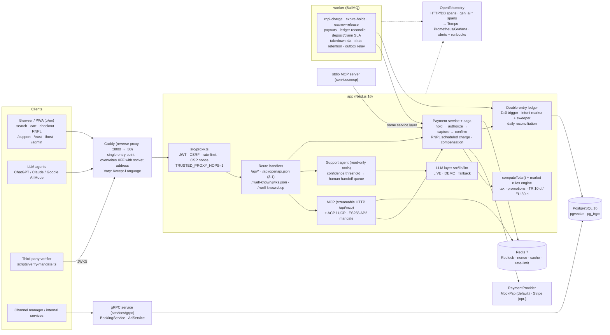

[Türkçe](README.tr.md) · **English**

<a id="readme-top"></a>

<div align="center">

# booking-platform

**An accommodation booking (OTA) platform that makes double bookings and double charges provably impossible through tests, keeps every cent balanced in a double-entry ledger, lets agents (MCP/ACP/UCP) book through the same secure flow as humans under a limited, user-signed authorization (AP2 mandate), and uses GenAI only for explanation and summarization, in a way that also works without an API key or internet access.**

[](LICENSE)


<br />


[**Explore the documentation »**](docs/ARCHITECTURE.md)

[Demo walkthrough](docs/DEMO_SCRIPT.md) · [Changelog](CHANGELOG.md) · [Final report](docs/FINAL_REPORT.md) · [Türkçe](README.tr.md)

</div>

> **This is a portfolio/demo project; no real payments are taken and no real stays are sold; tax rates and regulatory information are for educational purposes only and are not legal/financial advice.**

<details>
<summary><strong>Table of contents</strong></summary>

1. [About the project](#about-the-project)
   - [Value proposition](#value-proposition)
   - [Built with](#built-with)
2. [Architecture](#architecture)
   - [Industry comparison](#industry-comparison)
3. [Getting started](#getting-started)
   - [Prerequisites](#prerequisites)
   - [Installation](#installation)
4. [Usage](#usage)
   - [Demo users](#demo-users)
   - [LLM mode](#llm-mode)
   - [For agents: MCP, ACP, UCP and mandates](#for-agents-mcp-acp-ucp-and-mandates)
   - [Demo scenarios](#demo-scenarios)
   - [Screenshots](#screenshots)
5. [Features (v5)](#features-v5)
   - [Carried over from v4](#carried-over-from-v4)
   - [What does it prove?](#what-does-it-prove)
6. [Tests and scripts](#tests-and-scripts)
7. [Observability](#observability)
8. [Roadmap](#roadmap)
9. [Honesty note: what is mock / demo](#honesty-note-what-is-mock--demo)
10. [Documentation](#documentation)
11. [Contributing](#contributing)
12. [License](#license)
13. [Contact](#contact)
14. [Acknowledgments and attributions](#acknowledgments-and-attributions)
15. [Legal notice](#legal-notice)

</details>

## About the project

[](#screenshots)

Version: **v5** ([CHANGELOG](CHANGELOG.md), [FINAL_REPORT](docs/FINAL_REPORT.md))

### Value proposition

1. **Shown = charged = ledger.** The total on the search card, `/api/quote`, the PSP capture (+ wallet credit) and the charge journal are the same amount; this is verified with fast-check across 200 random listing/date/promotion/tax/FX/credit samples with 0 counterexamples ([v5-price-invariant.test.ts](tests/integration/v5-price-invariant.test.ts)).
2. **Verifiable agent commerce.** Agent payments require a user-signed ES256 AP2 mandate; the public key is published at [`/.well-known/jwks.json`](src/app/.well-known/jwks.json/route.ts), and a third party can verify the signature without trusting the platform using `npm run mandate:verify` ([scripts/verify-mandate.ts](scripts/verify-mandate.ts)).
3. **Evidenced supply chain.** On every push, [security.yml](.github/workflows/security.yml) runs Semgrep SAST, gitleaks, an OSV-Scanner gate and produces a CycloneDX SBOM artifact; SLSA provenance, CodeQL and OpenSSF Scorecard are defined in the workflow but only run on a public repo (the repo is currently private, so they do not run and there is no Scorecard badge).

<details>
<summary><strong>v4 value proposition (still valid)</strong></summary>

1. **Money correctness is proven, not assumed.** All amounts are `BigInt` minor units based on the ISO 4217 exponent; every charge, refund, escrow release, payout, deposit, wallet credit and lost dispute writes a balanced journal entry (a DB trigger enforces Σ=0); daily reconciliation reports the difference against the PSP's actual state. Property tests and scenarios verify "trial balance balanced, difference 0" at every step.
2. **Marketplace features of the industry giants, on a single consistent core.** Group cart (all-or-nothing hold), split payment, check-in+24 hour escrow and payouts with a reserve, damage deposit + resolution center, loyalty/wallet, promotion engine (Omnibus 30 days), flexible-date price calendar, visual search, PWA — all use the same lock, saga, outbox and ledger.
3. **Safe commerce for agents.** The MCP, ACP and UCP endpoints run the same saga as the human checkout; payment cannot be made without a user-signed, time-limited, amount-capped (optionally listing-restricted) and single-use AP2 intent mandate; granting a mandate requires recent-auth and mandates can be revoked.

</details>

### Built with

[](https://nextjs.org)
[](https://react.dev)
[](https://www.typescriptlang.org)
[](https://www.postgresql.org)
[](https://www.prisma.io)
[](https://redis.io)
[](https://docs.bullmq.io)
[](https://opentelemetry.io)
[](https://prometheus.io)
[](https://vitest.dev)
[](https://playwright.dev)
[](https://k6.io)

Full stack: Next.js 16 (App Router) · React 19 · TypeScript strict · PostgreSQL 16 + pgvector + pg_trgm · Prisma 5 · Redis 7 · BullMQ (FlowProducer) · Temporal (polyfill) · MCP (streamable HTTP + stdio) · gRPC · next-intl · jose + WebAuthn · OpenTelemetry · Prometheus · Vitest + testcontainers + fast-check · Playwright + axe · k6

<p align="right">(<a href="#readme-top">back to top</a>)</p>

## Architecture



Details: [docs/ARCHITECTURE.md](docs/ARCHITECTURE.md) (ledger, cart/split payment, escrow/payout/deposit and mandate flow diagrams; saga sequence; hybrid search; v5: RNPL timeline, compensation-journal flow, support agent + handoff, reverse proxy/IP resolution, mandate verification sequence) · decisions: [docs/adr/](docs/adr/)

### Industry comparison

Reference: the target table in [booking-v5.md §2](booking-v5.md). The "v5 (delivered)" column is the state of this repo; targets that were missed or could not be measured are stated explicitly in the last column.

| Capability            | Industry leaders                                       | v5 target                                                                      | v5 (delivered)                                                                                                                                                                                 | Limit / missed                                                                                                                                                  |
| --------------------- | ------------------------------------------------------ | ------------------------------------------------------------------------------ | ---------------------------------------------------------------------------------------------------------------------------------------------------------------------------------------------- | --------------------------------------------------------------------------------------------------------------------------------------------------------------- |
| Money traceability    | Booking/Airbnb internal ledgers, Stripe reconciliation | Every PSP movement in the journal, intent marker + sweeper                     | Every PSP movement is journaled, including cart/share/transfer/deposit compensations; intent marker + sweeper (ADR 0026); reconciliation difference 0 under chaos and the RNPL storm           | —                                                                                                                                                               |
| Flexible payment      | Airbnb RNPL, Booking "pay at property"                 | Charge N days before free cancellation ends, automatic cancellation on failure | RNPL (ADR 0028): 0 today, scheduled `rnpl-charge` + backup sweeper, automatic cancellation on failure; 0 violations in a storm of 1,006 triggers ([v5-rnpl-storm](docs/perf/v5-rnpl-storm.md)) | Only in the mock payment form (not in the Stripe Payment Element path)                                                                                          |
| Agent commerce        | Booking/Expedia ChatGPT apps, Google UCP Lodging, AP2  | ES256 + JWKS mandate, up-to-date UCP, third-party verification, MCP Apps card  | ES256 mandate + `/.well-known/jwks.json`, `npm run mandate:verify`, UCP manifest, MCP Apps `ui://booking/stay-card` (ADR 0025, 0035, 0036)                                                     | MCP Apps client support is limited; the card was verified by feeding it in the SDK format, not on a real client screen                                          |
| AI customer service   | Airbnb AI support agent, Booking Smart Messenger       | Support agent with read-only tools + human handoff via confidence threshold    | `/support` chat agent (read-only tools); low confidence, user request or sensitive topic → `/admin/support` human queue (ADR 0029)                                                             | The agent does not take actions (refunds/cancellations are handled by the human agent); template answers in DEMO mode                                           |
| LLM assurance         | Internal evals + observability                         | promptfoo eval + red-team in CI, OTel `gen_ai.*`, cost panel                   | `npm run llm:eval` 28 cases, 10 of them red-team (in CI, 95% threshold), `gen_ai.*` spans, Grafana LLM token/latency/eval panels (ADR 0030)                                                    | The CI eval runs against the network-less demo provider; a live model score was not measured separately; the panel shows tokens, not monetary cost              |
| Supply chain security | SLSA, SBOM, SAST                                       | CodeQL/Semgrep, gitleaks, SBOM, OSV, SLSA provenance, Scorecard                | `security.yml`: Semgrep, gitleaks, CycloneDX SBOM, OSV-Scanner gate; SHA-pinned actions, dependabot (ADR 0031)                                                                                 | CodeQL, SLSA provenance and Scorecard only run on a public repo; since the repo is private they **do not run**                                                  |
| Abuse resistance      | Card-testing detection, KYC gates                      | Single risk engine, KYC fail-closed, IP resolution via reverse proxy           | All payment paths go through a single risk engine; KYC fail-closed (v5#3); Caddy reverse proxy + `TRUSTED_PROXY_HOPS` (ADR 0034)                                                               | Client IP resolution is not guaranteed in a deployment without Caddy                                                                                            |
| Price transparency    | FTC Junk Fees, EU Omnibus, TR 10-day rule              | Market rules engine; "shown = charged = ledger" property test                  | Market rules engine (TR 10-day / EU 30-day discount reference, ADR 0032); fast-check 200 samples, 0 counterexamples                                                                            | Rule contents are for educational purposes, not a legal opinion                                                                                                 |
| Compliance (STR)      | EU 2024/1028, TR 7464 + 7565                           | Registration no. on the listing + market rule, KVKK export/deletion            | Registration/license no. on the PDP + market rule; KVKK "download my data" and account deletion (`/api/account`)                                                                               | Ministry and EU registration services are mocked                                                                                                                |
| API contract          | Expedia Rapid, Booking Connectivity (OpenAPI)          | `/api/openapi.json` 3.1 + contract tests                                       | `/api/openapi.json` (OpenAPI 3.1), 2xx schemas; real responses are validated against the schema in integration tests (≥ 20 endpoint operations)                                                | —                                                                                                                                                               |
| Observability         | SLO + error budget + runbook                           | Alerts with runbooks, `promtool` tests, burn-rate, chaos report                | Runbooks for all 29 alerts ([docs/runbooks/](docs/runbooks/README.md)), `promtool test rules` in CI, multi-window burn-rate; [v5-chaos](docs/perf/v5-chaos.md) (Toxiproxy)                     | —                                                                                                                                                               |
| Scale/performance     | Sub-second on hot inventory                            | Cart hold p95 ≤ 2 s (100 VU)                                                   | Lock queue fix: hold p95 at 20 VU 6.05 → **1.87 s** ([v5-cart](docs/perf/v5-cart.md))                                                                                                          | **Missed:** hold p95 at 100 VU is **8.40 s** (target 2 s); all VUs deliberately hit the same 4 inventory rows, the remaining bottleneck is the lock wait budget |
| i18n/accessibility    | 40+ languages, EAA                                     | Accept-Language negotiation, 0 axe violations on new screens                   | Accept-Language (q-value) negotiation when there is no cookie + `Vary`; axe e2e on new v5 screens                                                                                              | tr/en only; no manual screen reader testing                                                                                                                     |

<details>
<summary><strong>v4 industry comparison (v3.0.0 → v4)</strong></summary>

| Capability                      | Industry leaders                                    | v3.0.0                           | v4 (in this repo)                                                                                                                                                                                             | Mock / limit                                                                                        |
| ------------------------------- | --------------------------------------------------- | -------------------------------- | ------------------------------------------------------------------------------------------------------------------------------------------------------------------------------------------------------------- | --------------------------------------------------------------------------------------------------- |
| Multi-room / group cart         | Booking/Expedia multi-room; Airbnb group trips      | Single room type / booking       | `Cart` (≤`CART_MAX_ITEMS` items), all-or-nothing hold with ordered locks, single PSP charge; split payment (equal/custom shares, HMAC invite link, organizer fallback or full refund at deadline)             | No Stripe Payment Element or passkey step-up in cart/shares (mock hosted fields, falls back to 3DS) |
| Flexible dates & price calendar | Google/Booking ±3 days, month grid                  | Price alert                      | `MinPriceByDate` materialized table + incremental refresh job, PDP month grid (cheapest night, tax included/excluded), `flexDays` ±3 day suggestion in search (confirmed exactly by the quote engine)         | The calendar shows the base price without promotions; guest count `PRICE_CALENDAR_GUESTS`           |
| Marketplace money               | Vrbo Payments, Airbnb payouts, Stripe Connect       | `LedgerEntry` + simulated payout | Double-entry balanced journal (ADR 0020), daily reconciliation report, check-in+`PAYOUT_RELEASE_HOURS` escrow, commission (`PLATFORM_COMMISSION_BPS`), reserve, host payout schedule, DAC7 export             | Default `MockPayoutProvider`; Stripe Connect tested only with a network-less fake                   |
| Deposit & resolution center     | Airbnb AirCover / Resolution Center                 | None                             | Off-session deposit pre-authorization, guest refund / host damage claims, evidence upload (EXIF stripped), response SLA, admin decision, chargeback sync + lost dispute journal                               | MockPsp by default; Stripe deposit only with a fake                                                 |
| Trust & safety                  | Booking/Airbnb identity verification, party risk    | Fraud v2 + passkey step-up       | KYC (`IdentityVerification`, Stripe Identity provider + deterministic mock), scam link/IBAN scanning in messages, rule-based party risk score → warning to the host                                           | KYC mock by default; party risk is a warning only (no approval step)                                |
| Loyalty & wallet                | Genius, One Key                                     | None                             | Tiers + cashback credit (`guest_credit` in the ledger), partial payment with credit, FIFO lots, expiry                                                                                                        | Credit cannot be used in cart/split payment                                                         |
| Promotions                      | Early-bird, last-minute, mobile rate, coupon        | Rate plans                       | Rule-based engine (priority, stacking group, cap, reason codes), race-free coupon limit, Omnibus 30-day reference (`InventoryPriceHistory` DB trigger)                                                        | No coupons in the cart (automatic promotions are applied)                                           |
| AI reviews & comparison         | Airbnb AI review highlights, listing comparison     | LLM review summary               | Sentence embeddings + k-means clusters, highlights with a **verbatim-quote guard**; structured comparison of 2–4 listings using `createQuote` totals                                                          | In DEMO mode, the real sentences closest to the cluster centroid                                    |
| Visual intelligence             | Airbnb photo classification, Trip.com visual search | None                             | Blur/exposure quality score, 64-bit pHash duplicate detection, "like this photo" with CLIP (3rd RRF list)                                                                                                     | CLIP is an optional dependency, disabled by default (the demo override enables it)                  |
| Agent commerce                  | Google UCP lodging, ChatGPT apps, AP2               | MCP HTTP + ACP (mock token)      | ACP Stripe SPT path, UCP profile + checkout endpoints, AP2 intent mandate (JWS; amount/time/listing/nonce; revocation), MCP `checkout_stay`                                                                   | SPT tested only with a fake; mandate HS256 (only the platform can verify)                           |
| Mobile / PWA                    | Native apps, push                                   | Responsive web                   | Manifest + service worker, offline trip plan and signed QR card (`/trips`), Web Push (price drop, check-in reminder)                                                                                          | Push disabled without a VAPID key                                                                   |
| Accessibility                   | ADA 36.302(e), EAA                                  | axe e2e                          | Accessibility features with photo evidence and admin verification + search filter; dark theme; WCAG 2.2 AA axe tags                                                                                           | No on-site inspection (photo evidence)                                                              |
| Compliance automation           | DSA notice-and-action, Law No. 7565, 2024/1028      | License mock + SDEP export       | 24-hour takedown SLA workflow + breach alert, DSA Art. 16/17/20 (notice, statement of reasons, appeal, relist block), transparency report, UBL-TR e-Arşiv generator, accommodation tax history, retention job | Ministry, GİB/private integrator and EU registration services are mocked                            |
| Money precision                 | ISO 4217 all exponents                              | `Decimal(10,2)`                  | `BigInt` minor-unit columns + ISO 4217 exponent table (JPY 0, KWD 3), single half-up rounding (ADR 0019)                                                                                                      | Legacy decimal API fields are still in responses for backward compatibility                         |
| Account security                | Re-authentication, session management               | Passkey + step-up                | `auth_time` recent-auth, single-use step-up bound to operation+amount, 24 h cooldown for new passkeys, session list + remote sign-out, new device email (ADR 0024)                                            | —                                                                                                   |

</details>

Capabilities carried over from v3 (room-type inventory, tax engine, FX snapshot, hybrid search + LTR, revenue dashboard, channel manager, messaging, i18n) are preserved unchanged; details in [docs/ARCHITECTURE.md](docs/ARCHITECTURE.md).

<p align="right">(<a href="#readme-top">back to top</a>)</p>

## Getting started

### Prerequisites

- **Docker** (Compose v2) — the only requirement for the demo stack. `.env` is optional (`required: false`; safe defaults are used if it is missing).
- **Node.js 22** and npm — only for local development (the Docker images are based on `node:22-alpine`). Integration tests also require Docker (testcontainers).

### Installation

#### Run it in 30 seconds (Docker Compose demo)

```bash
cp .env.example .env
docker compose -f docker-compose.yml -f docker-compose.demo.yml up --build
```

→ <http://localhost:3000> (images are built on the first start; `--build` is not needed on later starts)

- **Reverse proxy (v5):** port 3000 is now published by **Caddy** (`APP_PORT`, default 3000), which forwards requests to `app:3000` on the internal network; the application is not exposed directly to the host. Caddy ignores the `X-Forwarded-For` sent by the client and writes the TCP socket address; the application trusts only this hop via `TRUSTED_PROXY_HOPS=1` ([ADR 0034](docs/adr/0034-reverse-proxy-client-ip.md), `docker/Caddyfile`).
- **Demo override:** `docker-compose.demo.yml` enables demo mode (demo seed, `/dev/mailbox`, MockPsp, persistent "DEMO" banner), the http cookie and visual search (`VISION_CLIP_ENABLED=true`). On its own, `docker compose up` behaves like production with safe defaults (Secure cookie, `DEMO_MODE=false`).
- **Secrets are generated automatically.** On first start, the `secrets-init` service randomly generates the JWT, internal API, transfer signing, webhook, metrics, Postgres and Redis secrets and writes them to the `booking_secrets` volume. The images contain no secrets.
- **Demo data:** the `migrate` service runs `prisma migrate deploy`, then loads the seed if `DEMO_SEED` is enabled and the database is empty (v4 additions: host payout account, 4 promotions + the `HOSGELDIN` coupon, listing photos, verified accessibility features). When `DEMO_MODE` is off, the demo seed is refused and `/dev/mailbox` returns 404 (`src/lib/config/seed-guard.ts`).
- **No keys or internet required:** LLM → DEMO (including the support agent), payments and payouts → mock, KYC → mock (only in the demo override; fail-closed otherwise), e-Arşiv integrator → mock, FX → static fallback, registration no. → mock registry, embeddings → hash, SMTP → dev mailbox, Web Push → disabled.

#### Local development

```bash
npm run db:up                          # dev compose: Postgres + Redis
npm run db:migrate && npm run db:seed  # prisma migrate deploy + seed
npm run dev                            # Next.js development server
npm run worker                         # BullMQ worker in a separate terminal
```

The names of the configurable environment variables are listed in [.env.example](.env.example).

<p align="right">(<a href="#readme-top">back to top</a>)</p>

## Usage

### Demo users

> **WARNING — DEMO ONLY.** These accounts are seeded only with the `docker-compose.demo.yml` override (`DEMO_MODE=true`) and use a publicly known password. Seeding is disabled in the base compose and in production.

| Role              | Email                                                 | Password       |
| ----------------- | ----------------------------------------------------- | -------------- |
| Guest             | `guest@booking.test`                                  | `Password123!` |
| Host              | `host@booking.test`                                   | `Password123!` |
| Admin             | `admin@booking.test`                                  | `Password123!` |
| Additional guests | `elif@test.com`, `mehmet@test.com`, `zeynep@test.com` | `Password123!` |

The demo users' email addresses are verified (booking/payment/transfer require a verified email). Test cards (mock hosted fields, tokenized in the browser): `4242 4242 4242 4242` approve, `4000 0000 0000 0002` decline, `4000 0000 0000 3220` 3DS (verification code `123456`). If SMTP is not configured, emails (including split payment invitations) land on the <http://localhost:3000/dev/mailbox> page.

### LLM mode

All LLM access goes through the `src/lib/llm/` contract ([ADR 0005](docs/adr/0005-llm-contract.md), [MODEL_CARD](docs/MODEL_CARD.md)).

| Mode                    | When                                                               | Behavior                                                                                              |
| ----------------------- | ------------------------------------------------------------------ | ----------------------------------------------------------------------------------------------------- |
| **DEMO**                | No key, or `LLM_MODE=demo`                                         | Never goes to the network; per-task deterministic generators produce output from real data            |
| **LIVE**                | `LLM_API_KEY` set in `.env` and `LLM_MODE=auto` (default)          | OpenAI-compatible Chat Completions (default model `deepseek-v4-flash`, changeable via `LLM_BASE_URL`) |
| **fallback** (per call) | Timeout / 429 / 5xx / invalid JSON / guard / budget on a live call | Demo output for that call, `llmMode: "fallback"` + a short `reason` code; the API still returns 200   |

- `GET /api/llm/status` (login required) shows the active mode; the key itself never appears in any response, log or telemetry. `npm run llm:smoke` returns 0 with "DEMO — smoke skipped" when there is no key.
- The LLM **never** makes price, tax, availability, refund, fraud, KYC, moderation, promotion or ranking decisions; every number in its output and (in review highlights) every quote passes through guards, and every text sent to the LLM passes through KVKK redaction. All LLM paths are subject to a daily per-user token budget and are limited process-wide by `LLM_MAX_CONCURRENCY` (4) (v4#3).
- v5: the support agent also goes through the same contract (model in LIVE, deterministic template in DEMO). Every call produces an OTel `gen_ai.*` span (semconv v1.37.0; by default only the model, token counts and finish reason — content is written only when `LLM_OTEL_CAPTURE_CONTENT=true`, and only after redaction). `npm run llm:eval` runs 28 cases (10 of them prompt-injection red-team) against the network-less demo provider, and CI turns red if the pass rate is below 95%; for the live model use `npm run llm:eval -- --live` (local only, requires a key) ([ADR 0030](docs/adr/0030-llm-evals-genai-telemetry.md)).

### For agents: MCP, ACP, UCP and mandates

| Channel                                                 | Identity                                           | Tools / endpoints                                                                                                                                                 |
| ------------------------------------------------------- | -------------------------------------------------- | ----------------------------------------------------------------------------------------------------------------------------------------------------------------- |
| `POST /api/mcp` (streamable HTTP)                       | `Authorization: Bearer <access token>`             | `search_stays`, `get_quote`, `create_hold`, `checkout_stay` (SPT + mandate), `get_price_insight`, `list_my_bookings`, `cancel_booking` + `ui://booking/stay-card` |
| `npm run mcp:server` (stdio)                            | `MCP_ACCESS_TOKEN` environment variable            | Same tool set (`services/mcp/`)                                                                                                                                   |
| `/api/agentic/checkout_sessions` (ACP)                  | Login + `Idempotency-Key`; `mandate` on completion | Create → update → `…/[id]/complete`; payment via `spt_…` (Stripe) or `spt_mock_*`; same saga as the human checkout                                                |
| `/.well-known/ucp` + `/api/ucp/checkout-sessions` (UCP) | Profile is public; session endpoints require login | Maps the UCP lodging schema to the ACP services                                                                                                                   |
| `/api/account/agent-mandates`                           | Verified email + recent-auth (grant); login (list) | Grant and list AP2 intent mandates, revoke with `DELETE …/[nonce]`                                                                                                |

The access token is taken from the `accessToken` field of the `POST /api/auth/login` response. A missing, expired, over-limit, other-user, revoked or replayed mandate is rejected before reaching the PSP (403/402/409 `MANDATE_*`). Smoke test: `npm run mcp:smoke` (success with a mandate + rejection paths). Decision: [ADR 0023](docs/adr/0023-agentic-commerce-mandates.md).

### Demo scenarios

- 3-minute demo walkthrough: [docs/DEMO_SCRIPT.md](docs/DEMO_SCRIPT.md)
- Reset the demo state: `npm run demo:reset`; 20 end-to-end scenarios (7 HTTP + 13 in-process v4/v5 scenarios; every in-process scenario checks the trial balance and reconciliation): `npm run demo:scenarios`. v5 scenarios: RNPL on-time/failed charge, cart compensation, transfer payout without KYC, support agent human handoff, third-party mandate verification + OpenAPI discovery, TR/EU discount reference.

### Screenshots

`npm run docs:screenshots` (against a running demo stack; `SCREENSHOT_SET=v3|v4|v5` for a single set).

#### v5

| Reserve now, pay later (0 ₺ today + cancellation timeline) | Scheduled RNPL charge in booking details                  |
| ---------------------------------------------------------- | --------------------------------------------------------- |
|             |                    |
| **AI support chat + "Connect to a human" handoff**         | **Admin support queue (human agent)**                     |
|               |            |
| **Trust center (SBOM, JWKS, OpenAPI, Scorecard)**          | **Registration/license number on the PDP**                |
|                      |  |

#### v4

| Group cart (two properties, all-or-nothing)                      | Cart checkout (rooms held, single payment)                  |
| ---------------------------------------------------------------- | ----------------------------------------------------------- |
|                               |              |
| **Split payment (organizer + 2 participants, payment deadline)** | **PDP price calendar (lowest nightly price, tax included)** |
|                   |            |
| **Listing comparison (quote engine total + AI commentary)**      | **Resolution center — admin claims queue**                  |
|                            |             |
| **Wallet and loyalty (`/account`)**                              | **Host payout dashboard (escrow / released / reserve)**     |
|                                 |            |
| **Dark theme (`prefers-color-scheme: dark`)**                    |                                                             |
|                          |                                                             |

<details>
<summary><strong>v3 screenshots and the MCP card</strong></summary>

#### v3

| Checkout with line items (nights, accommodation tax, VAT included) | PDP price insight (conformal interval, "typical" label)       |
| ------------------------------------------------------------------ | ------------------------------------------------------------- |
|        |                   |
| **Host revenue dashboard (`/host/revenue`)**                       | **Booking messaging (phone number masked)**                   |
|                     |                           |
| **Smart filter (natural language → filter chips)**                 | **Property page (gallery, price, attributed review summary)** |
|                   |                                  |
| **Multi-city trip planner (tool-using, grounded)**                 | **Host extranet**                                             |
|                          |                            |
| **Home page**                                                      | **Admin panel (outbox, moderation, experiments, fraud)**      |
|                                     |                                   |

**MCP `ui://booking/stay-card` widget:**


</details>

The screenshots are produced from the compose demo stack (seeded, LLM demo mode) with `npm run docs:screenshots` ([scripts/screenshots.ts](scripts/screenshots.ts)). Honesty notes:

- The MCP card is rendered from real `POST /api/mcp` responses (`resources/read ui://booking/stay-card` + `tools/call search_stays`), but it is **not** a screenshot of a ChatGPT/Claude client: the template is rendered on a blank page, fed in the same format as the `window.openai.toolOutput` provided by the Apps SDK.
- The v4 set is produced with `SCREENSHOT_SET=v4 npm run docs:screenshots`; the script creates a sample cart and split payment plan in the demo stack (one participant has paid their share). The damage claim in the resolution center screenshot comes from scenario 10 of `npm run demo:scenarios` (in the live demo a claim cannot be opened before the stay starts). The wallet appears empty because the demo guest has no completed stays; the cashback → credit flow is verified in scenario 14. Since seed prices are flat, all days in the price calendar are at the same level.
- The metrics in the revenue dashboard screenshot are zero because the property had no sales in the selected window.

<p align="right">(<a href="#readme-top">back to top</a>)</p>

## Features (v5)

- **Reserve now, pay later (RNPL):** 0 ₺ today; the charge is scheduled before free cancellation ends (`rnpl-charge` + backup sweeper), and if it fails the booking is cancelled automatically ([ADR 0028](docs/adr/0028-reserve-now-pay-later.md)).
- **AI support agent + human handoff:** the `/support` chat answers with read-only tools; low confidence, a user request or a sensitive topic is handed off to a human agent in the `/admin/support` queue ([ADR 0029](docs/adr/0029-support-agent-human-handoff.md)).
- **LLM eval and telemetry:** `npm run llm:eval` (promptfoo, 28 cases, 10 of them red-team, 95% threshold in CI), OTel `gen_ai.*` spans, Grafana LLM panels ([ADR 0030](docs/adr/0030-llm-evals-genai-telemetry.md)).
- **Market rules engine:** discount reference period TR 10 days / EU 30 days, registration/license number rule ([ADR 0032](docs/adr/0032-market-rules-engine.md)).
- **Verifiable agent commerce:** ES256 mandate, `/.well-known/jwks.json`, `npm run mandate:verify`, persistent nonce registry, MCP Apps `ui://` card ([ADR 0025](docs/adr/0025-asymmetric-mandate-signing.md), [0035](docs/adr/0035-verifiable-agent-commerce.md), [0036](docs/adr/0036-mcp-apps-stay-card.md)).
- **Trust center `/trust`:** SBOM, JWKS, OpenAPI, Scorecard status ("not published" — private repo) and policy links.
- **Alerts with runbooks:** each of the 29 alerts is linked to [docs/runbooks/](docs/runbooks/README.md), `promtool` unit tests in CI, multi-window burn-rate SLOs.
- **Chaos and load reports:** [v5-cart](docs/perf/v5-cart.md) (cart hot spot), [v5-chaos](docs/perf/v5-chaos.md) (Redis/Postgres outage with Toxiproxy), [v5-rnpl-storm](docs/perf/v5-rnpl-storm.md) (RNPL charge storm).
- **OpenAPI 3.1:** `/api/openapi.json`, 2xx response schemas and contract tests that validate real responses against the schema.
- **Money and security:** every PSP movement is journaled (intent marker + sweeper, [ADR 0026](docs/adr/0026-compensation-journal-intent-marker.md)), payment service split ([ADR 0027](docs/adr/0027-payment-service-split.md)), KYC fail-closed, trusted client IP via the Caddy reverse proxy, fixes v5#1–#20 ([SECURITY](docs/SECURITY.md)).

### Carried over from v4

- **Security fixes v4#1–#20** — each with a `regression: v4#N` test ([SECURITY §5](docs/SECURITY.md)): capture-before-commit transfer saga, recent-auth and operation-bound step-up, LLM budget/concurrency, anonymous rate-limit key, safe compose defaults, mandatory verified email, cancel–capture race, late webhook reconciliation, idempotency body binding, SSRF, login hardening with PoW, 3DS attempt limit, cursor pagination, minor-unit money, webhook provider separation, last-admin protection, HLL view counter, ARI money validation, `.env.*` ignore.
- **Money core:** `BigInt` minor units (ADR 0019), double-entry ledger + daily reconciliation + `GET /api/admin/reconciliation` (ADR 0020).
- **Group cart and split payment** (`/cart`, `/checkout/cart`, `/pay/share/[token]`), cart late-success reconciliation.
- **Escrow, payouts, reserve, DAC7** (`/host/payouts`, `/admin/payouts`, `npm run dac7:export`) and **damage deposit + resolution center** (`/resolution`, `/admin/claims`) (ADR 0021).
- **Trust & safety:** KYC, message scam scanning, party risk panel.
- **Loyalty and wallet**, **promotion engine + coupons + Omnibus reference**.
- **Flexible-date price calendar** and ±N day suggestions in search.
- **AI review highlights** (quote-guarded) and **listing comparison** (`/compare`).
- **Visual intelligence:** photo quality score, pHash duplicates, CLIP visual search (ADR 0022).
- **Agent commerce v2:** ACP SPT, UCP, AP2 mandate (ADR 0023).
- **PWA + Web Push:** offline trip plan, QR card, price drop/check-in notifications.
- **Compliance automation:** 7565 24-hour SLA, DSA notice/decision/appeal + transparency report, UBL-TR, accessibility features, data retention job ([COMPLIANCE](docs/COMPLIANCE.md)).
- **Account:** session list and remote sign-out (`/account/sessions`), new device notification (ADR 0024); dark theme; WCAG 2.2 AA.
- **Demo:** 7 new in-process v4 scenarios, optional Inside Airbnb import.

### What does it prove?

Each of the claims below is protected by integration tests running against real PostgreSQL + Redis (testcontainers):

| Claim                                                                                          | Test                                                                                                                                                                                                                                                                                                                                                                                                    |
| ---------------------------------------------------------------------------------------------- | ------------------------------------------------------------------------------------------------------------------------------------------------------------------------------------------------------------------------------------------------------------------------------------------------------------------------------------------------------------------------------------------------------- |
| Of two concurrent requests for the last room, only one wins                                    | [booking-concurrency.test.ts](tests/integration/booking-concurrency.test.ts) — "aynı oda ve tarih için iki eşzamanlı istekten yalnız biri rezervasyon yaratır" (only one of two concurrent requests for the same room and dates creates a booking); "aynı Idempotency-Key ile tekrar eden istek aynı rezervasyonu döndürür" (a repeated request with the same Idempotency-Key returns the same booking) |
| Room-type counters do not oversell                                                             | [v3-inventory.test.ts](tests/integration/v3-inventory.test.ts) — "P0-2: units=3 oda tipine 100 paralel rezervasyon → tam 3 başarılı, kalanlar 409 SOLD_OUT/ROOM_BUSY" (100 parallel bookings on a units=3 room type → exactly 3 succeed, the rest get 409 SOLD_OUT/ROOM_BUSY)                                                                                                                           |
| There is no double charge                                                                      | [v3-payment-race.test.ts](tests/integration/v3-payment-race.test.ts) — "regression: v3#1 50 paralel ödeme (farklı Idempotency-Key) → tam 1 capture, defter = toplam" (50 parallel payments with different Idempotency-Keys → exactly 1 capture, ledger = total)                                                                                                                                         |
| A failure at any saga step is compensated; no money is left hanging                            | [v3-saga.test.ts](tests/integration/v3-saga.test.ts) — failure at the hold, authorize, capture or confirm step → the hold is released, the money is refunded/voided, the ledger stays balanced                                                                                                                                                                                                          |
| 100 parallel carts in reverse order do not oversell and hold all-or-nothing                    | [v4-cart.test.ts](tests/integration/v4-cart.test.ts)                                                                                                                                                                                                                                                                                                                                                    |
| In every money flow the trial balance is balanced and the reconciliation difference is 0       | [v4-ledger-flows.test.ts](tests/integration/v4-ledger-flows.test.ts) (payment → partial refund → cancellation → transfer → payout; fast-check random flows), [ledger-templates.test.ts](tests/unit/ledger/ledger-templates.test.ts)                                                                                                                                                                     |
| Shown = charged = ledger: search card = `/api/quote` = PSP capture (+ credit) = charge journal | [v5-price-invariant.test.ts](tests/integration/v5-price-invariant.test.ts) — fast-check 200 random listing/date/promotion/tax/FX/credit samples, 0 counterexamples                                                                                                                                                                                                                                      |
| Double payments and deadline races in split payment are consistent                             | [v4-split-payment.test.ts](tests/integration/v4-split-payment.test.ts)                                                                                                                                                                                                                                                                                                                                  |
| No payout before the escrow period; the host does not go negative after a refund/release       | [v4-payouts.test.ts](tests/integration/v4-payouts.test.ts), [v4-resolution.test.ts](tests/integration/v4-resolution.test.ts), [v4-fix-sweep-2.test.ts](tests/integration/v4-fix-sweep-2.test.ts)                                                                                                                                                                                                        |
| Agent payments without a mandate / over the limit / replayed are rejected                      | [p1-11-agentic-mandates.test.ts](tests/integration/p1-11-agentic-mandates.test.ts)                                                                                                                                                                                                                                                                                                                      |
| A stolen session cannot perform sensitive operations; the victim can close it remotely         | [v4-sessions.test.ts](tests/integration/v4-sessions.test.ts), [v4-recent-auth.test.ts](tests/integration/v4-recent-auth.test.ts)                                                                                                                                                                                                                                                                        |
| Money only as BigInt minor units (including KWD/JPY; no Decimal in the schema)                 | [v4-15-minor-unit-money.test.ts](tests/unit/regressions/v4-15-minor-unit-money.test.ts), [currencies.test.ts](tests/unit/money/currencies.test.ts)                                                                                                                                                                                                                                                      |

Load and chaos measurements: [docs/perf/](docs/perf/). Search quality ([docs/perf/ltr.md](docs/perf/ltr.md)): on a 30-query golden set, nDCG@10 v2 0.2377 → hybrid RRF 0.8733; on synthetic click data, LTR 0.7343 → 0.8130. **The LTR data is synthetic** and does not represent real user behavior.

<p align="right">(<a href="#readme-top">back to top</a>)</p>

## Tests and scripts

| Suite                         | Result                                                     |
| ----------------------------- | ---------------------------------------------------------- |
| Unit                          | 1282 tests (v5, `npm run test:unit`)                       |
| Integration                   | 418 tests (90 files)                                       |
| E2E (+ axe)                   | 43 tests (7 files, including axe)                          |
| Coverage (unit + integration) | lines 90.25% · branches 79.27% (v5 measurement)            |
| LLM eval (demo provider)      | 28/28 cases, 10/10 red-team (`evals/results/summary.json`) |

```bash
npm run check          # lint + typecheck + prettier --check + unit tests (no infrastructure)
npm run test:unit      # tests/unit/** — no Docker needed
npm run test:int       # tests/integration/** — requires Docker (testcontainers)
npm run test:coverage  # unit + integration, coverage threshold (requires Docker)
npm run test:e2e       # Playwright + axe, against the demo stack (+ docker-compose.e2e.yml: LLM demo)
```

| Script                                           | What it does                                                                               |
| ------------------------------------------------ | ------------------------------------------------------------------------------------------ |
| `dev` / `build` / `start`                        | Next.js development / build / run                                                          |
| `lint` / `typecheck` / `format` / `format:check` | ESLint (0 warnings), `tsc --noEmit`, Prettier                                              |
| `db:up` / `db:migrate` / `db:seed`               | Dev compose (Postgres + Redis), `prisma migrate deploy`, seed                              |
| `worker`                                         | BullMQ worker (maintenance, pricing, saga, compliance, resolution queues + outbox relay)   |
| `grpc:server`                                    | gRPC `BookingService` + `AriService`                                                       |
| `mcp:server` / `mcp:smoke`                       | stdio MCP server / smoke test (booking with a mandate + rejection paths)                   |
| `llm:smoke`                                      | 1 JSON + 1 text call for the live LLM (skipped when there is no key)                       |
| `llm:eval`                                       | promptfoo LLM eval (28 cases; network-less demo by default, `-- --live` local only)        |
| `mandate:verify`                                 | Verifies an AP2 mandate against `/.well-known/jwks.json` from a third party's perspective  |
| `demo:reset` / `demo:scenarios`                  | Resets the demo data / runs the 20 scenarios (7 HTTP + 13 v4/v5 in-process, summary table) |
| `import:insideairbnb`                            | Imports an Inside Airbnb Istanbul subset + optional OSM POIs (skipped without network)     |
| `docs:screenshots`                               | Generates the README screenshots                                                           |
| `embeddings:backfill`                            | Regenerates property embeddings                                                            |
| `vision:download` / `vision:backfill`            | Downloads the CLIP model (optional) / backfills photo quality, pHash and embeddings        |
| `ltr:clicks` / `ltr:train`                       | Generates a synthetic click log / trains LightGBM lambdarank → ONNX (Python)               |
| `availability:rollover`                          | Moves the inventory horizon forward                                                        |
| `data:retention`                                 | Retention policy pruning (audit, webhook, outbox, price history …)                         |
| `sdep:export` / `dac7:export`                    | EU 2024/1028 SDEP CSV / DAC7 host report (JSON/CSV, pseudonymized option)                  |
| `i18n:check`                                     | tr/en message key parity                                                                   |

Integration tests never write to `DATABASE_URL`; they use the container's URL. Tests do not access the network (`tests/setup.ts` blocks the global `fetch`). CI: [.github/workflows/ci.yml](.github/workflows/ci.yml) (lint, typecheck, unit, integration, e2e, `llm:eval`, actionlint, `promtool`) and [security.yml](.github/workflows/security.yml).

<p align="right">(<a href="#readme-top">back to top</a>)</p>

## Observability

```bash
docker compose --profile observability up --build
```

Prometheus <http://127.0.0.1:9090>, Grafana <http://127.0.0.1:3001> (dashboard: `docs/observability/grafana-dashboard.json`), Tempo (OTLP). `/api/metrics` is protected by `METRICS_TOKEN`; worker metrics are on port 9464 (e.g. `saga_compensation_total`, `ledger_imbalance_total`, `takedown_sla_breach_total`). `/api/health` (liveness) and `/api/ready` (DB + Redis) are public. LLM calls produce `gen_ai.*` spans following the OTel GenAI semantic conventions; Grafana has panels for LLM calls/latency/tokens and the eval pass rate.

Alerts (`docker/observability/alerts.yml`): multi-window burn-rate alerts for the SLOs; the runbook for each alert is in [docs/runbooks/](docs/runbooks/README.md), unit tests in `alerts.test.yml` (`promtool test rules`, CI). Supply chain: `security.yml` (Semgrep, gitleaks, OSV-Scanner, CycloneDX SBOM; CodeQL, SLSA provenance and OpenSSF Scorecard only run on a public repo, and the repo is currently private) — disclosure policy in [SECURITY.md](SECURITY.md), decision in [ADR 0031](docs/adr/0031-supply-chain-provenance.md).

<p align="right">(<a href="#readme-top">back to top</a>)</p>

## Roadmap

Completed (v5):

- [x] RNPL (reserve now, pay later) and automatic cancellation on a failed charge
- [x] AI support agent + human handoff queue
- [x] LLM eval (promptfoo, CI) and OTel `gen_ai.*` telemetry
- [x] Market rules engine (TR 10 days / EU 30 days) and the "shown = charged = ledger" property test
- [x] ES256 + JWKS for AP2 mandates and a third-party verification script
- [x] CI workflow update, `security.yml` supply chain scans, dependabot
- [x] Alerts with runbooks, `promtool` tests, chaos and load reports
- [x] Trusted client IP via the Caddy reverse proxy; OpenAPI 3.1 contract
- [x] Security fixes v5#1–#20

Completed (v4):

- [x] Security fixes v4#1–#20, each with a regression test
- [x] `BigInt` minor-unit money, double-entry ledger and daily reconciliation
- [x] Group cart (all-or-nothing hold) and split payment
- [x] Escrow, payouts, reserve and DAC7 export
- [x] Damage deposit and resolution center (claims, chargeback sync)
- [x] Trust & safety: KYC, message scam scanning, party risk panel
- [x] Loyalty and wallet; promotion engine, coupons and Omnibus reference
- [x] Flexible-date price calendar and ±N day suggestions in search
- [x] AI review highlights (quote-guarded) and listing comparison
- [x] Visual intelligence: quality score, pHash duplicates, CLIP visual search
- [x] Agent commerce v2: ACP SPT, UCP, AP2 mandate
- [x] PWA + Web Push
- [x] Compliance automation: 7565 SLA, DSA notice/decision/appeal, transparency report, UBL-TR, retention job
- [x] Account security: recent-auth, operation-bound step-up, session list + remote sign-out, new device notification

Open / deferred (from the limitations in the [honesty note](#honesty-note-what-is-mock--demo) below, [ARCHITECTURE §18](docs/ARCHITECTURE.md#18-bilinen-sınırlamalar) and [COMPLIANCE §6](docs/COMPLIANCE.md#6-sınırlar)):

- [ ] Cart hold p95 ≤ 2 s target at 100 VU (currently 8.40 s; [v5-cart](docs/perf/v5-cart.md))
- [ ] Running SLSA provenance, CodeQL and OpenSSF Scorecard once the repo is public (and only then a Scorecard badge)
- [ ] RNPL support in the Stripe Payment Element path
- [ ] Live smoke with a Stripe test mode account: SPT (ACP), Connect, off-session deposit, Stripe Identity
- [ ] Stripe Connect onboarding link and payout webhooks
- [ ] Stripe Payment Element, passkey step-up, wallet credit and coupons in cart and split payment
- [ ] Host approval step for party risk (currently only a warning + panel)
- [ ] DSA: host re-appeal for a listing removed after the notifier's appeal was upheld
- [ ] GİB/private integrator, Ministry and EU registration service integrations; UBL-TR XSD validation
- [ ] Law 6502 pre-contractual information form and right-of-withdrawal exception declaration UI
- [ ] Accessibility: manual screen reader testing and an accessibility statement page
- [ ] Training the LTR model on real (non-synthetic) click data

<p align="right">(<a href="#readme-top">back to top</a>)</p>

## Honesty note: what is mock / demo

The following are **not connected** to a real external service, or have only been tested with network-less fake clients:

| Component                                                      | Status                                                                                                                                                                                              |
| -------------------------------------------------------------- | --------------------------------------------------------------------------------------------------------------------------------------------------------------------------------------------------- |
| Payments                                                       | Default **`MockPsp`** (`PAYMENT_PROVIDER=mock`). The Stripe PaymentIntent/webhook provider is in the code; tests use recorded responses and the network-less `tests/support/stripe-fake.ts`         |
| Stripe SPT (ACP), Stripe Connect, Customer/off-session deposit | Tested only with a network-less fake; a live smoke with a Stripe test mode account was **not performed**. SPT endpoint/parameter names are modeled on the preview API                               |
| KYC                                                            | **Mock only in demo mode** (`MockIdentityProvider`, test documents); outside demo mode it fails closed if Stripe Identity is not ready (503 `KYC_UNAVAILABLE`). Stripe Identity was not tested live |
| Payouts                                                        | Default **`MockPayoutProvider`** (`acct_mock_`, `po_mock_`); no Stripe Connect onboarding link or payout webhooks                                                                                   |
| e-Arşiv / e-Fatura                                             | PDF "DEMO — mali değeri yoktur" (no fiscal value); UBL-TR XML generator + **mock integrator** (`MockEInvoiceIntegrator`); no GİB/private integrator connection, no XSD validation                   |
| License / registration no., 7565 requests, SDEP                | Ministry and EU registration services are **mocked**; official letters are entered manually; SDEP and DAC7 are exported to files only                                                               |
| Visual search (CLIP)                                           | `@huggingface/transformers` is an **optional** dependency, default `VISION_CLIP_ENABLED=false`; without the model the feature is disabled with a reason code                                        |
| Embeddings / LTR                                               | Default embedding is a hash (`hash-fnv1a-128-syn`); LTR was trained on **synthetic** clicks                                                                                                         |
| LLM                                                            | DEMO when there is no key; demo outputs are deterministic templates                                                                                                                                 |
| Web Push                                                       | Disabled without a VAPID key (`/api/push/subscription` 503 `PUSH_DISABLED`)                                                                                                                         |
| AP2 mandate                                                    | ES256 + JWKS in v5; a third party can verify with `npm run mandate:verify`. No end-to-end integration test with a real agent platform (ChatGPT/Google)                                              |
| MCP Apps card                                                  | `ui://booking/stay-card` is served in the MCP Apps format; client support is limited, and the card was verified by feeding it in the SDK format, not in a real ChatGPT/Claude client                |
| RNPL                                                           | Offered in the UI only in the mock payment form (the card is saved at the PSP and charged from the saved card when due); no RNPL option in the Stripe Payment Element form                          |
| Support agent                                                  | Read-only tools; takes no actions. DEMO template answers when there is no key; the eval score was measured with the demo provider                                                                   |
| Supply chain                                                   | SLSA provenance, CodeQL and OpenSSF Scorecard are defined in the workflow but do not run because the repo is private; no Scorecard badge                                                            |
| Cart performance                                               | 100 VU cart hold p95 8.40 s — missed the 2 s target (1.87 s at 20 VU)                                                                                                                               |
| Party risk                                                     | Warning + panel only; no host approval step                                                                                                                                                         |
| Maps, FX                                                       | Static `data/fx-rates.json` without internet                                                                                                                                                        |

All known limitations: [docs/ARCHITECTURE.md §18](docs/ARCHITECTURE.md#18-bilinen-sınırlamalar), [docs/SECURITY.md](docs/SECURITY.md), [docs/COMPLIANCE.md](docs/COMPLIANCE.md).

<p align="right">(<a href="#readme-top">back to top</a>)</p>

## Documentation

| Document                                     | Contents                                                                                    |
| -------------------------------------------- | ------------------------------------------------------------------------------------------- |
| [ARCHITECTURE](docs/ARCHITECTURE.md)         | Bounded contexts, inventory v2, saga, ledger, cart, escrow/payout/deposit, mandate diagrams |
| [adr/](docs/adr/)                            | Architecture decision records 0001–0036 (below)                                             |
| [runbooks/](docs/runbooks/README.md)         | Symptoms, panel, query, mitigation and rollback for each alert                              |
| [MODEL_CARD](docs/MODEL_CARD.md)             | LLM tasks, LTR (synthetic data warning), conformal interval, photo quality score and CLIP   |
| [METHODOLOGY](docs/METHODOLOGY.md)           | Tax, conformal prediction, RRF, fraud, promotions, review highlights guard, party risk      |
| [COMPLIANCE](docs/COMPLIANCE.md)             | TR/EU/US/PCI mapping table with "where in the code" references (not a legal opinion)        |
| [SECURITY](docs/SECURITY.md)                 | STRIDE + v4 threat model, v3 and v4#1–#20 fix tables                                        |
| [DEMO_SCRIPT](docs/DEMO_SCRIPT.md)           | 3-minute demo walkthrough + demo scenarios                                                  |
| [FINAL_REPORT](docs/FINAL_REPORT.md)         | What was done phase by phase, metrics, limitations                                          |
| [api-contract](docs/api-contract.md)         | Endpoint contract (v3 and v4 sections, error codes)                                         |
| [perf/](docs/perf/) · [chaos](load/chaos.md) | Performance, load, chaos and ranking measurements                                           |
| [CHANGELOG](CHANGELOG.md)                    | Release notes                                                                               |

<details>
<summary><strong>Architecture decision records (ADR 0001–0036)</strong></summary>

ADRs: [0001 modular monolith](docs/adr/0001-modular-monolith.md) · [0002 two-layer locking](docs/adr/0002-two-layer-locking.md) · [0003 transactional outbox](docs/adr/0003-transactional-outbox.md) · [0004 minor-unit money and quote](docs/adr/0004-minor-unit-money-quote.md) · [0005 LLM contract](docs/adr/0005-llm-contract.md) · [0006 availability partitioning](docs/adr/0006-availability-partitioning.md) · [0007 transfer claim link and escrow](docs/adr/0007-transfer-claim-link-escrow.md) · [0008 hash vs real embedding](docs/adr/0008-hash-vs-real-embedding.md) · [0009 Next 16 upgrade](docs/adr/0009-framework-upgrade-next16.md) · [0010 room-type inventory](docs/adr/0010-room-type-inventory-counters.md) · [0011 property time zone](docs/adr/0011-property-time-zone-temporal.md) · [0012 tax engine and persistent FX](docs/adr/0012-tax-engine-and-persistent-fx.md) · [0013 payment saga](docs/adr/0013-payment-saga.md) · [0014 hybrid search and LTR](docs/adr/0014-hybrid-search-ltr-experiments.md) · [0015 agentic booking and revenue dashboard](docs/adr/0015-agentic-booking-channel-revenue.md) · [0016 legacy pricing and negotiation](docs/adr/0016-legacy-pricing-and-negotiation.md) · [0017 messaging, moderation, step-up](docs/adr/0017-messaging-moderation-step-up.md) · [0018 i18n](docs/adr/0018-i18n-namespaces-and-formatting.md) · [0019 BigInt minor-unit money](docs/adr/0019-minor-unit-bigint-money.md) · [0020 double-entry ledger and reconciliation](docs/adr/0020-double-entry-ledger.md) · [0021 escrow, payout, reserve, deposit](docs/adr/0021-escrow-payout-deposit.md) · [0022 multimodal search](docs/adr/0022-multimodal-search.md) · [0023 agentic commerce and mandates](docs/adr/0023-agentic-commerce-mandates.md) · [0024 recent-auth and step-up binding](docs/adr/0024-recent-auth-step-up-binding.md) · [0025 asymmetric mandate signing and JWKS](docs/adr/0025-asymmetric-mandate-signing.md) · [0026 compensation journal intent marker](docs/adr/0026-compensation-journal-intent-marker.md) · [0027 payment service split](docs/adr/0027-payment-service-split.md) · [0028 reserve now, pay later](docs/adr/0028-reserve-now-pay-later.md) · [0029 support agent and human handoff](docs/adr/0029-support-agent-human-handoff.md) · [0030 LLM evals and GenAI telemetry](docs/adr/0030-llm-evals-genai-telemetry.md) · [0031 supply chain and provenance](docs/adr/0031-supply-chain-provenance.md) · [0032 market rules engine](docs/adr/0032-market-rules-engine.md) · [0033 removal of the legacy ledger and decimal fields](docs/adr/0033-legacy-ledger-contract.md) · [0034 reverse proxy and client IP](docs/adr/0034-reverse-proxy-client-ip.md) · [0035 verifiable agent commerce](docs/adr/0035-verifiable-agent-commerce.md) · [0036 MCP Apps stay card](docs/adr/0036-mcp-apps-stay-card.md)

</details>

<p align="right">(<a href="#readme-top">back to top</a>)</p>

## Contributing

This is a portfolio project; suggestions and bug reports are welcome.

1. Fork the repo and create a feature branch (`git checkout -b feat/short-description`).
2. Use [Conventional Commits](https://www.conventionalcommits.org/) for commit messages (e.g. `feat(cart): …`, `fix(security): …`, `docs(readme): …`).
3. Before submitting, `npm run check` (lint + typecheck + format:check + unit tests) must be green; for changes that touch infrastructure, also run `npm run test:int`.
4. Push to the branch and open a pull request.

<p align="right">(<a href="#readme-top">back to top</a>)</p>

## License

Distributed under the [MIT](LICENSE) license. See the [LICENSE](LICENSE) file for details.

<p align="right">(<a href="#readme-top">back to top</a>)</p>

<a id="contact"></a>

## Contact

- GitHub: [@tunadeniz1304](https://github.com/tunadeniz1304)
- Project: <https://github.com/tunadeniz1304/booking-platform>

<p align="right">(<a href="#readme-top">back to top</a>)</p>

## Acknowledgments and attributions

- Map/location data: © OpenStreetMap contributors, licensed under the [ODbL](https://opendatacommons.org/licenses/odbl/).
- Images: [Unsplash](https://unsplash.com) (Unsplash License); photos belong to their owners. Without network access, the seed uses synthetic scenes generated with sharp.
- The seed data (users, reviews, price history) and the LTR click log are deterministically generated fictional data.
- Open source projects this is built on: [Next.js](https://nextjs.org), [React](https://react.dev), [Prisma](https://www.prisma.io), [PostgreSQL](https://www.postgresql.org), [pgvector](https://github.com/pgvector/pgvector), [Redis](https://redis.io), [BullMQ](https://docs.bullmq.io), [Model Context Protocol](https://modelcontextprotocol.io), [next-intl](https://next-intl.dev), [OpenTelemetry](https://opentelemetry.io), [Prometheus](https://prometheus.io), [Vitest](https://vitest.dev), [Testcontainers](https://testcontainers.com), [fast-check](https://fast-check.dev), [Playwright](https://playwright.dev), [axe-core](https://github.com/dequelabs/axe-core), [k6](https://k6.io).
- README structure: [Best-README-Template](https://github.com/othneildrew/Best-README-Template); badges: [Shields.io](https://shields.io).

### Data attribution (Inside Airbnb)

The Istanbul listings optionally imported with `npm run import:insideairbnb` are adapted from [Inside Airbnb](https://insideairbnb.com/get-the-data/) data and are subject to the [CC BY 4.0](https://creativecommons.org/licenses/by/4.0/) license: a subset is taken, fields are mapped to the platform model, and personal fields such as host name/ID are not imported; the source is credited in each listing's description. The data is not added to the repo (the script works with a file/URL). The "nearby places" information added with `--osm` is © OpenStreetMap contributors, ODbL.

<p align="right">(<a href="#readme-top">back to top</a>)</p>

## Legal notice

**This is a portfolio/demo project; no real payments are taken and no real stays are sold; tax, invoicing, DAC7, KYC and other regulatory implementations are for educational purposes only and are not legal/financial advice.** Mock e-Arşiv invoices carry the text "DEMO — mali değeri yoktur" (no fiscal value). The compliance document is not a legal opinion. The demo stack should not be run in an environment exposed to the internet.

<p align="right">(<a href="#readme-top">back to top</a>)</p>
