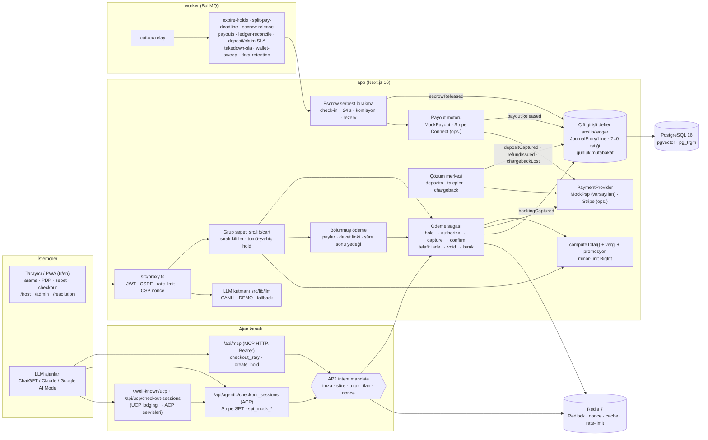

# booking-platform

**Çift rezervasyonu ve çift tahsilatı testlerle kanıtlanabilir biçimde imkânsız kılan, her kuruşu çift girişli bir defterde dengeli tutan, ajanların (MCP/ACP/UCP) kullanıcının imzaladığı sınırlı bir yetkiyle (AP2 mandate) insanlarla aynı güvenli akıştan rezervasyon yapabildiği ve GenAI'ı anahtar ve internet olmadan da çalışacak şekilde yalnızca açıklama ve özetleme için kullanan bir konaklama rezervasyon (OTA) platformu.**

> **Portföy/demo projesidir; gerçek ödeme alınmaz, gerçek konaklama satılmaz; vergi oranları ve mevzuat bilgisi eğitim amaçlıdır, hukuki/mali tavsiye değildir.**

Next.js 16 (App Router) · React 19 · TypeScript strict · PostgreSQL 16 + pgvector + pg_trgm · Prisma 5 · Redis 7 · BullMQ (FlowProducer) · Temporal (polyfill) · MCP (streamable HTTP + stdio) · gRPC · next-intl · jose + WebAuthn · OpenTelemetry · Prometheus · Vitest + testcontainers + fast-check · Playwright + axe · k6

Sürüm: **v4** ([CHANGELOG](CHANGELOG.md), [FINAL_REPORT](docs/FINAL_REPORT.md))

## Değer önerisi

1. **Para doğruluğu kanıtlanır, varsayılmaz.** Tüm tutarlar ISO 4217 üssüne göre `BigInt` minor-unit; her tahsilat, iade, escrow serbest bırakma, payout, depozito, cüzdan kredisi ve kaybedilen itiraz dengeli bir jurnal girişi yazar (DB tetiği Σ=0'ı zorlar); günlük mutabakat PSP gerçeğiyle farkı raporlar. Property testleri ve senaryolar her adımda "mizan dengede, fark 0" doğrular.
2. **Sektör devlerinin pazar yeri özellikleri, tek tutarlı çekirdek üstünde.** Grup sepeti (tümü-ya-hiç tutma), bölünmüş ödeme, check-in+24 saat escrow ve rezervli payout, hasar depozitosu + çözüm merkezi, sadakat/cüzdan, promosyon motoru (Omnibus 30 gün), esnek tarih fiyat takvimi, görsel arama, PWA — hepsi aynı kilit, saga, outbox ve defteri kullanır.
3. **Ajanlar için güvenli ticaret.** MCP, ACP ve UCP uçları insan checkout'uyla aynı sagayı çalıştırır; ödeme kullanıcının imzaladığı, süreli, tutar sınırlı (isteğe bağlı ilan kısıtlı) ve tek kullanımlık AP2 intent mandate'i olmadan yapılamaz; mandate verme recent-auth ister ve iptal edilebilir.

---

## Mimari



Ayrıntılar: [docs/ARCHITECTURE.md](docs/ARCHITECTURE.md) (defter, sepet/bölünmüş ödeme, escrow/payout/depozito ve mandate akış diyagramları; saga sekansı; hibrit arama) · kararlar: [docs/adr/](docs/adr/)

## Sektör kıyası

| Yetkinlik                   | Sektör liderleri                                     | v3.0.0                        | v4 (bu repoda)                                                                                                                                                                                         | Mock / sınır                                                                                  |
| --------------------------- | ---------------------------------------------------- | ----------------------------- | ------------------------------------------------------------------------------------------------------------------------------------------------------------------------------------------------------ | --------------------------------------------------------------------------------------------- |
| Çoklu oda / grup sepeti     | Booking/Expedia çok odalı; Airbnb group trips        | Tek oda tipi / rezervasyon    | `Cart` (≤`CART_MAX_ITEMS` kalem), sıralı kilitlerle tümü-ya-hiç tutma, tek PSP tahsilatı; bölünmüş ödeme (eşit/özel paylar, HMAC davet linki, süre sonu organizatör yedeği veya tam iade)              | Sepette/payda Stripe Payment Element ve passkey step-up yok (mock hosted fields, 3DS'e düşer) |
| Esnek tarih & fiyat takvimi | Google/Booking ±3 gün, ay ızgarası                   | Fiyat alarmı                  | `MinPriceByDate` materyalize tablosu + artımlı yenileme işi, PDP ay ızgarası (en ucuz gece, vergi dahil/hariç), aramada `flexDays` ±3 gün önerisi (teklif motoruyla kesin doğrulanır)                  | Takvim promosyonsuz taban fiyatı gösterir; kişi sayısı `PRICE_CALENDAR_GUESTS`                |
| Pazar yeri parası           | Vrbo Payments, Airbnb payouts, Stripe Connect        | `LedgerEntry` + simüle payout | Çift girişli dengeli jurnal (ADR 0020), günlük mutabakat raporu, check-in+`PAYOUT_RELEASE_HOURS` escrow, komisyon (`PLATFORM_COMMISSION_BPS`), rezerv, host payout takvimi, DAC7 dışa aktarımı         | Varsayılan `MockPayoutProvider`; Stripe Connect yalnız ağsız fake ile test edildi             |
| Depozito & çözüm merkezi    | Airbnb AirCover / Resolution Center                  | Yok                           | Off-session depozito ön provizyonu, misafir iade / ev sahibi hasar talepleri, kanıt yükleme (EXIF silinir), yanıt SLA'sı, admin kararı, chargeback senkronu + kaybedilen itiraz jurnali                | MockPsp varsayılan; Stripe depozito yalnız fake ile                                           |
| Güven & emniyet             | Booking/Airbnb kimlik doğrulama, parti riski         | Fraud v2 + passkey step-up    | KYC (`IdentityVerification`, Stripe Identity sağlayıcısı + deterministik mock), mesajda dolandırıcılık bağlantısı/IBAN taraması, kural tabanlı parti riski skoru → ev sahibine uyarı                   | Varsayılan KYC mock; parti riski yalnız uyarı (onay adımı yok)                                |
| Sadakat & cüzdan            | Genius, One Key                                      | Yok                           | Seviyeler + cashback kredisi (defterde `guest_credit`), kredi ile kısmi ödeme, FIFO lot, süre dolumu                                                                                                   | Sepet/bölünmüş ödemede kredi kullanılamaz                                                     |
| Promosyonlar                | Early-bird, last-minute, mobile rate, kupon          | Fiyat planları                | Kural tabanlı motor (öncelik, birleşme grubu, tavan, gerekçe kodları), kupon limiti yarışsız, Omnibus 30 gün referansı (`InventoryPriceHistory` DB tetiği)                                             | Sepette kupon yok (otomatik promosyonlar uygulanır)                                           |
| AI yorum & karşılaştırma    | Airbnb AI review highlights, listing comparison      | LLM yorum özeti               | Cümle embedding + k-means kümeleri, **birebir alıntı guard'lı** öne çıkanlar; 2–4 ilanın `createQuote` toplamlarıyla yapılandırılmış karşılaştırması                                                   | DEMO modunda kümenin merkezine en yakın gerçek cümleler                                       |
| Görsel zekâ                 | Airbnb fotoğraf sınıflandırma, Trip.com görsel arama | Yok                           | Bulanıklık/pozlama kalite skoru, 64-bit pHash duplikat tespiti, CLIP ile "bu fotoğraftaki gibi" (RRF 3. liste)                                                                                         | CLIP opsiyonel bağımlılık, varsayılan kapalı (demo override'ı açar)                           |
| Ajan ticareti               | Google UCP lodging, ChatGPT apps, AP2                | MCP HTTP + ACP (mock token)   | ACP Stripe SPT yolu, UCP profil + checkout uçları, AP2 intent mandate (JWS; tutar/süre/ilan/nonce; iptal), MCP `checkout_stay`                                                                         | SPT yalnız fake ile test edildi; mandate HS256 (yalnız platform doğrular)                     |
| Mobil / PWA                 | Native uygulamalar, push                             | Responsive web                | Manifest + service worker, offline seyahat planı ve imzalı QR kartı (`/trips`), Web Push (fiyat düşüşü, check-in hatırlatması)                                                                         | VAPID anahtarı yoksa push kapalı                                                              |
| Erişilebilirlik             | ADA 36.302(e), EAA                                   | axe e2e                       | Kanıt fotoğraflı, admin doğrulamalı erişilebilirlik özellikleri + arama filtresi; koyu tema; WCAG 2.2 AA axe etiketleri                                                                                | Yerinde denetim yok (fotoğraf kanıtı)                                                         |
| Uyum otomasyonu             | DSA bildirim-ve-eylem, 7565 s. Kanun, 2024/1028      | Lisans mock + SDEP export     | 24 saat kaldırma SLA iş akışı + ihlal alarmı, DSA md.16/17/20 (bildirim, gerekçeli karar, itiraz, relist engeli), şeffaflık raporu, UBL-TR e-Arşiv üreticisi, konaklama vergisi tarihçesi, saklama işi | Bakanlık, GİB/özel entegratör ve AB kayıt servisleri mock                                     |
| Para hassasiyeti            | ISO 4217 tüm üsler                                   | `Decimal(10,2)`               | `BigInt` minor-unit kolonlar + ISO 4217 üs tablosu (JPY 0, KWD 3), tek half-up yuvarlama (ADR 0019)                                                                                                    | Eski ondalık API alanları geriye uyum için hâlâ yanıtlarda                                    |
| Hesap güvenliği             | Yeniden doğrulama, oturum yönetimi                   | Passkey + step-up             | `auth_time` recent-auth, işleme+tutara bağlı tek kullanımlık step-up, 24 s yeni passkey soğuması, oturum listesi + uzaktan çıkış, yeni cihaz e-postası (ADR 0024)                                      | —                                                                                             |

v3'ten devralınan yetkinlikler (oda tipi envanteri, vergi motoru, FX snapshot, hibrit arama + LTR, gelir paneli, kanal yöneticisi, mesajlaşma, i18n) değişmeden korunur; ayrıntı [docs/ARCHITECTURE.md](docs/ARCHITECTURE.md).

## Ekran görüntüleri

| Satır kalemli checkout (gece, konaklama vergisi, dahil KDV) | PDP fiyat içgörüsü (conformal aralık, "olağan" etiketi) |
| ----------------------------------------------------------- | ------------------------------------------------------- |
|  |            |
| **Host gelir paneli (`/host/revenue`)**                     | **Rezervasyon mesajlaşması (telefon numarası maskeli)** |
|                   |                    |
| **Akıllı filtre (doğal dil → filtre çipleri)**              | **Mülk sayfası (galeri, fiyat, atıflı yorum özeti)**    |
|            |                            |
| **Çok şehirli trip-planner (araçlı, grounded)**             | **Host extranet**                                       |
|                   |                      |
| **Ana sayfa**                                               | **Admin paneli (outbox, moderasyon, deney, fraud)**     |
|                              |                             |

**MCP `ui://stay-card` widget'ı:**


Görüntüler compose demo yığınından (seed'li, LLM demo modu) `npm run docs:screenshots` ile üretilir ([scripts/screenshots.ts](scripts/screenshots.ts)). Dürüstlük notları:

- MCP kartı gerçek `POST /api/mcp` yanıtlarından (`resources/read ui://stay-card` + `tools/call search_stays`) çizilir, ancak ChatGPT/Claude istemcisinin ekran görüntüsü **değildir**: şablon, Apps SDK'nın sağladığı `window.openai.toolOutput` ile aynı biçimde beslenerek boş bir sayfada render edilir.
- Bu görüntüler v3 arayüzündendir; v4 ekranları (fiyat takvimi, sepet, bölünmüş ödeme, çözüm merkezi, payout paneli) henüz bu tabloya eklenmedi.
- Gelir paneli görüntüsündeki mülkte seçilen pencerede satış olmadığı için metrikler sıfırdır.

## 30 saniyede çalıştır

Gereksinim: Docker (Compose v2). `.env` dosyası gerekmez (varsa okunur).

```bash
docker compose -f docker-compose.yml -f docker-compose.demo.yml up
```

→ <http://localhost:3000> (ilk açılışta imajlar derlenir; kod değiştirdiyseniz sona `--build` ekleyin)

- **Demo override'ı:** `docker-compose.demo.yml` demo modunu (demo seed, `/dev/mailbox`, MockPsp, kalıcı "DEMO" şeridi), http çerezini ve görsel aramayı (`VISION_CLIP_ENABLED=true`) açar. Tek başına `docker compose up` güvenli varsayılanlarla (Secure çerez, `DEMO_MODE=false`) production gibi davranır.
- **Sırlar otomatik üretilir.** `secrets-init` servisi ilk açılışta JWT, iç API, transfer imza, webhook, metrik, Postgres ve Redis sırlarını rastgele üretip `booking_secrets` volume'una yazar. İmajlarda sır yoktur.
- **Demo verisi:** `migrate` servisi `prisma migrate deploy` çalıştırır, ardından `DEMO_SEED` açıksa ve veritabanı boşsa seed yükler (v4 eki: ev sahibi payout hesabı, 4 promosyon + `HOSGELDIN` kuponu, ilan fotoğrafları, doğrulanmış erişilebilirlik özellikleri). `DEMO_MODE` kapalıyken demo seed reddedilir ve `/dev/mailbox` 404 döner (`src/lib/config/seed-guard.ts`).
- **Anahtar ve internet gerekmez:** LLM → DEMO, ödeme ve payout → mock, KYC → mock, e-Arşiv entegratörü → mock, FX → statik yedek, kayıt no → mock registry, embedding → hash, SMTP → dev mailbox, Web Push → kapalı.
- Demo durumunu sıfırlamak: `npm run demo:reset`; 14 uçtan uca senaryo (7 HTTP + 7 v4 süreç içi, her v4 senaryosunda mizan ve mutabakat kontrolü): `npm run demo:scenarios`.
- Yerel geliştirme: `npm run db:up` → `npm run db:migrate && npm run db:seed` → `npm run dev` ve ayrı terminalde `npm run worker`.

### Demo kullanıcılar

> **UYARI — YALNIZCA DEMO.** Bu hesaplar yalnızca `docker-compose.demo.yml` override'ıyla (`DEMO_MODE=true`) seed edilir ve herkesçe bilinen bir parola kullanır. Temel compose ve production'da seed devre dışıdır.

| Rol           | E-posta                                               | Parola         |
| ------------- | ----------------------------------------------------- | -------------- |
| Misafir       | `guest@booking.test`                                  | `Password123!` |
| Ev sahibi     | `host@booking.test`                                   | `Password123!` |
| Admin         | `admin@booking.test`                                  | `Password123!` |
| Ek misafirler | `elif@test.com`, `mehmet@test.com`, `zeynep@test.com` | `Password123!` |

Demo kullanıcılarının e-postası doğrulanmıştır (rezervasyon/ödeme/devir doğrulanmış e-posta ister). Test kartları (mock hosted fields, tarayıcıda token'a çevrilir): `4242 4242 4242 4242` onay, `4000 0000 0000 0002` ret, `4000 0000 0000 3220` 3DS (doğrulama kodu `123456`). SMTP yapılandırılmamışsa e-postalar (bölünmüş ödeme davetleri dahil) <http://localhost:3000/dev/mailbox> sayfasına düşer.

3 dakikalık demo akışı: [docs/DEMO_SCRIPT.md](docs/DEMO_SCRIPT.md)

## LLM modu

Tüm LLM erişimi `src/lib/llm/` sözleşmesinden geçer ([ADR 0005](docs/adr/0005-llm-contract.md), [MODEL_CARD](docs/MODEL_CARD.md)).

| Mod                  | Ne zaman                                                            | Davranış                                                                                          |
| -------------------- | ------------------------------------------------------------------- | ------------------------------------------------------------------------------------------------- |
| **DEMO**             | Anahtar yok veya `LLM_MODE=demo`                                    | Ağa hiç çıkmaz; görev başına deterministik üreticiler gerçek verilerden çıktı üretir              |
| **CANLI**            | `.env` içinde `LLM_API_KEY` tanımlı ve `LLM_MODE=auto` (varsayılan) | OpenAI-uyumlu Chat Completions (varsayılan model `deepseek-v4-flash`, `LLM_BASE_URL` ile değişir) |
| **fallback** (çağrı) | Canlı çağrıda timeout / 429 / 5xx / geçersiz JSON / guard / bütçe   | O çağrı için demo çıktısı, `llmMode: "fallback"` + kısa `reason` kodu; API yine 200 döner         |

- `GET /api/llm/status` (giriş gerekli) etkin modu gösterir; anahtarın kendisi hiçbir yanıtta, logda veya telemetride görünmez. `npm run llm:smoke` anahtar yoksa "DEMO — smoke atlandı" ile 0 döner.
- LLM **asla** fiyat, vergi, müsaitlik, iade, fraud, KYC, moderasyon, promosyon veya sıralama kararı vermez; çıktıdaki her sayı ve (yorum öne çıkanlarında) her alıntı guard'lardan geçer, LLM'e giden her metin KVKK redaksiyonundan geçer. Tüm LLM yolları kullanıcı başına günlük token bütçesine tabidir ve süreç çapında `LLM_MAX_CONCURRENCY` (4) ile sınırlanır (v4#3).

### Ajanlar için: MCP, ACP, UCP ve mandate

| Kanal                                                   | Kimlik                                                   | Araçlar / uçlar                                                                                                                                           |
| ------------------------------------------------------- | -------------------------------------------------------- | --------------------------------------------------------------------------------------------------------------------------------------------------------- |
| `POST /api/mcp` (streamable HTTP)                       | `Authorization: Bearer <access token>`                   | `search_stays`, `get_quote`, `create_hold`, `checkout_stay` (SPT + mandate), `get_price_insight`, `list_my_bookings`, `cancel_booking` + `ui://stay-card` |
| `npm run mcp:server` (stdio)                            | `MCP_ACCESS_TOKEN` ortam değişkeni                       | Aynı araç kümesi (`services/mcp/`)                                                                                                                        |
| `/api/agentic/checkout_sessions` (ACP)                  | Giriş + `Idempotency-Key`; tamamlamada `mandate`         | Oluştur → güncelle → `…/[id]/complete`; ödeme `spt_…` (Stripe) veya `spt_mock_*`; insan checkout'uyla aynı saga                                           |
| `/.well-known/ucp` + `/api/ucp/checkout-sessions` (UCP) | Profil herkese açık; oturum uçları giriş ister           | UCP lodging şemasını ACP servislerine eşler                                                                                                               |
| `/api/account/agent-mandates`                           | Doğrulanmış e-posta + recent-auth (verme); giriş (liste) | AP2 intent mandate verme, listeleme, `DELETE …/[nonce]` ile iptal                                                                                         |

Access token `POST /api/auth/login` yanıtındaki `accessToken` alanından alınır. Mandate'siz, süresi dolmuş, limiti aşan, başka kullanıcıya ait, iptal edilmiş veya tekrar oynatılan mandate PSP'ye gitmeden reddedilir (403/402/409 `MANDATE_*`). Duman testi: `npm run mcp:smoke` (mandate'li başarı + ret yolları). Karar: [ADR 0023](docs/adr/0023-agentic-commerce-mandates.md).

## v4 özellikleri

- **Güvenlik düzeltmeleri v4#1–#20** — her biri `regression: v4#N` testiyle ([SECURITY §5](docs/SECURITY.md)): devir capture-önce-commit sagası, recent-auth ve işleme bağlı step-up, LLM bütçe/eşzamanlılık, anonim rate-limit anahtarı, güvenli compose varsayılanları, doğrulanmış e-posta zorunluluğu, iptal–capture yarışı, geç webhook mutabakatı, idempotency gövde bağı, SSRF, PoW'lu giriş sertleştirmesi, 3DS deneme sınırı, cursor sayfalama, minor-unit para, webhook sağlayıcı ayrımı, son admin koruması, HLL görüntülenme sayacı, ARI para doğrulaması, `.env.*` ignore.
- **Para çekirdeği:** `BigInt` minor-unit (ADR 0019), çift girişli defter + günlük mutabakat + `GET /api/admin/reconciliation` (ADR 0020).
- **Grup sepeti ve bölünmüş ödeme** (`/cart`, `/checkout/cart`, `/pay/share/[token]`), sepet geç-başarı uzlaştırması.
- **Escrow, payout, rezerv, DAC7** (`/host/payouts`, `/admin/payouts`, `npm run dac7:export`) ve **hasar depozitosu + çözüm merkezi** (`/resolution`, `/admin/claims`) (ADR 0021).
- **Güven & emniyet:** KYC, mesaj dolandırıcılık taraması, parti riski paneli.
- **Sadakat ve cüzdan**, **promosyon motoru + kupon + Omnibus referansı**.
- **Esnek tarih fiyat takvimi** ve aramada ±N gün önerisi.
- **AI yorum öne çıkanları** (alıntı guard'lı) ve **ilan karşılaştırma** (`/compare`).
- **Görsel zekâ:** fotoğraf kalite skoru, pHash duplikat, CLIP görsel arama (ADR 0022).
- **Ajan ticareti v2:** ACP SPT, UCP, AP2 mandate (ADR 0023).
- **PWA + Web Push:** offline seyahat planı, QR kartı, fiyat düşüşü/check-in bildirimleri.
- **Uyum otomasyonu:** 7565 24 saat SLA, DSA bildirim/karar/itiraz + şeffaflık raporu, UBL-TR, erişilebilirlik özellikleri, veri saklama işi ([COMPLIANCE](docs/COMPLIANCE.md)).
- **Hesap:** oturum listesi ve uzaktan çıkış (`/account/sessions`), yeni cihaz bildirimi (ADR 0024); koyu tema; WCAG 2.2 AA.
- **Demo:** 7 yeni süreç içi v4 senaryosu, isteğe bağlı Inside Airbnb içe aktarımı.

## Neyi kanıtlıyor?

Aşağıdaki iddiaların her biri gerçek PostgreSQL + Redis (testcontainers) üzerinde koşan entegrasyon testleriyle korunur:

| İddia                                                                              | Test                                                                                                                                                                                                                                    |
| ---------------------------------------------------------------------------------- | --------------------------------------------------------------------------------------------------------------------------------------------------------------------------------------------------------------------------------------- |
| Son oda için eşzamanlı iki istekten yalnız biri kazanır                            | [booking-concurrency.test.ts](tests/integration/booking-concurrency.test.ts) — "aynı oda ve tarih için iki eşzamanlı istekten yalnız biri rezervasyon yaratır"; "aynı Idempotency-Key ile tekrar eden istek aynı rezervasyonu döndürür" |
| Oda tipi sayaçları aşırı satış yapmaz                                              | [v3-inventory.test.ts](tests/integration/v3-inventory.test.ts) — "P0-2: units=3 oda tipine 100 paralel rezervasyon → tam 3 başarılı, kalanlar 409 SOLD_OUT/ROOM_BUSY"                                                                   |
| Çift tahsilat yoktur                                                               | [v3-payment-race.test.ts](tests/integration/v3-payment-race.test.ts) — "regression: v3#1 50 paralel ödeme (farklı Idempotency-Key) → tam 1 capture, defter = toplam"                                                                    |
| Saganın her adımındaki hata telafi edilir, para asılı kalmaz                       | [v3-saga.test.ts](tests/integration/v3-saga.test.ts) — hold, authorize, capture, confirm adımlarında hata → tutma bırakılır, para iade/void, defter dengede                                                                             |
| Ters sıralı 100 paralel sepet aşırı satmaz ve tümü-ya-hiç tutar                    | [v4-cart.test.ts](tests/integration/v4-cart.test.ts)                                                                                                                                                                                    |
| Her para akışında mizan dengede, mutabakat farkı 0                                 | [v4-ledger-flows.test.ts](tests/integration/v4-ledger-flows.test.ts) (ödeme → kısmi iade → iptal → devir → payout; fast-check rastgele akışlar), [ledger-templates.test.ts](tests/unit/ledger/ledger-templates.test.ts)                 |
| Bölünmüş ödemede çift ödeme ve süre sonu yarışları tutarlı                         | [v4-split-payment.test.ts](tests/integration/v4-split-payment.test.ts)                                                                                                                                                                  |
| Escrow süresinden önce payout yok; iade/serbest bırakma sonrası host eksiye düşmez | [v4-payouts.test.ts](tests/integration/v4-payouts.test.ts), [v4-resolution.test.ts](tests/integration/v4-resolution.test.ts), [v4-fix-sweep-2.test.ts](tests/integration/v4-fix-sweep-2.test.ts)                                        |
| Mandate'siz / aşan / tekrar oynatılan ajan ödemesi reddedilir                      | [p1-11-agentic-mandates.test.ts](tests/integration/p1-11-agentic-mandates.test.ts)                                                                                                                                                      |
| Çalınan oturum hassas işlem yapamaz; kurban onu uzaktan kapatır                    | [v4-sessions.test.ts](tests/integration/v4-sessions.test.ts), [v4-recent-auth.test.ts](tests/integration/v4-recent-auth.test.ts)                                                                                                        |
| Minor-unit geçişi toplamları korur (KWD/JPY dahil)                                 | [v4-money-backfill.test.ts](tests/integration/v4-money-backfill.test.ts), [currencies.test.ts](tests/unit/money/currencies.test.ts)                                                                                                     |

Yük ve kaos ölçümleri: [docs/perf/](docs/perf/). Arama kalitesi ([docs/perf/ltr.md](docs/perf/ltr.md)): 30 sorguluk altın kümede nDCG@10 v2 0.2377 → hibrit RRF 0.8733; sentetik tıklama verisinde LTR 0.7343 → 0.8130. **LTR verisi sentetiktir**, gerçek kullanıcı davranışını temsil etmez.

## Testler ve betikler

```bash
npm run check          # lint + typecheck + prettier --check + unit testler (altyapısız)
npm run test:unit      # tests/unit/** — Docker gerekmez
npm run test:int       # tests/integration/** — Docker gerekir (testcontainers)
npm run test:coverage  # unit + integration, kapsam eşiği (Docker gerekir)
npm run test:e2e       # Playwright + axe, çalışan demo yığınına karşı
```

| Script                                           | Ne yapar                                                                                |
| ------------------------------------------------ | --------------------------------------------------------------------------------------- |
| `dev` / `build` / `start`                        | Next.js geliştirme / derleme / çalıştırma                                               |
| `lint` / `typecheck` / `format` / `format:check` | ESLint (0 uyarı), `tsc --noEmit`, Prettier                                              |
| `db:up` / `db:migrate` / `db:seed`               | Dev compose (Postgres + Redis), `prisma migrate deploy`, seed                           |
| `worker`                                         | BullMQ worker (bakım, fiyat, saga, uyum, çözüm kuyrukları + outbox relay)               |
| `grpc:server`                                    | gRPC `BookingService` + `AriService`                                                    |
| `mcp:server` / `mcp:smoke`                       | stdio MCP sunucusu / duman testi (mandate'li rezervasyon + ret yolları)                 |
| `llm:smoke`                                      | Canlı LLM için 1 JSON + 1 metin çağrısı (anahtar yoksa atlanır)                         |
| `demo:reset` / `demo:scenarios`                  | Demo verisini sıfırlar / 14 senaryoyu koşar (7 HTTP + 7 v4 süreç içi, özet tablo)       |
| `import:insideairbnb`                            | Inside Airbnb İstanbul alt kümesi + opsiyonel OSM POI içe aktarımı (ağ yoksa atlar)     |
| `docs:screenshots`                               | README ekran görüntülerini üretir                                                       |
| `embeddings:backfill`                            | Mülk embedding'lerini yeniden üretir                                                    |
| `vision:download` / `vision:backfill`            | CLIP modelini indirir (opsiyonel) / fotoğraf kalite, pHash ve embedding'lerini doldurur |
| `ltr:clicks` / `ltr:train`                       | Sentetik tıklama günlüğü üretir / LightGBM lambdarank → ONNX eğitir (Python)            |
| `availability:rollover`                          | Envanter ufkunu ileri taşır                                                             |
| `money:backfill`                                 | Ondalık → minor-unit kolon backfill'i (idempotent; eski kolon yoksa atlar)              |
| `data:retention`                                 | Saklama politikası budaması (denetim, webhook, outbox, fiyat geçmişi …)                 |
| `sdep:export` / `dac7:export`                    | AB 2024/1028 SDEP CSV / DAC7 ev sahibi raporu (JSON/CSV, takma adlı seçenek)            |
| `i18n:check`                                     | tr/en mesaj anahtarı eşitliği                                                           |

Entegrasyon testleri hiçbir zaman `DATABASE_URL`'e yazmaz; container'ın URL'ini kullanır. Testler ağa çıkmaz (`tests/setup.ts` global `fetch`'i engeller). CI: [.github/workflows/ci.yml](.github/workflows/ci.yml).

## Gözlemlenebilirlik

```bash
docker compose --profile observability up --build
```

Prometheus <http://127.0.0.1:9090>, Grafana <http://127.0.0.1:3001> (dashboard: `docs/observability/grafana-dashboard.json`), Tempo (OTLP). `/api/metrics` `METRICS_TOKEN` ile korunur; worker metrikleri 9464 portundadır (ör. `saga_compensation_total`, `ledger_imbalance_total`, `takedown_sla_breach_total`). `/api/health` (liveness) ve `/api/ready` (DB + Redis) açıktır.

## Dürüstlük notu: mock / demo olanlar

Aşağıdakiler gerçek bir dış servise **bağlı değildir** ya da yalnızca ağsız sahte (fake) istemcilerle test edilmiştir:

| Bileşen                                                         | Durum                                                                                                                                                                      |
| --------------------------------------------------------------- | -------------------------------------------------------------------------------------------------------------------------------------------------------------------------- |
| Ödeme                                                           | Varsayılan **`MockPsp`** (`PAYMENT_PROVIDER=mock`). Stripe PaymentIntent/webhook sağlayıcısı kodda; testler kayıtlı yanıtlarla ve ağsız `tests/support/stripe-fake.ts` ile |
| Stripe SPT (ACP), Stripe Connect, Customer/off-session depozito | Yalnız ağsız fake ile test edildi; Stripe test modu hesabıyla canlı smoke **yapılmadı**. SPT uç/parametre adları önizleme API'sine göre modellendi                         |
| KYC                                                             | Varsayılan deterministik **mock** (`MockIdentityProvider`, test belgeleri); Stripe Identity sağlayıcısı yalnız anahtar + webhook sırrı varken, canlı test yok              |
| Payout                                                          | Varsayılan **`MockPayoutProvider`** (`acct_mock_`, `po_mock_`); Stripe Connect onboarding linki ve payout webhook'ları yok                                                 |
| e-Arşiv / e-Fatura                                              | PDF "DEMO — mali değeri yoktur"; UBL-TR XML üreticisi + **mock entegratör** (`MockEInvoiceIntegrator`); GİB/özel entegratör bağlantısı yok, XSD doğrulaması yok            |
| Lisans / kayıt no, 7565 talepleri, SDEP                         | Bakanlık ve AB kayıt servisleri **mock**; resmî yazılar elle girilir; SDEP ve DAC7 yalnız dosyaya dışa aktarılır                                                           |
| Görsel arama (CLIP)                                             | `@huggingface/transformers` **opsiyonel** bağımlılık, varsayılan `VISION_CLIP_ENABLED=false`; model yoksa özellik gerekçe koduyla kapalı                                   |
| Embedding / LTR                                                 | Varsayılan embedding hash (`hash-fnv1a-128-syn`); LTR **sentetik** tıklamalarla eğitildi                                                                                   |
| LLM                                                             | Anahtar yoksa DEMO; demo çıktıları deterministik şablonlardır                                                                                                              |
| Web Push                                                        | VAPID anahtarı yoksa kapalı (`/api/push/subscription` 503 `PUSH_DISABLED`)                                                                                                 |
| AP2 mandate                                                     | HS256 — yalnız platform doğrulayabilir (üçüncü taraf doğrulaması için ES256/EdDSA + JWKS gerekir)                                                                          |
| Parti riski                                                     | Yalnız uyarı + panel; ev sahibi onay adımı yok                                                                                                                             |
| Harita, FX                                                      | İnternet yoksa statik `data/fx-rates.json`                                                                                                                                 |

Bilinen sınırlamaların tamamı: [docs/ARCHITECTURE.md §13](docs/ARCHITECTURE.md), [docs/SECURITY.md](docs/SECURITY.md), [docs/COMPLIANCE.md](docs/COMPLIANCE.md).

## Dokümantasyon

| Doküman                                      | İçerik                                                                                              |
| -------------------------------------------- | --------------------------------------------------------------------------------------------------- |
| [ARCHITECTURE](docs/ARCHITECTURE.md)         | Bounded context'ler, envanter v2, saga, defter, sepet, escrow/payout/depozito, mandate diyagramları |
| [adr/](docs/adr/)                            | Mimari karar kayıtları 0001–0024 (aşağıda)                                                          |
| [MODEL_CARD](docs/MODEL_CARD.md)             | LLM görevleri, LTR (sentetik veri uyarısı), conformal aralık, fotoğraf kalite skoru ve CLIP         |
| [METHODOLOGY](docs/METHODOLOGY.md)           | Vergi, conformal prediction, RRF, fraud, promosyon, yorum öne çıkanları guard'ı, parti riski        |
| [COMPLIANCE](docs/COMPLIANCE.md)             | TR/AB/ABD/PCI eşleme tablosu, "kodda nerede" referanslı (hukuki görüş değildir)                     |
| [SECURITY](docs/SECURITY.md)                 | STRIDE + v4 tehdit modeli, v3 ve v4#1–#20 düzeltme tabloları                                        |
| [DEMO_SCRIPT](docs/DEMO_SCRIPT.md)           | 3 dakikalık demo akışı + demo senaryoları                                                           |
| [FINAL_REPORT](docs/FINAL_REPORT.md)         | Faz faz yapılanlar, metrikler, sınırlamalar                                                         |
| [api-contract](docs/api-contract.md)         | Uç nokta sözleşmesi (v3 ve v4 bölümleri, hata kodları)                                              |
| [perf/](docs/perf/) · [chaos](load/chaos.md) | Performans, yük, kaos ve sıralama ölçümleri                                                         |
| [CHANGELOG](CHANGELOG.md)                    | Sürüm notları                                                                                       |

ADR'ler: [0001 modüler monolit](docs/adr/0001-modular-monolith.md) · [0002 iki katmanlı kilit](docs/adr/0002-two-layer-locking.md) · [0003 transactional outbox](docs/adr/0003-transactional-outbox.md) · [0004 minor-unit para ve quote](docs/adr/0004-minor-unit-money-quote.md) · [0005 LLM sözleşmesi](docs/adr/0005-llm-contract.md) · [0006 availability partisyonu](docs/adr/0006-availability-partitioning.md) · [0007 devir claim linki ve escrow](docs/adr/0007-transfer-claim-link-escrow.md) · [0008 hash vs gerçek embedding](docs/adr/0008-hash-vs-real-embedding.md) · [0009 Next 16 yükseltmesi](docs/adr/0009-framework-upgrade-next16.md) · [0010 oda tipi envanteri](docs/adr/0010-room-type-inventory-counters.md) · [0011 tesis saat dilimi](docs/adr/0011-property-time-zone-temporal.md) · [0012 vergi motoru ve kalıcı FX](docs/adr/0012-tax-engine-and-persistent-fx.md) · [0013 ödeme sagası](docs/adr/0013-payment-saga.md) · [0014 hibrit arama ve LTR](docs/adr/0014-hybrid-search-ltr-experiments.md) · [0015 ajan rezervasyonu ve gelir paneli](docs/adr/0015-agentic-booking-channel-revenue.md) · [0016 legacy fiyat ve pazarlık](docs/adr/0016-legacy-pricing-and-negotiation.md) · [0017 mesajlaşma, moderasyon, step-up](docs/adr/0017-messaging-moderation-step-up.md) · [0018 i18n](docs/adr/0018-i18n-namespaces-and-formatting.md) · [0019 BigInt minor-unit para](docs/adr/0019-minor-unit-bigint-money.md) · [0020 çift girişli defter ve mutabakat](docs/adr/0020-double-entry-ledger.md) · [0021 escrow, payout, rezerv, depozito](docs/adr/0021-escrow-payout-deposit.md) · [0022 çok-modlu arama](docs/adr/0022-multimodal-search.md) · [0023 ajan ticareti ve mandate'ler](docs/adr/0023-agentic-commerce-mandates.md) · [0024 recent-auth ve step-up bağlama](docs/adr/0024-recent-auth-step-up-binding.md)

## Yasal uyarı ve atıflar

**Portföy/demo projesidir; gerçek ödeme alınmaz, gerçek konaklama satılmaz; vergi, fatura, DAC7, KYC ve diğer regülasyon uygulamaları eğitim amaçlıdır, hukuki/mali tavsiye değildir.** Mock e-Arşiv faturalarda "DEMO — mali değeri yoktur" yazar. Uyum dokümanı hukuki görüş değildir. Demo yığını internete açık bir ortamda çalıştırılmamalıdır.

- Harita/konum verisi: © OpenStreetMap katkıda bulunanları, [ODbL](https://opendatacommons.org/licenses/odbl/) lisansıyla.
- Görseller: [Unsplash](https://unsplash.com) (Unsplash License); fotoğraflar sahiplerine aittir. Ağ yoksa seed, sharp ile üretilmiş sentetik sahneler kullanır.
- Seed verisi (kullanıcılar, yorumlar, fiyat geçmişi) ve LTR tıklama günlüğü deterministik olarak üretilmiş kurgusal veridir.

### Veri atfı (Inside Airbnb)

`npm run import:insideairbnb` ile isteğe bağlı içe aktarılan İstanbul ilanları [Inside Airbnb](https://insideairbnb.com/get-the-data/) verisinden uyarlanmıştır ve [CC BY 4.0](https://creativecommons.org/licenses/by/4.0/) lisansına tabidir: alt küme alınır, alanlar platform modeline eşlenir, ev sahibi adı/kimliği gibi kişisel alanlar içe alınmaz; her ilanın açıklamasında kaynak belirtilir. Veri repoya eklenmez (betik dosya/URL ile çalışır). `--osm` ile eklenen "yakındaki yerler" bilgisi © OpenStreetMap katkıda bulunanları, ODbL.

Lisans: [MIT](LICENSE)

---

## English summary

**booking-platform** is a portfolio-grade online travel agency (OTA) built with Next.js 16, PostgreSQL + pgvector, Redis and BullMQ. Money is stored as `BigInt` minor units (ISO 4217 exponents) and every capture, refund, escrow release, payout, damage deposit, wallet credit and lost chargeback posts a balanced double-entry journal (a deferred DB trigger enforces Σ=0), reconciled daily against PSP state. Group carts hold N room types all-or-nothing under ordered locks and can be paid by several people (split payment with deadline fallback); payouts are released 24 h after check-in with commission and a rolling reserve.

Agents book through MCP, ACP (Stripe Shared Payment Token path) or UCP endpoints that run the same saga as the web checkout, and every agent payment needs a user-signed, time- and amount-bound (optionally listing-bound), single-use AP2 intent mandate. Sensitive account actions require recent authentication; step-up tokens are bound to booking + amount + nonce. The LLM only explains and summarises (quote-guarded review highlights, listing comparison); without a key it runs a deterministic demo mode. Still mock by default: payments (`MockPsp`), payouts, KYC (Stripe Identity mock), e-Arşiv integrator, license/STR registries; Stripe SPT/Connect/deposit paths are tested only against a network-less fake; CLIP visual search is optional.

Run it: `docker compose -f docker-compose.yml -f docker-compose.demo.yml up`, then open <http://localhost:3000>. Demo accounts (`guest@`, `host@`, `admin@booking.test`, password `Password123!`) exist **only with the demo override**. No real payments are taken and no real stays are sold; tax and regulatory features are for education only. Optional Inside Airbnb data is CC BY 4.0.
