# booking-platform

**Çift rezervasyonu ve çift tahsilatı testlerle kanıtlanabilir biçimde imkânsız kılan, vergiler dahil toplamı kuruşu kuruşuna tamsayı olarak hesaplayan, ajanların (MCP/ACP) insanlarla aynı güvenli akıştan rezervasyon yapabildiği ve GenAI'ı anahtar ve internet olmadan da çalışacak şekilde yalnızca açıklama ve özetleme için kullanan bir konaklama rezervasyon (OTA) platformu.**

> **Portföy/demo projesidir; gerçek ödeme alınmaz, gerçek konaklama satılmaz; vergi oranları ve mevzuat bilgisi eğitim amaçlıdır, hukuki/mali tavsiye değildir.**

Next.js 16 (App Router) · React 19 · TypeScript strict · PostgreSQL 16 + pgvector + pg_trgm · Prisma 5 · Redis 7 · BullMQ (FlowProducer) · Temporal (polyfill) · MCP (streamable HTTP + stdio) · gRPC · next-intl · jose + WebAuthn · OpenTelemetry · Prometheus · Vitest + testcontainers + fast-check · Playwright + axe · k6

Sürüm: **3.0.0** ([CHANGELOG](CHANGELOG.md), [FINAL_REPORT](docs/FINAL_REPORT.md))

---

## Mimari

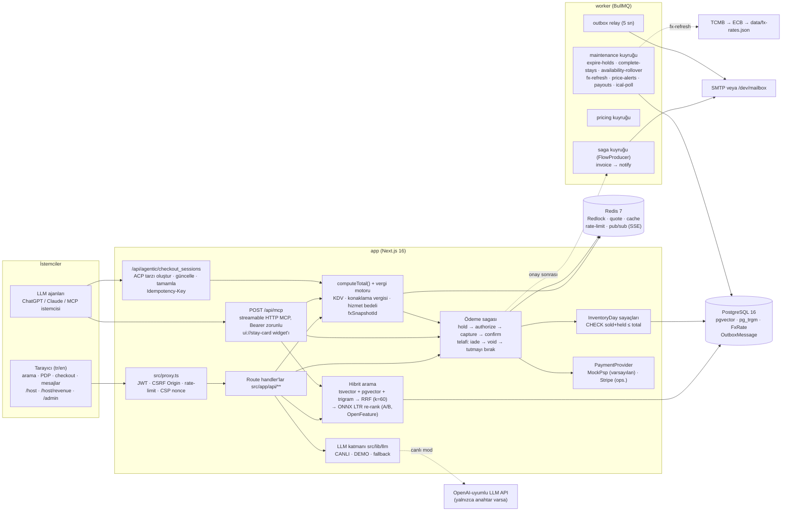

Ayrıntılar: [docs/ARCHITECTURE.md](docs/ARCHITECTURE.md) (saga sıralama diyagramı, hibrit arama SQL'i, ödeme durum makinesi) · kararlar: [docs/adr/](docs/adr/)

## Sektör kıyası (v3)

| Yetkinlik                | Sektör liderleri                                 | Bu repoda (v3.0.0)                                                                                                                                                                                                               | Mock / demo olan                                                                                              |
| ------------------------ | ------------------------------------------------ | -------------------------------------------------------------------------------------------------------------------------------------------------------------------------------------------------------------------------------- | ------------------------------------------------------------------------------------------------------------- |
| Envanter modeli          | Oda tipi × adet, rate plan, LOS/CTA/CTD          | `RoomType.units`, `RatePlan` (iade edilemez / kahvaltılı), `Restriction` (minStay/maxStay/CTA/CTD/stopSell), `InventoryDay{total, sold, held}` koşullu sayaç (ADR 0010); tesis saat dilimi (ADR 0011)                            | —                                                                                                             |
| Toplam fiyat şeffaflığı  | FTC (12.05.2025), Omnibus, "all-in" fiyat        | Veri tabanlı vergi motoru (`data/tax-rules.json`): KDV %10 (dahil), konaklama vergisi %1, `SERVICE_FEE_BPS`; kart = PDP = checkout = tahsilat, satır kalemli döküm; fiyat alarmında Omnibus 30 gün en düşük referansı (ADR 0012) | Vergi oranları eğitim amaçlıdır                                                                               |
| Çoklu para birimi        | Görüntü ≠ tahsilat para birimi, kur snapshot     | `FxRate` tablosu, günlük `fx-refresh` işi (TCMB → ECB → statik yedek, bayat işareti), teklif `fxSnapshotId` ile kuru sabitler                                                                                                    | İnternet yoksa statik `data/fx-rates.json`                                                                    |
| Ödeme                    | Stripe/Adyen, SCA/3DS, saga, payout              | Telafili saga (ADR 0013), rezervasyon başına ödeme kilidi, onay sonrası FlowProducer `invoice → notify`, `Payout` kaydı; Stripe PaymentIntent + imzalı webhook sağlayıcısı                                                       | **Varsayılan `MockPsp`** (`PAYMENT_PROVIDER=mock`); Stripe yalnız anahtarla; mock `payouts`; mock e-Arşiv PDF |
| Arama ve sıralama        | Smart Filter, yüzlerce sinyal, kişiselleştirme   | tsvector + pgvector + trigram + tam ifade → RRF; ONNX LightGBM LTR re-rank (`models/ranker.onnx`), OpenFeature `search-ranking` A/B deneyi, `/ranking` şeffaflık sayfası (ADR 0014)                                              | LTR **sentetik** tıklamalarla eğitildi; embedding varsayılanı hash (`hash-fnv1a-128-syn`, ADR 0008)           |
| Fiyat içgörüsü           | Expedia Price Insights, fiyat alarmı             | Split conformal %90 aralık + düşük/tipik/yüksek etiketi (`GET /api/price-insight`), `price-alerts` işi ile fiyat düşüş e-postası                                                                                                 | —                                                                                                             |
| Ev sahibi gelir yönetimi | Revenue management, Cloudbeds Signals            | `/host/revenue`: doluluk, ADR, RevPAR, pickup grafiği; katkı tablolu, her zaman [taban, tavan] içinde fiyat önerisi, kabul/ret (ADR 0015)                                                                                        | Açıklama metni LLM (demo modunda şablon)                                                                      |
| Kanal yöneticisi         | SiteMinder/Mews ARI push, parity                 | `ical-poll` işi (ETag / `If-Modified-Since`, SSRF korumalı), besleme token döndürme, idempotent gRPC ARI push, yalnız uyaran parite kontrolü                                                                                     | Gerçek bir OTA kanalı bağlı değil                                                                             |
| Mesajlaşma               | Smart Messenger                                  | Rezervasyon başına yazışma, Redis pub/sub + SSE, kayıttan önce telefon/e-posta/IBAN/URL/kart/TCKN maskeleme, onaysız gönderilmeyen AI taslak yanıt (ADR 0017)                                                                    | —                                                                                                             |
| Yorumlar                 | Doğrulanmış konaklama, AI özeti                  | Yalnız COMPLETED rezervasyon sahibi, alt puanlar, bildir → moderasyon kuyruğu, "AI tarafından üretildi" etiketi, atıflı özet                                                                                                     | —                                                                                                             |
| Kimlik ve risk           | Passkey, 2FA, risk tabanlı step-up               | Passkey (WebAuthn), e-posta doğrulama, şifre sıfırlama, hesap kilitleme, `tokenVersion`; gerekçe kodlu fraud v2 → `allow / challenge_3ds / step_up_passkey / review / deny`                                                      | —                                                                                                             |
| Ajan rezervasyonu        | ChatGPT apps (Booking/Expedia), Expedia MCP      | `/api/mcp` streamable HTTP (Bearer, 401 + `WWW-Authenticate`), `ui://stay-card` widget'ı, 6 araç; ACP tarzı `checkout_sessions` insan akışıyla aynı sagayı çalıştırır                                                            | Tam OAuth yetkilendirme sunucusu yok (uygulamanın access token'ı); ACP ödeme belirteci mock (`spt_mock_*`)    |
| Uyum                     | 7565 s. Kanun belge no, AB 2024/1028 + SDEP, EAA | Belge/kayıt no doğrulaması, VERIFIED olmayan ilan aramada görünmez, SDEP CSV (`npm run sdep:export`), KVKK dışa aktarma/silme — bkz. [COMPLIANCE](docs/COMPLIANCE.md)                                                            | **Mock** Bakanlık/AB kayıt servisi (`src/lib/compliance/license-registry.ts`)                                 |
| Çok dillilik             | 40+ dil                                          | Tüm arayüz tr/en (next-intl, ad alanlı mesajlar), `Intl` ile tarih/para/sayı, iki dilli e-posta, `npm run i18n:check` (ADR 0018)                                                                                                 | Yalnız iki dil                                                                                                |

## Ekran görüntüleri

| Satır kalemli checkout (gece, konaklama vergisi, dahil KDV) | PDP fiyat içgörüsü (conformal aralık, "olağan" etiketi) |
| ----------------------------------------------------------- | ------------------------------------------------------- |
| 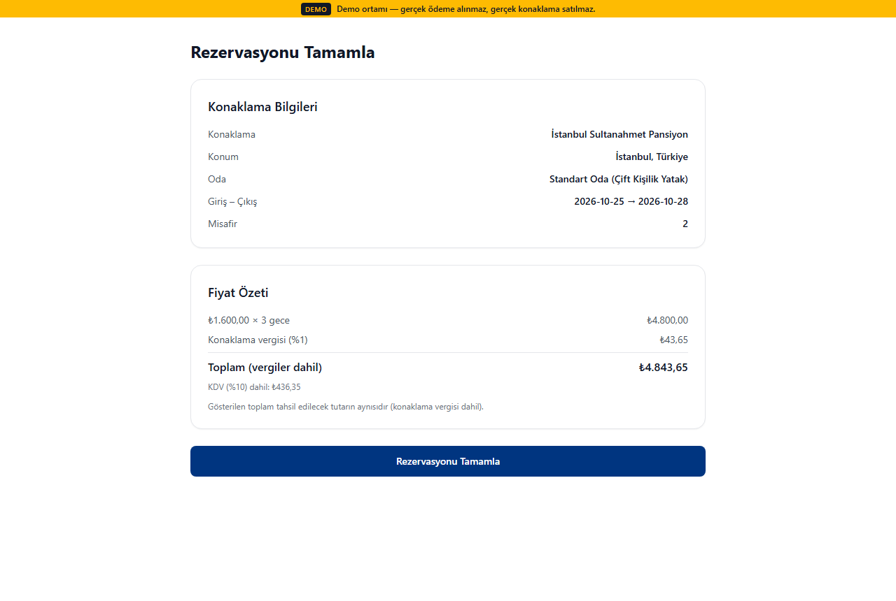 | 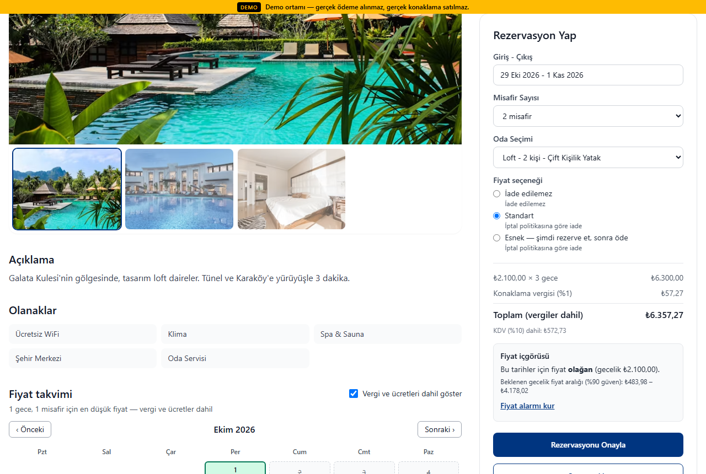           |
| **Host gelir paneli (`/host/revenue`)**                     | **Rezervasyon mesajlaşması (telefon numarası maskeli)** |
| 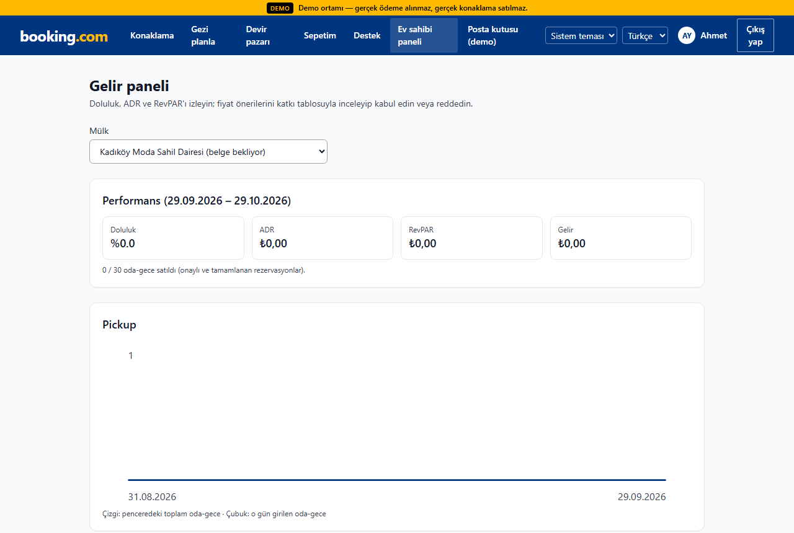                  | 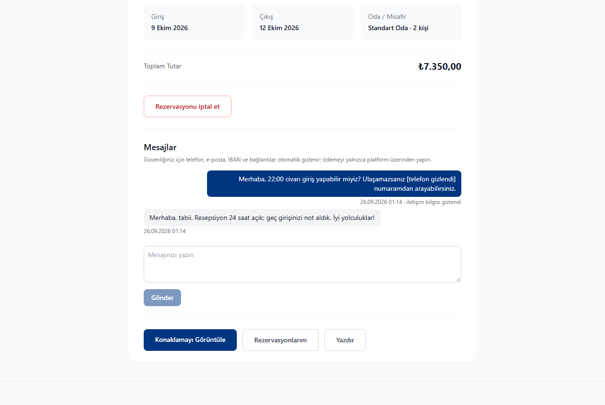                   |
| **Akıllı filtre (doğal dil → filtre çipleri)**              | **Mülk sayfası (galeri, fiyat, atıflı yorum özeti)**    |
|            | 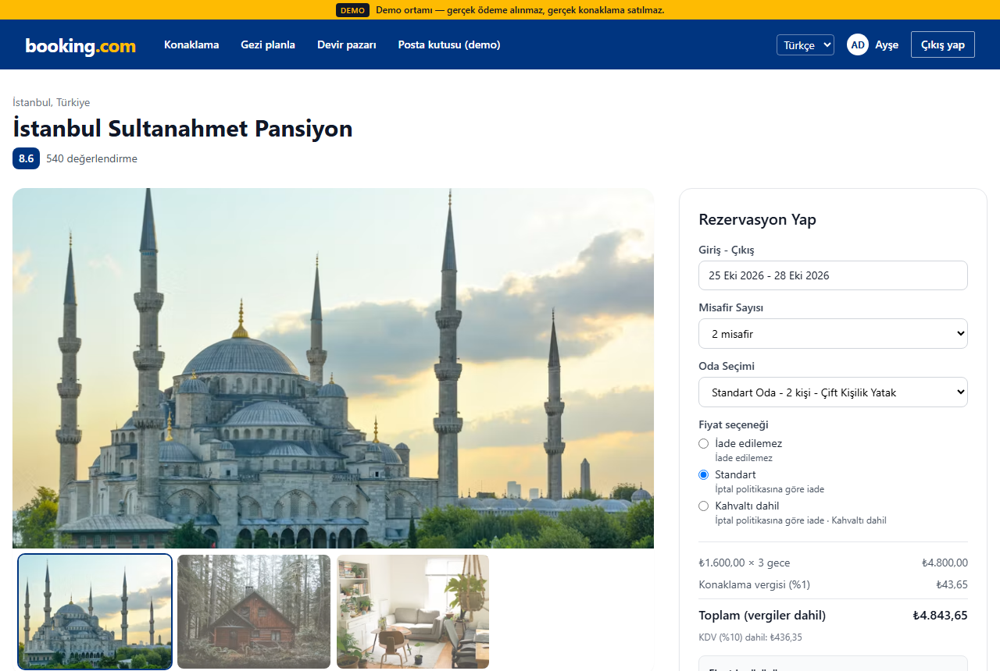                           |
| **Çok şehirli trip-planner (araçlı, grounded)**             | **Host extranet**                                       |
| 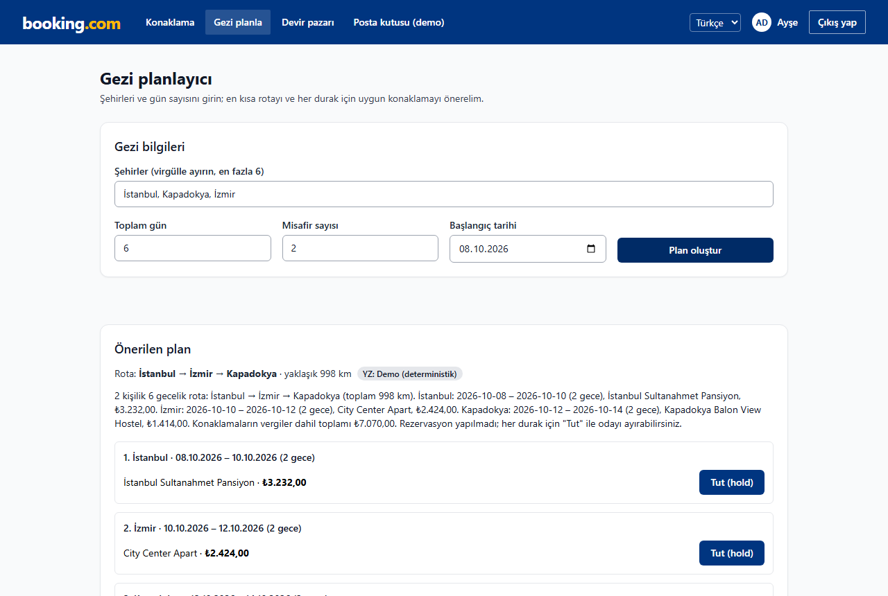                  | 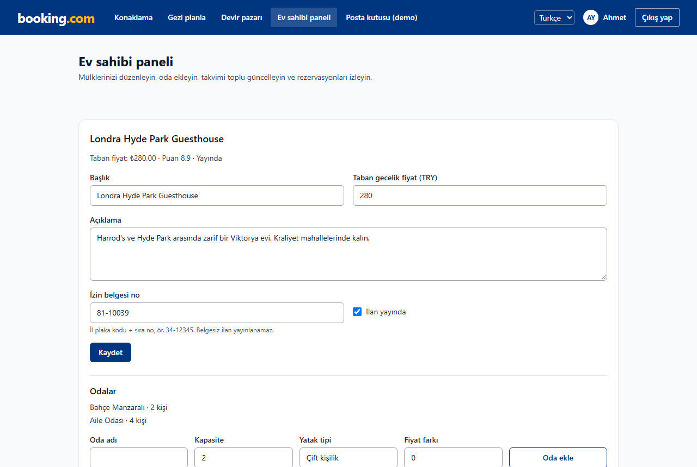                     |
| **Ana sayfa**                                               | **Admin paneli (outbox, moderasyon, deney, fraud)**     |
| 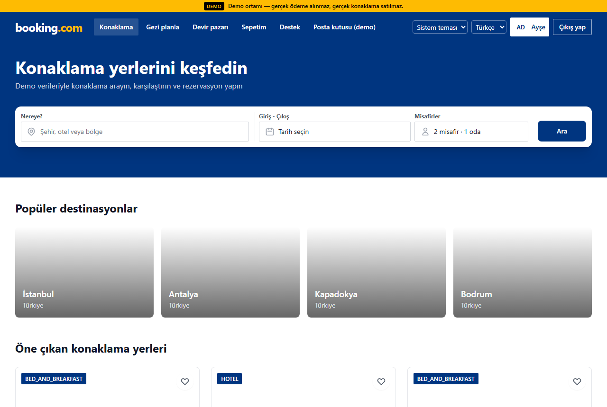                             | 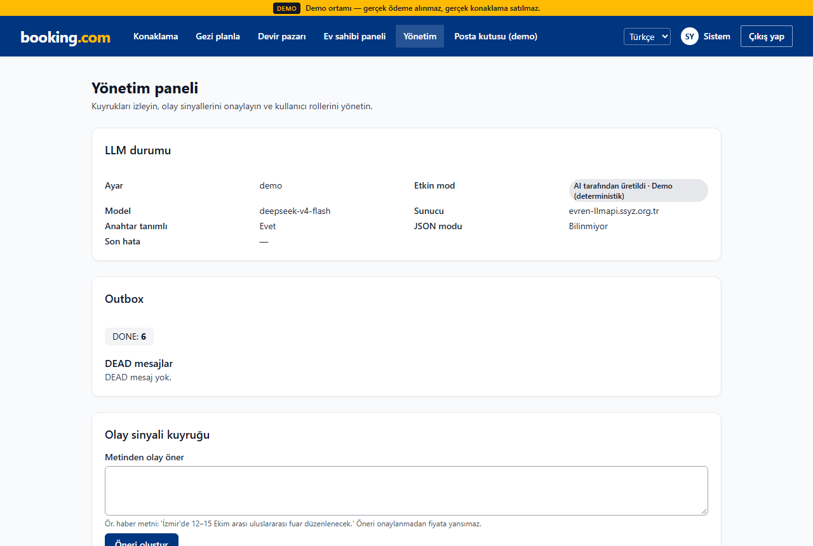                            |

**MCP `ui://stay-card` widget'ı:**

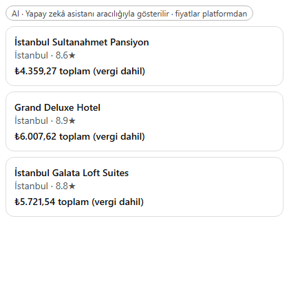

Görüntüler compose demo yığınından (seed'li, LLM demo modu) `npm run docs:screenshots` ile üretilir ([scripts/screenshots.ts](scripts/screenshots.ts)). Dürüstlük notları:

- MCP kartı gerçek `POST /api/mcp` yanıtlarından (`resources/read ui://stay-card` + `tools/call search_stays`) çizilir, ancak ChatGPT/Claude istemcisinin ekran görüntüsü **değildir**: şablon, Apps SDK'nın sağladığı `window.openai.toolOutput` ile aynı biçimde beslenerek boş bir sayfada render edilir.
- PDP'de ayrı bir fiyat takvimi yoktur; fiyat bilgisi fiyat içgörüsü bileşeniyle (`PriceInsight`) gösterilir.
- Gelir paneli görüntüsündeki mülkte seçilen pencerede satış olmadığı için metrikler sıfırdır.

## 30 saniyede çalıştır

Gereksinim: Docker (Compose v2).

```bash
cp .env.example .env && docker compose -f docker-compose.yml -f docker-compose.demo.yml up
```

→ <http://localhost:3000> (ilk açılışta imajlar derlenir; kod değiştirdiyseniz sona `--build` ekleyin)

- **Demo override'ı:** `docker-compose.demo.yml` demo modunu (demo seed, `/dev/mailbox`, MockPsp, kalıcı "DEMO" şeridi) ve http çerezini açar. Tek başına `docker compose up` güvenli varsayılanlarla (Secure çerez, `DEMO_MODE=false`) production gibi davranır.

- **Sırlar otomatik üretilir.** `secrets-init` servisi ilk açılışta JWT, iç API, transfer imza, webhook, metrik, Postgres ve Redis sırlarını rastgele üretip `booking_secrets` volume'una yazar. İmajlarda sır yoktur.
- **Demo verisi:** `migrate` servisi `prisma migrate deploy` çalıştırır, ardından `DEMO_SEED` açıksa ve veritabanı boşsa seed yükler. `DEMO_MODE` kapalıyken demo seed reddedilir ve `/dev/mailbox` 404 döner (`src/lib/config/seed-guard.ts`).
- **Anahtar ve internet gerekmez:** LLM → DEMO, ödeme → MockPsp, FX → statik yedek, kayıt no → mock registry, embedding → hash, SMTP → dev mailbox.
- Demo durumunu sıfırlamak: `npm run demo:reset`; 7 uçtan uca senaryo: `npm run demo:scenarios`.
- Yerel geliştirme: `npm run db:up` → `npm run db:migrate && npm run db:seed` → `npm run dev` ve ayrı terminalde `npm run worker`.

### Demo kullanıcılar

> **UYARI — YALNIZCA DEMO.** Bu hesaplar seed ile oluşturulur ve herkesçe bilinen bir parola kullanır. Production'da seed devre dışıdır.

| Rol           | E-posta                                               | Parola         |
| ------------- | ----------------------------------------------------- | -------------- |
| Misafir       | `guest@booking.test`                                  | `Password123!` |
| Ev sahibi     | `host@booking.test`                                   | `Password123!` |
| Admin         | `admin@booking.test`                                  | `Password123!` |
| Ek misafirler | `elif@test.com`, `mehmet@test.com`, `zeynep@test.com` | `Password123!` |

Test kartları (mock hosted fields, tarayıcıda token'a çevrilir): `4242 4242 4242 4242` onay, `4000 0000 0000 0002` ret, `4000 0000 0000 3220` 3DS (doğrulama kodu `123456`). SMTP yapılandırılmamışsa e-postalar <http://localhost:3000/dev/mailbox> sayfasına düşer.

3 dakikalık demo akışı: [docs/DEMO_SCRIPT.md](docs/DEMO_SCRIPT.md)

## LLM modu

Tüm LLM erişimi `src/lib/llm/` sözleşmesinden geçer ([ADR 0005](docs/adr/0005-llm-contract.md), [MODEL_CARD](docs/MODEL_CARD.md)).

| Mod                  | Ne zaman                                                            | Davranış                                                                                          |
| -------------------- | ------------------------------------------------------------------- | ------------------------------------------------------------------------------------------------- |
| **DEMO**             | Anahtar yok veya `LLM_MODE=demo`                                    | Ağa hiç çıkmaz; görev başına deterministik üreticiler gerçek verilerden çıktı üretir              |
| **CANLI**            | `.env` içinde `LLM_API_KEY` tanımlı ve `LLM_MODE=auto` (varsayılan) | OpenAI-uyumlu Chat Completions (varsayılan model `deepseek-v4-flash`, `LLM_BASE_URL` ile değişir) |
| **fallback** (çağrı) | Canlı çağrıda timeout / 429 / 5xx / geçersiz JSON / guard / bütçe   | O çağrı için demo çıktısı, `llmMode: "fallback"` + kısa `reason` kodu; API yine 200 döner         |

- `GET /api/llm/status` (giriş gerekli) etkin modu gösterir; anahtarın kendisi hiçbir yanıtta, logda veya telemetride görünmez. `npm run llm:smoke` anahtar yoksa "DEMO — smoke atlandı" ile 0 döner.
- LLM **asla** fiyat, vergi, müsaitlik, iade, fraud, moderasyon veya sıralama kararı vermez; çıktıdaki her sayı guard'lardan geçer, LLM'e giden her metin KVKK redaksiyonundan geçer; kullanıcı başına token/maliyet bütçesi vardır.
- Ölçülen davranış ([docs/perf/k6-results.md](docs/perf/k6-results.md)): demo modunda p95 49 ms; ulaşılamayan sağlayıcıda istekler %100 fallback (`reason=timeout`), 5xx 0.

### Ajanlar için: MCP ve ACP

| Kanal                             | Kimlik                                        | Araçlar / uçlar                                                                                                                            |
| --------------------------------- | --------------------------------------------- | ------------------------------------------------------------------------------------------------------------------------------------------ |
| `POST /api/mcp` (streamable HTTP) | `Authorization: Bearer <access token>`        | `search_stays`, `get_quote`, `create_hold`, `get_price_insight`, `list_my_bookings`, `cancel_booking` (`confirm: true`) + `ui://stay-card` |
| `npm run mcp:server` (stdio)      | `MCP_ACCESS_TOKEN` ortam değişkeni            | Aynı araç kümesi (`services/mcp/`)                                                                                                         |
| `/api/agentic/checkout_sessions`  | Giriş (çerez veya Bearer) + `Idempotency-Key` | Oluştur → güncelle → `…/[id]/complete`; insan checkout'uyla aynı `quote → hold → payment` sagası                                           |

Access token `POST /api/auth/login` yanıtındaki `accessToken` alanından alınır. Token'sız MCP isteği JSON-RPC'ye ulaşmadan 401 + `WWW-Authenticate` alır. Duman testi: `npm run mcp:smoke`. Kararın gerekçesi: [ADR 0015](docs/adr/0015-agentic-booking-channel-revenue.md).

## Neyi kanıtlıyor?

Aşağıdaki iddiaların her biri gerçek PostgreSQL + Redis (testcontainers) üzerinde koşan entegrasyon testleriyle korunur:

| İddia                                                        | Test                                                                                                                                                                                                                                    |
| ------------------------------------------------------------ | --------------------------------------------------------------------------------------------------------------------------------------------------------------------------------------------------------------------------------------- |
| Son oda için eşzamanlı iki istekten yalnız biri kazanır      | [booking-concurrency.test.ts](tests/integration/booking-concurrency.test.ts) — "aynı oda ve tarih için iki eşzamanlı istekten yalnız biri rezervasyon yaratır"; "aynı Idempotency-Key ile tekrar eden istek aynı rezervasyonu döndürür" |
| Oda tipi sayaçları aşırı satış yapmaz                        | [v3-inventory.test.ts](tests/integration/v3-inventory.test.ts) — "P0-2: units=3 oda tipine 100 paralel rezervasyon → tam 3 başarılı, kalanlar 409 SOLD_OUT/ROOM_BUSY"                                                                   |
| Sayaçlar her olası işlem dizisinde tutarlı kalır             | [v3-inventory.test.ts](tests/integration/v3-inventory.test.ts) — "P0-2 (fast-check): rastgele tut/iptal/süre dolumu/öde dizilerinde sayaçlar rezervasyon durumlarıyla tutarlı"                                                          |
| Çift tahsilat yoktur                                         | [v3-payment-race.test.ts](tests/integration/v3-payment-race.test.ts) — "regression: v3#1 50 paralel ödeme (farklı Idempotency-Key) → tam 1 capture, defter = toplam"                                                                    |
| Ödenmiş satır başka bir yetkilendirmeyle ezilmez             | [v3-payment-race.test.ts](tests/integration/v3-payment-race.test.ts) — "regression: v3#1 PAID ödeme satırı başka bir yetkilendirmeyle ezilmez (kilit kaybı senaryosu)"                                                                  |
| Saganın her adımındaki hata telafi edilir, para asılı kalmaz | [v3-saga.test.ts](tests/integration/v3-saga.test.ts) — "`<adım>` adımında hata → tutma bırakılır, para iade/void, defter dengede" (hold, authorize, capture, confirm)                                                                   |
| Onay sonrası fatura hatası rezervasyonu bozmaz               | [v3-saga.test.ts](tests/integration/v3-saga.test.ts) — "onay sonrası fatura hatası → rezervasyon onaylı kalır, akış yeniden denenince tamamlanır"                                                                                       |
| Ajan checkout'u insan akışıyla aynı güvenceleri taşır        | [agentic-checkout.test.ts](tests/integration/agentic-checkout.test.ts) — "regression: v3#11 aynı Idempotency-Key farklı gövdeyle 409" ve diğerleri                                                                                      |

Yük altında ([docs/perf/k6-results.md](docs/perf/k6-results.md)): `payment-race.js` düzeltme sonrası 20/20 CONFIRMED, çift tahsilat 0, `pay_5xx` 0; `search.js` 50 rps'de p95 29 ms; Redis kapalıyken arama p95 232.4 ms ([load/chaos.md](load/chaos.md)). Başarısız eşikler de raporlarda olduğu gibi yazılıdır (ör. yoğun host'ta `hold-spike` p95, canlı LLM p95 15.1 s).

Arama kalitesi ([docs/perf/ltr.md](docs/perf/ltr.md)): 30 sorguluk altın kümede nDCG@10 v2 0.2377 → hibrit RRF 0.8733; sentetik tıklama verisinde LTR 0.7343 → 0.8130 (+%10.71). **LTR verisi sentetiktir**, gerçek kullanıcı davranışını temsil etmez.

## Testler ve betikler

```bash
npm run check          # lint + typecheck + prettier --check + unit testler (altyapısız)
npm run test:unit      # tests/unit/** — Docker gerekmez
npm run test:int       # tests/integration/** — Docker gerekir (testcontainers)
npm run test:coverage  # unit + integration, kapsam eşiği (Docker gerekir)
npm run test:e2e       # Playwright + axe, çalışan demo yığınına karşı
```

| Script                                           | Ne yapar                                                                            |
| ------------------------------------------------ | ----------------------------------------------------------------------------------- |
| `dev` / `build` / `start`                        | Next.js geliştirme / derleme / çalıştırma                                           |
| `lint` / `typecheck` / `format` / `format:check` | ESLint (0 uyarı), `tsc --noEmit`, Prettier                                          |
| `db:up` / `db:migrate` / `db:seed`               | Dev compose (Postgres + Redis), `prisma migrate deploy`, seed                       |
| `worker`                                         | BullMQ worker (maintenance, pricing, saga kuyrukları + outbox relay)                |
| `grpc:server`                                    | gRPC `BookingService` + `AriService`                                                |
| `mcp:server` / `mcp:smoke`                       | stdio MCP sunucusu / duman testi                                                    |
| `llm:smoke`                                      | Canlı LLM için 1 JSON + 1 metin çağrısı (anahtar yoksa atlanır)                     |
| `demo:reset` / `demo:scenarios`                  | Demo verisini sıfırlar / 13 senaryoyu koşar (7 HTTP + 6 v4 süreç içi, özet tablo)   |
| `import:insideairbnb`                            | Inside Airbnb İstanbul alt kümesi + opsiyonel OSM POI içe aktarımı (ağ yoksa atlar) |
| `docs:screenshots`                               | README ekran görüntülerini üretir                                                   |
| `embeddings:backfill`                            | Mülk embedding'lerini yeniden üretir                                                |
| `ltr:clicks` / `ltr:train`                       | Sentetik tıklama günlüğü üretir / LightGBM lambdarank → ONNX eğitir (Python)        |
| `availability:rollover`                          | Envanter ufkunu ileri taşır                                                         |
| `sdep:export`                                    | AB 2024/1028 SDEP CSV dışa aktarımı                                                 |
| `i18n:check`                                     | tr/en mesaj anahtarı eşitliği                                                       |

Entegrasyon testleri hiçbir zaman `DATABASE_URL`'e yazmaz; container'ın URL'ini kullanır. Testler ağa çıkmaz (`tests/setup.ts` global `fetch`'i engeller). CI: [.github/workflows/ci.yml](.github/workflows/ci.yml).

## Gözlemlenebilirlik

```bash
docker compose --profile observability up --build
```

Prometheus <http://127.0.0.1:9090>, Grafana <http://127.0.0.1:3001> (dashboard: `docs/observability/grafana-dashboard.json`), Tempo (OTLP). `/api/metrics` `METRICS_TOKEN` ile korunur; worker metrikleri 9464 portundadır (ör. `saga_compensation_total`, `booking_expire_inventory_drift_total`). `/api/health` (liveness) ve `/api/ready` (DB + Redis) açıktır.

## Dokümantasyon

| Doküman                                                                                                                          | İçerik                                                                       |
| -------------------------------------------------------------------------------------------------------------------------------- | ---------------------------------------------------------------------------- |
| [ARCHITECTURE](docs/ARCHITECTURE.md)                                                                                             | Bounded context'ler, envanter v2, saga sekansı, hibrit arama, durum makinesi |
| [adr/](docs/adr/)                                                                                                                | Mimari karar kayıtları 0001–0018 (aşağıda)                                   |
| [MODEL_CARD](docs/MODEL_CARD.md)                                                                                                 | LLM görevleri, LTR modeli (sentetik veri uyarısı), conformal fiyat aralığı   |
| [METHODOLOGY](docs/METHODOLOGY.md)                                                                                               | Vergi hesabı, conformal prediction, RRF, fraud skoru, rota                   |
| [COMPLIANCE](docs/COMPLIANCE.md)                                                                                                 | KVKK/GDPR/DSA/Omnibus/FTC/PCI eşleme tablosu (hukuki görüş değildir)         |
| [SECURITY](docs/SECURITY.md)                                                                                                     | STRIDE tehdit modeli, kapatılan v3 hataları                                  |
| [DEMO_SCRIPT](docs/DEMO_SCRIPT.md)                                                                                               | 3 dakikalık demo akışı                                                       |
| [FINAL_REPORT](docs/FINAL_REPORT.md)                                                                                             | Faz faz yapılanlar, hata → test eşlemesi, metrikler, sınırlamalar            |
| [api-contract](docs/api-contract.md)                                                                                             | Uç nokta sözleşmesi (v3 bölümü dahil)                                        |
| [k6-results](docs/perf/k6-results.md) · [lighthouse](docs/perf/lighthouse.md) · [ltr](docs/perf/ltr.md) · [chaos](load/chaos.md) | Performans, yük, kaos ve sıralama ölçümleri                                  |
| [CHANGELOG](CHANGELOG.md)                                                                                                        | Sürüm notları                                                                |

ADR'ler: [0001 modüler monolit](docs/adr/0001-modular-monolith.md) · [0002 iki katmanlı kilit](docs/adr/0002-two-layer-locking.md) · [0003 transactional outbox](docs/adr/0003-transactional-outbox.md) · [0004 minor-unit para ve quote](docs/adr/0004-minor-unit-money-quote.md) · [0005 LLM sözleşmesi](docs/adr/0005-llm-contract.md) · [0006 availability partisyonu](docs/adr/0006-availability-partitioning.md) · [0007 devir claim linki ve escrow](docs/adr/0007-transfer-claim-link-escrow.md) · [0008 hash vs gerçek embedding](docs/adr/0008-hash-vs-real-embedding.md) · [0009 Next 16 yükseltmesi](docs/adr/0009-framework-upgrade-next16.md) · [0010 oda tipi envanteri](docs/adr/0010-room-type-inventory-counters.md) · [0011 tesis saat dilimi](docs/adr/0011-property-time-zone-temporal.md) · [0012 vergi motoru ve kalıcı FX](docs/adr/0012-tax-engine-and-persistent-fx.md) · [0013 ödeme sagası](docs/adr/0013-payment-saga.md) · [0014 hibrit arama ve LTR](docs/adr/0014-hybrid-search-ltr-experiments.md) · [0015 ajan rezervasyonu ve gelir paneli](docs/adr/0015-agentic-booking-channel-revenue.md) · [0016 legacy fiyat ve pazarlık](docs/adr/0016-legacy-pricing-and-negotiation.md) · [0017 mesajlaşma, moderasyon, step-up](docs/adr/0017-messaging-moderation-step-up.md) · [0018 i18n](docs/adr/0018-i18n-namespaces-and-formatting.md)

## Yasal uyarı ve atıflar

**Portföy/demo projesidir; gerçek ödeme alınmaz, gerçek konaklama satılmaz; vergi oranları ve mevzuat bilgisi eğitim amaçlıdır, hukuki/mali tavsiye değildir.** Mock e-Arşiv faturalarda "DEMO — mali değeri yoktur" yazar. Uyum dokümanı hukuki görüş değildir.

- Harita/konum verisi: © OpenStreetMap katkıda bulunanları, [ODbL](https://opendatacommons.org/licenses/odbl/) lisansıyla.
- Görseller: [Unsplash](https://unsplash.com) (Unsplash License); fotoğraflar sahiplerine aittir.
- Seed verisi (kullanıcılar, yorumlar, fiyat geçmişi) ve LTR tıklama günlüğü deterministik olarak üretilmiş kurgusal veridir.

### Veri atfı (Inside Airbnb)

`npm run import:insideairbnb` ile isteğe bağlı içe aktarılan İstanbul ilanları [Inside Airbnb](https://insideairbnb.com/get-the-data/) verisinden uyarlanmıştır ve [CC BY 4.0](https://creativecommons.org/licenses/by/4.0/) lisansına tabidir: alt küme alınır, alanlar platform modeline eşlenir, ev sahibi adı/kimliği gibi kişisel alanlar içe alınmaz; her ilanın açıklamasında kaynak belirtilir. Veri repoya eklenmez (betik dosya/URL ile çalışır). `--osm` ile eklenen "yakındaki yerler" bilgisi © OpenStreetMap katkıda bulunanları, ODbL.

Lisans: [MIT](LICENSE)

---

## English summary

**booking-platform** is a portfolio-grade online travel agency (OTA) built with Next.js 16, PostgreSQL + pgvector, Redis and BullMQ. Room-type inventory uses conditional counters (`sold + held ≤ total`); 100 parallel bookings on a 3-unit room yield exactly 3 successes, and 50 parallel payments on one booking yield exactly one capture — both verified by integration tests. Payment runs as a compensating saga (hold → authorize → capture → confirm, then invoice → notify via FlowProducer). Prices come from a single `computeTotal()` with a data-driven tax engine (VAT, accommodation tax, service fee) and persisted daily FX snapshots.

Search fuses lexical, vector, trigram and phrase channels with RRF and can re-rank with an ONNX LightGBM model (trained on **synthetic** clicks) behind an OpenFeature A/B flag. Agents can book through a Bearer-protected streamable-HTTP MCP endpoint (`/api/mcp`, with a `ui://stay-card` widget) or ACP-style `checkout_sessions`, which run the same saga as the web checkout. The LLM only explains and summarises; without a key it runs a deterministic demo mode and falls back per call on errors. Still mock by default: payment (`MockPsp`), license registry, e-Arşiv invoices, payouts; embeddings default to feature hashing.

Run it: `cp .env.example .env && docker compose -f docker-compose.yml -f docker-compose.demo.yml up`, then open <http://localhost:3000>. Demo accounts (`guest@`, `host@`, `admin@booking.test`, password `Password123!`) are **demo only**. No real payments are taken and no real stays are sold.
