<a id="readme-top"></a>

<div align="center">

# booking-platform

**Çift rezervasyonu ve çift tahsilatı testlerle kanıtlanabilir biçimde imkânsız kılan, her kuruşu çift girişli bir defterde dengeli tutan, ajanların (MCP/ACP/UCP) kullanıcının imzaladığı sınırlı bir yetkiyle (AP2 mandate) insanlarla aynı güvenli akıştan rezervasyon yapabildiği ve GenAI'ı anahtar ve internet olmadan da çalışacak şekilde yalnızca açıklama ve özetleme için kullanan bir konaklama rezervasyon (OTA) platformu.**

[](LICENSE)


<br />


[**Dokümantasyonu keşfet »**](docs/ARCHITECTURE.md)

[Demo akışı](docs/DEMO_SCRIPT.md) · [Değişiklik günlüğü](CHANGELOG.md) · [Final raporu](docs/FINAL_REPORT.md) · [English summary](#english-summary)

</div>

> **Portföy/demo projesidir; gerçek ödeme alınmaz, gerçek konaklama satılmaz; vergi oranları ve mevzuat bilgisi eğitim amaçlıdır, hukuki/mali tavsiye değildir.**

<details>
<summary><strong>İçindekiler</strong></summary>

1. [Proje hakkında](#proje-hakkında)
   - [Değer önerisi](#değer-önerisi)
   - [Kullanılan teknolojiler](#kullanılan-teknolojiler)
2. [Mimari](#mimari)
   - [Sektör kıyası](#sektör-kıyası)
3. [Başlarken](#başlarken)
   - [Gereksinimler](#gereksinimler)
   - [Kurulum](#kurulum)
4. [Kullanım](#kullanım)
   - [Demo kullanıcılar](#demo-kullanıcılar)
   - [LLM modu](#llm-modu)
   - [Ajanlar için: MCP, ACP, UCP ve mandate](#ajanlar-için-mcp-acp-ucp-ve-mandate)
   - [Demo senaryoları](#demo-senaryoları)
   - [Ekran görüntüleri](#ekran-görüntüleri)
5. [Özellikler (v5)](#özellikler-v5)
   - [v4'ten devralınanlar](#v4ten-devralınanlar)
   - [Neyi kanıtlıyor?](#neyi-kanıtlıyor)
6. [Testler ve betikler](#testler-ve-betikler)
7. [Gözlemlenebilirlik](#gözlemlenebilirlik)
8. [Yol haritası](#yol-haritası)
9. [Dürüstlük notu: mock / demo olanlar](#dürüstlük-notu-mock--demo-olanlar)
10. [Dokümantasyon](#dokümantasyon)
11. [Katkı](#katkı)
12. [Lisans](#lisans)
13. [İletişim](#contact)
14. [Teşekkürler ve atıflar](#teşekkürler-ve-atıflar)
15. [Yasal uyarı](#yasal-uyarı)
16. [English summary](#english-summary)

</details>

## Proje hakkında

[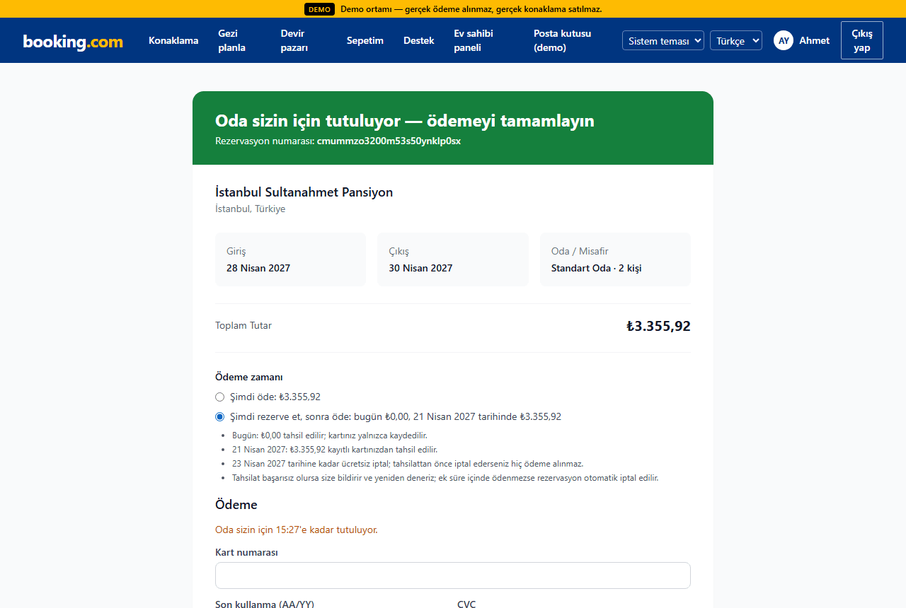](#ekran-görüntüleri)

Sürüm: **v5** ([CHANGELOG](CHANGELOG.md), [FINAL_REPORT](docs/FINAL_REPORT.md))

### Değer önerisi

1. **Gösterilen = tahsil edilen = defter.** Arama kartındaki toplam, `/api/quote`, PSP capture (+ cüzdan kredisi) ve tahsilat jurnali aynı tutardır; bu, fast-check ile 200 rastgele ilan/tarih/promosyon/vergi/FX/kredi örneğinde 0 karşı örnekle doğrulanır ([v5-price-invariant.test.ts](tests/integration/v5-price-invariant.test.ts)).
2. **Doğrulanabilir ajan ticareti.** Ajan ödemeleri kullanıcının imzaladığı ES256 AP2 mandate'i ister; açık anahtar [`/.well-known/jwks.json`](src/app/.well-known/jwks.json/route.ts) üzerinden yayımlanır ve üçüncü taraf, platforma güvenmeden `npm run mandate:verify` ([scripts/verify-mandate.ts](scripts/verify-mandate.ts)) ile imzayı doğrulayabilir.
3. **Kanıtlı tedarik zinciri.** Her push'ta [security.yml](.github/workflows/security.yml) Semgrep SAST, gitleaks, OSV-Scanner geçidi ve CycloneDX SBOM artefaktı üretir; SLSA provenance, CodeQL ve OpenSSF Scorecard iş akışında tanımlıdır ancak yalnız public repoda çalışır (repo şu an private olduğundan koşmaz, Scorecard rozeti yoktur).

<details>
<summary><strong>v4 değer önerisi (geçerliliğini koruyor)</strong></summary>

1. **Para doğruluğu kanıtlanır, varsayılmaz.** Tüm tutarlar ISO 4217 üssüne göre `BigInt` minor-unit; her tahsilat, iade, escrow serbest bırakma, payout, depozito, cüzdan kredisi ve kaybedilen itiraz dengeli bir jurnal girişi yazar (DB tetiği Σ=0'ı zorlar); günlük mutabakat PSP gerçeğiyle farkı raporlar. Property testleri ve senaryolar her adımda "mizan dengede, fark 0" doğrular.
2. **Sektör devlerinin pazar yeri özellikleri, tek tutarlı çekirdek üstünde.** Grup sepeti (tümü-ya-hiç tutma), bölünmüş ödeme, check-in+24 saat escrow ve rezervli payout, hasar depozitosu + çözüm merkezi, sadakat/cüzdan, promosyon motoru (Omnibus 30 gün), esnek tarih fiyat takvimi, görsel arama, PWA — hepsi aynı kilit, saga, outbox ve defteri kullanır.
3. **Ajanlar için güvenli ticaret.** MCP, ACP ve UCP uçları insan checkout'uyla aynı sagayı çalıştırır; ödeme kullanıcının imzaladığı, süreli, tutar sınırlı (isteğe bağlı ilan kısıtlı) ve tek kullanımlık AP2 intent mandate'i olmadan yapılamaz; mandate verme recent-auth ister ve iptal edilebilir.

</details>

### Kullanılan teknolojiler

[](https://nextjs.org)
[](https://react.dev)
[](https://www.typescriptlang.org)
[](https://www.postgresql.org)
[](https://www.prisma.io)
[](https://redis.io)
[](https://docs.bullmq.io)
[](https://opentelemetry.io)
[](https://prometheus.io)
[](https://vitest.dev)
[](https://playwright.dev)
[](https://k6.io)

Tam yığın: Next.js 16 (App Router) · React 19 · TypeScript strict · PostgreSQL 16 + pgvector + pg_trgm · Prisma 5 · Redis 7 · BullMQ (FlowProducer) · Temporal (polyfill) · MCP (streamable HTTP + stdio) · gRPC · next-intl · jose + WebAuthn · OpenTelemetry · Prometheus · Vitest + testcontainers + fast-check · Playwright + axe · k6

<p align="right">(<a href="#readme-top">back to top</a>)</p>

## Mimari

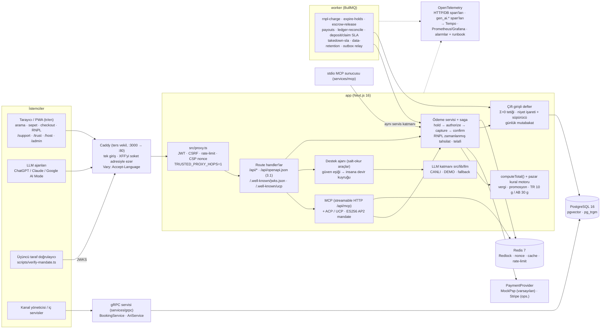

Ayrıntılar: [docs/ARCHITECTURE.md](docs/ARCHITECTURE.md) (defter, sepet/bölünmüş ödeme, escrow/payout/depozito ve mandate akış diyagramları; saga sekansı; hibrit arama; v5: RNPL zaman çizelgesi, telafi-jurnal akışı, destek ajanı + devir, ters vekil/IP çözümü, mandate doğrulama sekansı) · kararlar: [docs/adr/](docs/adr/)

### Sektör kıyası

Referans: [booking-v5.md §2](booking-v5.md) hedef tablosu. "v5 (gerçekleşen)" sütunu bu repodaki durumdur; tutmayan veya ölçülemeyen hedefler son sütunda açıkça belirtilir.

| Yetkinlik                 | Sektör liderleri                                          | v5 hedefi                                                                    | v5 (gerçekleşen)                                                                                                                                                                       | Sınır / tutmayan                                                                                                                           |
| ------------------------- | --------------------------------------------------------- | ---------------------------------------------------------------------------- | -------------------------------------------------------------------------------------------------------------------------------------------------------------------------------------- | ------------------------------------------------------------------------------------------------------------------------------------------ |
| Para izlenebilirliği      | Booking/Airbnb iç defterleri, Stripe mutabakatı           | Her PSP hareketi jurnalde, niyet işareti + süpürücü                          | Sepet/pay/devir/depozito telafileri dahil her PSP hareketi jurnalde; niyet işareti + süpürücü (ADR 0026); kaos ve RNPL fırtınasında mutabakat farkı 0                                  | —                                                                                                                                          |
| Esnek ödeme               | Airbnb RNPL, Booking "pay at property"                    | Ücretsiz iptal bitiminden N gün önce tahsilat, başarısızlıkta otomatik iptal | RNPL (ADR 0028): bugün 0, zamanlanmış `rnpl-charge` + yedek süpürücü, başarısızlıkta otomatik iptal; 1 006 tetiklemeli fırtınada ihlal 0 ([v5-rnpl-storm](docs/perf/v5-rnpl-storm.md)) | Yalnız mock ödeme formunda (Stripe Payment Element yolunda yok)                                                                            |
| Ajan ticareti             | Booking/Expedia ChatGPT app'leri, Google UCP Lodging, AP2 | ES256 + JWKS mandate, UCP güncel, üçüncü taraf doğrulama, MCP Apps kartı     | ES256 mandate + `/.well-known/jwks.json`, `npm run mandate:verify`, UCP manifest, MCP Apps `ui://booking/stay-card` (ADR 0025, 0035, 0036)                                             | MCP Apps istemci desteği sınırlı; kart gerçek istemci ekranında değil, SDK biçimiyle beslenerek doğrulandı                                 |
| AI müşteri hizmeti        | Airbnb AI destek ajanı, Booking Smart Messenger           | Salt-okur araçlı destek ajanı + güven eşiğiyle insana devir                  | `/support` sohbet ajanı (salt-okur araçlar); düşük güven, talep veya hassas konu → `/admin/support` insan kuyruğu (ADR 0029)                                                           | Ajan işlem yapmaz (iade/iptal insan temsilcide); DEMO modunda şablon yanıtlar                                                              |
| LLM güvencesi             | İç eval + gözlemlenebilirlik                              | promptfoo eval + red-team CI'da, OTel `gen_ai.*`, maliyet paneli             | `npm run llm:eval` 28 vaka, 10'u red-team (CI'da, eşik %95), `gen_ai.*` span'ları, Grafana LLM token/gecikme/eval panelleri (ADR 0030)                                                 | CI eval'i ağsız demo sağlayıcısıyla koşar, canlı model skoru ayrıca ölçülmedi; panel token gösterir, parasal maliyet değil                 |
| Tedarik zinciri güvenliği | SLSA, SBOM, SAST                                          | CodeQL/Semgrep, gitleaks, SBOM, OSV, SLSA provenance, Scorecard              | `security.yml`: Semgrep, gitleaks, CycloneDX SBOM, OSV-Scanner geçidi; SHA-pinli action'lar, dependabot (ADR 0031)                                                                     | CodeQL, SLSA provenance ve Scorecard yalnız public repoda koşar; repo private olduğundan **çalışmıyor**                                    |
| Kötüye kullanım direnci   | Kart test tespiti, KYC kapıları                           | Tek risk motoru, KYC fail-closed, IP çözümü ters vekille                     | Tüm ödeme yolları tek risk motorundan; KYC fail-closed (v5#3); Caddy ters vekil + `TRUSTED_PROXY_HOPS` (ADR 0034)                                                                      | Caddy'siz dağıtımda istemci IP çözümü garanti edilmez                                                                                      |
| Fiyat şeffaflığı          | FTC Junk Fees, AB Omnibus, TR 10 gün kuralı               | Pazar kural motoru; "gösterilen = tahsil edilen = defter" property testi     | Pazar kural motoru (TR 10 gün / AB 30 gün indirim referansı, ADR 0032); fast-check 200 örnek, 0 karşı örnek                                                                            | Kural içerikleri eğitim amaçlı, hukuki görüş değil                                                                                         |
| Uyum (STR)                | AB 2024/1028, TR 7464 + 7565                              | Kayıt no ilanda + pazar kuralı, KVKK export/silme                            | PDP'de kayıt/belge no + pazar kuralı; KVKK "verilerimi indir" ve hesap silme (`/api/account`)                                                                                          | Bakanlık ve AB kayıt servisleri mock                                                                                                       |
| API sözleşmesi            | Expedia Rapid, Booking Connectivity (OpenAPI)             | `/api/openapi.json` 3.1 + kontrat testleri                                   | `/api/openapi.json` (OpenAPI 3.1), 2xx şemaları; integration testlerinde gerçek yanıtlar şemaya karşı doğrulanır (≥ 20 uç işlemi)                                                      | —                                                                                                                                          |
| Gözlemlenebilirlik        | SLO + error budget + runbook                              | Runbook'lu alarmlar, `promtool` testleri, burn-rate, chaos raporu            | 29 alarmın hepsinde runbook ([docs/runbooks/](docs/runbooks/README.md)), `promtool test rules` CI'da, çok pencereli burn-rate; [v5-chaos](docs/perf/v5-chaos.md) (Toxiproxy)           | —                                                                                                                                          |
| Ölçek/performans          | Sıcak envanterde saniye altı                              | Sepet hold p95 ≤ 2 s (100 VU)                                                | Kilit kuyruğu düzeltmesi: 20 VU'da hold p95 6,05 → **1,87 s** ([v5-cart](docs/perf/v5-cart.md))                                                                                        | **Tutmadı:** 100 VU'da hold p95 **8,40 s** (hedef 2 s); tüm VU'lar bilerek aynı 4 envanter satırında, kalan darboğaz kilit bekleme bütçesi |
| i18n/erişilebilirlik      | 40+ dil, EAA                                              | Accept-Language müzakeresi, yeni ekranlarda axe 0 ihlal                      | Çerez yoksa Accept-Language (q-değerli) müzakeresi + `Vary`; yeni v5 ekranlarında axe e2e                                                                                              | Yalnız tr/en; manuel ekran okuyucu testi yok                                                                                               |

<details>
<summary><strong>v4 sektör kıyası (v3.0.0 → v4)</strong></summary>

| Yetkinlik                   | Sektör liderleri                                     | v3.0.0                        | v4 (bu repoda)                                                                                                                                                                                         | Mock / sınır                                                                                  |
| --------------------------- | ---------------------------------------------------- | ----------------------------- | ------------------------------------------------------------------------------------------------------------------------------------------------------------------------------------------------------ | --------------------------------------------------------------------------------------------- |
| Çoklu oda / grup sepeti     | Booking/Expedia çok odalı; Airbnb group trips        | Tek oda tipi / rezervasyon    | `Cart` (≤`CART_MAX_ITEMS` kalem), sıralı kilitlerle tümü-ya-hiç tutma, tek PSP tahsilatı; bölünmüş ödeme (eşit/özel paylar, HMAC davet linki, süre sonu organizatör yedeği veya tam iade)              | Sepette/payda Stripe Payment Element ve passkey step-up yok (mock hosted fields, 3DS'e düşer) |
| Esnek tarih & fiyat takvimi | Google/Booking ±3 gün, ay ızgarası                   | Fiyat alarmı                  | `MinPriceByDate` materyalize tablosu + artımlı yenileme işi, PDP ay ızgarası (en ucuz gece, vergi dahil/hariç), aramada `flexDays` ±3 gün önerisi (teklif motoruyla kesin doğrulanır)                  | Takvim promosyonsuz taban fiyatı gösterir; kişi sayısı `PRICE_CALENDAR_GUESTS`                |
| Pazar yeri parası           | Vrbo Payments, Airbnb payouts, Stripe Connect        | `LedgerEntry` + simüle payout | Çift girişli dengeli jurnal (ADR 0020), günlük mutabakat raporu, check-in+`PAYOUT_RELEASE_HOURS` escrow, komisyon (`PLATFORM_COMMISSION_BPS`), rezerv, host payout takvimi, DAC7 dışa aktarımı         | Varsayılan `MockPayoutProvider`; Stripe Connect yalnız ağsız fake ile test edildi             |
| Depozito & çözüm merkezi    | Airbnb AirCover / Resolution Center                  | Yok                           | Off-session depozito ön provizyonu, misafir iade / ev sahibi hasar talepleri, kanıt yükleme (EXIF silinir), yanıt SLA'sı, admin kararı, chargeback senkronu + kaybedilen itiraz jurnali                | MockPsp varsayılan; Stripe depozito yalnız fake ile                                           |
| Güven & emniyet             | Booking/Airbnb kimlik doğrulama, parti riski         | Fraud v2 + passkey step-up    | KYC (`IdentityVerification`, Stripe Identity sağlayıcısı + deterministik mock), mesajda dolandırıcılık bağlantısı/IBAN taraması, kural tabanlı parti riski skoru → ev sahibine uyarı                   | Varsayılan KYC mock; parti riski yalnız uyarı (onay adımı yok)                                |
| Sadakat & cüzdan            | Genius, One Key                                      | Yok                           | Seviyeler + cashback kredisi (defterde `guest_credit`), kredi ile kısmi ödeme, FIFO lot, süre dolumu                                                                                                   | Sepet/bölünmüş ödemede kredi kullanılamaz                                                     |
| Promosyonlar                | Early-bird, last-minute, mobile rate, kupon          | Fiyat planları                | Kural tabanlı motor (öncelik, birleşme grubu, tavan, gerekçe kodları), kupon limiti yarışsız, Omnibus 30 gün referansı (`InventoryPriceHistory` DB tetiği)                                             | Sepette kupon yok (otomatik promosyonlar uygulanır)                                           |
| AI yorum & karşılaştırma    | Airbnb AI review highlights, listing comparison      | LLM yorum özeti               | Cümle embedding + k-means kümeleri, **birebir alıntı guard'lı** öne çıkanlar; 2–4 ilanın `createQuote` toplamlarıyla yapılandırılmış karşılaştırması                                                   | DEMO modunda kümenin merkezine en yakın gerçek cümleler                                       |
| Görsel zekâ                 | Airbnb fotoğraf sınıflandırma, Trip.com görsel arama | Yok                           | Bulanıklık/pozlama kalite skoru, 64-bit pHash duplikat tespiti, CLIP ile "bu fotoğraftaki gibi" (RRF 3. liste)                                                                                         | CLIP opsiyonel bağımlılık, varsayılan kapalı (demo override'ı açar)                           |
| Ajan ticareti               | Google UCP lodging, ChatGPT apps, AP2                | MCP HTTP + ACP (mock token)   | ACP Stripe SPT yolu, UCP profil + checkout uçları, AP2 intent mandate (JWS; tutar/süre/ilan/nonce; iptal), MCP `checkout_stay`                                                                         | SPT yalnız fake ile test edildi; mandate HS256 (yalnız platform doğrular)                     |
| Mobil / PWA                 | Native uygulamalar, push                             | Responsive web                | Manifest + service worker, offline seyahat planı ve imzalı QR kartı (`/trips`), Web Push (fiyat düşüşü, check-in hatırlatması)                                                                         | VAPID anahtarı yoksa push kapalı                                                              |
| Erişilebilirlik             | ADA 36.302(e), EAA                                   | axe e2e                       | Kanıt fotoğraflı, admin doğrulamalı erişilebilirlik özellikleri + arama filtresi; koyu tema; WCAG 2.2 AA axe etiketleri                                                                                | Yerinde denetim yok (fotoğraf kanıtı)                                                         |
| Uyum otomasyonu             | DSA bildirim-ve-eylem, 7565 s. Kanun, 2024/1028      | Lisans mock + SDEP export     | 24 saat kaldırma SLA iş akışı + ihlal alarmı, DSA md.16/17/20 (bildirim, gerekçeli karar, itiraz, relist engeli), şeffaflık raporu, UBL-TR e-Arşiv üreticisi, konaklama vergisi tarihçesi, saklama işi | Bakanlık, GİB/özel entegratör ve AB kayıt servisleri mock                                     |
| Para hassasiyeti            | ISO 4217 tüm üsler                                   | `Decimal(10,2)`               | `BigInt` minor-unit kolonlar + ISO 4217 üs tablosu (JPY 0, KWD 3), tek half-up yuvarlama (ADR 0019)                                                                                                    | Eski ondalık API alanları geriye uyum için hâlâ yanıtlarda                                    |
| Hesap güvenliği             | Yeniden doğrulama, oturum yönetimi                   | Passkey + step-up             | `auth_time` recent-auth, işleme+tutara bağlı tek kullanımlık step-up, 24 s yeni passkey soğuması, oturum listesi + uzaktan çıkış, yeni cihaz e-postası (ADR 0024)                                      | —                                                                                             |

</details>

v3'ten devralınan yetkinlikler (oda tipi envanteri, vergi motoru, FX snapshot, hibrit arama + LTR, gelir paneli, kanal yöneticisi, mesajlaşma, i18n) değişmeden korunur; ayrıntı [docs/ARCHITECTURE.md](docs/ARCHITECTURE.md).

<p align="right">(<a href="#readme-top">back to top</a>)</p>

## Başlarken

### Gereksinimler

- **Docker** (Compose v2) — demo yığını için tek gereksinim. `.env` isteğe bağlıdır (`required: false`; yoksa güvenli varsayılanlar kullanılır).
- **Node.js 22** ve npm — yalnız yerel geliştirme için (Docker imajları `node:22-alpine` tabanlıdır). Entegrasyon testleri de Docker ister (testcontainers).

### Kurulum

#### 30 saniyede çalıştır (Docker Compose demo)

```bash
cp .env.example .env
docker compose -f docker-compose.yml -f docker-compose.demo.yml up --build
```

→ <http://localhost:3000> (ilk açılışta imajlar derlenir; sonraki açılışlarda `--build` gerekmez)

- **Ters vekil (v5):** 3000 portunu artık **Caddy** yayımlar (`APP_PORT`, varsayılan 3000) ve istekleri iç ağdaki `app:3000`'e iletir; uygulama host'a doğrudan açılmaz. Caddy istemcinin gönderdiği `X-Forwarded-For`'u yok sayıp TCP soket adresini yazar, uygulama `TRUSTED_PROXY_HOPS=1` ile yalnız bu halkaya güvenir ([ADR 0034](docs/adr/0034-reverse-proxy-client-ip.md), `docker/Caddyfile`).
- **Demo override'ı:** `docker-compose.demo.yml` demo modunu (demo seed, `/dev/mailbox`, MockPsp, kalıcı "DEMO" şeridi), http çerezini ve görsel aramayı (`VISION_CLIP_ENABLED=true`) açar. Tek başına `docker compose up` güvenli varsayılanlarla (Secure çerez, `DEMO_MODE=false`) production gibi davranır.
- **Sırlar otomatik üretilir.** `secrets-init` servisi ilk açılışta JWT, iç API, transfer imza, webhook, metrik, Postgres ve Redis sırlarını rastgele üretip `booking_secrets` volume'una yazar. İmajlarda sır yoktur.
- **Demo verisi:** `migrate` servisi `prisma migrate deploy` çalıştırır, ardından `DEMO_SEED` açıksa ve veritabanı boşsa seed yükler (v4 eki: ev sahibi payout hesabı, 4 promosyon + `HOSGELDIN` kuponu, ilan fotoğrafları, doğrulanmış erişilebilirlik özellikleri). `DEMO_MODE` kapalıyken demo seed reddedilir ve `/dev/mailbox` 404 döner (`src/lib/config/seed-guard.ts`).
- **Anahtar ve internet gerekmez:** LLM → DEMO (destek ajanı dahil), ödeme ve payout → mock, KYC → mock (yalnız demo override'ında; aksi halde fail-closed), e-Arşiv entegratörü → mock, FX → statik yedek, kayıt no → mock registry, embedding → hash, SMTP → dev mailbox, Web Push → kapalı.

#### Yerel geliştirme

```bash
npm run db:up                          # dev compose: Postgres + Redis
npm run db:migrate && npm run db:seed  # prisma migrate deploy + seed
npm run dev                            # Next.js geliştirme sunucusu
npm run worker                         # ayrı terminalde BullMQ worker
```

Yapılandırılabilir ortam değişkenlerinin adları [.env.example](.env.example) dosyasında listelenir.

<p align="right">(<a href="#readme-top">back to top</a>)</p>

## Kullanım

### Demo kullanıcılar

> **UYARI — YALNIZCA DEMO.** Bu hesaplar yalnızca `docker-compose.demo.yml` override'ıyla (`DEMO_MODE=true`) seed edilir ve herkesçe bilinen bir parola kullanır. Temel compose ve production'da seed devre dışıdır.

| Rol           | E-posta                                               | Parola         |
| ------------- | ----------------------------------------------------- | -------------- |
| Misafir       | `guest@booking.test`                                  | `Password123!` |
| Ev sahibi     | `host@booking.test`                                   | `Password123!` |
| Admin         | `admin@booking.test`                                  | `Password123!` |
| Ek misafirler | `elif@test.com`, `mehmet@test.com`, `zeynep@test.com` | `Password123!` |

Demo kullanıcılarının e-postası doğrulanmıştır (rezervasyon/ödeme/devir doğrulanmış e-posta ister). Test kartları (mock hosted fields, tarayıcıda token'a çevrilir): `4242 4242 4242 4242` onay, `4000 0000 0000 0002` ret, `4000 0000 0000 3220` 3DS (doğrulama kodu `123456`). SMTP yapılandırılmamışsa e-postalar (bölünmüş ödeme davetleri dahil) <http://localhost:3000/dev/mailbox> sayfasına düşer.

### LLM modu

Tüm LLM erişimi `src/lib/llm/` sözleşmesinden geçer ([ADR 0005](docs/adr/0005-llm-contract.md), [MODEL_CARD](docs/MODEL_CARD.md)).

| Mod                  | Ne zaman                                                            | Davranış                                                                                          |
| -------------------- | ------------------------------------------------------------------- | ------------------------------------------------------------------------------------------------- |
| **DEMO**             | Anahtar yok veya `LLM_MODE=demo`                                    | Ağa hiç çıkmaz; görev başına deterministik üreticiler gerçek verilerden çıktı üretir              |
| **CANLI**            | `.env` içinde `LLM_API_KEY` tanımlı ve `LLM_MODE=auto` (varsayılan) | OpenAI-uyumlu Chat Completions (varsayılan model `deepseek-v4-flash`, `LLM_BASE_URL` ile değişir) |
| **fallback** (çağrı) | Canlı çağrıda timeout / 429 / 5xx / geçersiz JSON / guard / bütçe   | O çağrı için demo çıktısı, `llmMode: "fallback"` + kısa `reason` kodu; API yine 200 döner         |

- `GET /api/llm/status` (giriş gerekli) etkin modu gösterir; anahtarın kendisi hiçbir yanıtta, logda veya telemetride görünmez. `npm run llm:smoke` anahtar yoksa "DEMO — smoke atlandı" ile 0 döner.
- LLM **asla** fiyat, vergi, müsaitlik, iade, fraud, KYC, moderasyon, promosyon veya sıralama kararı vermez; çıktıdaki her sayı ve (yorum öne çıkanlarında) her alıntı guard'lardan geçer, LLM'e giden her metin KVKK redaksiyonundan geçer. Tüm LLM yolları kullanıcı başına günlük token bütçesine tabidir ve süreç çapında `LLM_MAX_CONCURRENCY` (4) ile sınırlanır (v4#3).
- v5: destek ajanı da aynı sözleşmeden geçer (CANLI'da model, DEMO'da deterministik şablon). Her çağrı OTel `gen_ai.*` span'ı üretir (semconv v1.37.0; varsayılan olarak yalnız model, token sayısı, bitiş nedeni — içerik yalnız `LLM_OTEL_CAPTURE_CONTENT=true` iken ve redaksiyondan geçerek yazılır). `npm run llm:eval` 28 vakayı (10'u prompt-injection red-team) ağsız demo sağlayıcısıyla koşar, geçme oranı %95'in altındaysa CI kırmızıdır; canlı model için `npm run llm:eval -- --live` (yalnız yerel, anahtar gerekir) ([ADR 0030](docs/adr/0030-llm-evals-genai-telemetry.md)).

### Ajanlar için: MCP, ACP, UCP ve mandate

| Kanal                                                   | Kimlik                                                   | Araçlar / uçlar                                                                                                                                                   |
| ------------------------------------------------------- | -------------------------------------------------------- | ----------------------------------------------------------------------------------------------------------------------------------------------------------------- |
| `POST /api/mcp` (streamable HTTP)                       | `Authorization: Bearer <access token>`                   | `search_stays`, `get_quote`, `create_hold`, `checkout_stay` (SPT + mandate), `get_price_insight`, `list_my_bookings`, `cancel_booking` + `ui://booking/stay-card` |
| `npm run mcp:server` (stdio)                            | `MCP_ACCESS_TOKEN` ortam değişkeni                       | Aynı araç kümesi (`services/mcp/`)                                                                                                                                |
| `/api/agentic/checkout_sessions` (ACP)                  | Giriş + `Idempotency-Key`; tamamlamada `mandate`         | Oluştur → güncelle → `…/[id]/complete`; ödeme `spt_…` (Stripe) veya `spt_mock_*`; insan checkout'uyla aynı saga                                                   |
| `/.well-known/ucp` + `/api/ucp/checkout-sessions` (UCP) | Profil herkese açık; oturum uçları giriş ister           | UCP lodging şemasını ACP servislerine eşler                                                                                                                       |
| `/api/account/agent-mandates`                           | Doğrulanmış e-posta + recent-auth (verme); giriş (liste) | AP2 intent mandate verme, listeleme, `DELETE …/[nonce]` ile iptal                                                                                                 |

Access token `POST /api/auth/login` yanıtındaki `accessToken` alanından alınır. Mandate'siz, süresi dolmuş, limiti aşan, başka kullanıcıya ait, iptal edilmiş veya tekrar oynatılan mandate PSP'ye gitmeden reddedilir (403/402/409 `MANDATE_*`). Duman testi: `npm run mcp:smoke` (mandate'li başarı + ret yolları). Karar: [ADR 0023](docs/adr/0023-agentic-commerce-mandates.md).

### Demo senaryoları

- 3 dakikalık demo akışı: [docs/DEMO_SCRIPT.md](docs/DEMO_SCRIPT.md)
- Demo durumunu sıfırlamak: `npm run demo:reset`; 20 uçtan uca senaryo (7 HTTP + 13 süreç içi v4/v5 senaryosu; süreç içi her senaryoda mizan ve mutabakat kontrolü): `npm run demo:scenarios`. v5 senaryoları: RNPL zamanında/başarısız tahsilat, sepet telafisi, KYC'siz devir payout'u, destek ajanı insana devir, üçüncü taraf mandate doğrulaması + OpenAPI keşfi, TR/AB indirim referansı.

### Ekran görüntüleri

`npm run docs:screenshots` (çalışan demo yığınına karşı; `SCREENSHOT_SET=v3|v4|v5` tek küme).

#### v5

| Şimdi rezerve et, sonra öde (bugün 0 ₺ + iptal zaman çizelgesi) | Rezervasyon detayında planlı RNPL tahsilatı       |
| --------------------------------------------------------------- | ------------------------------------------------- |
|                  | 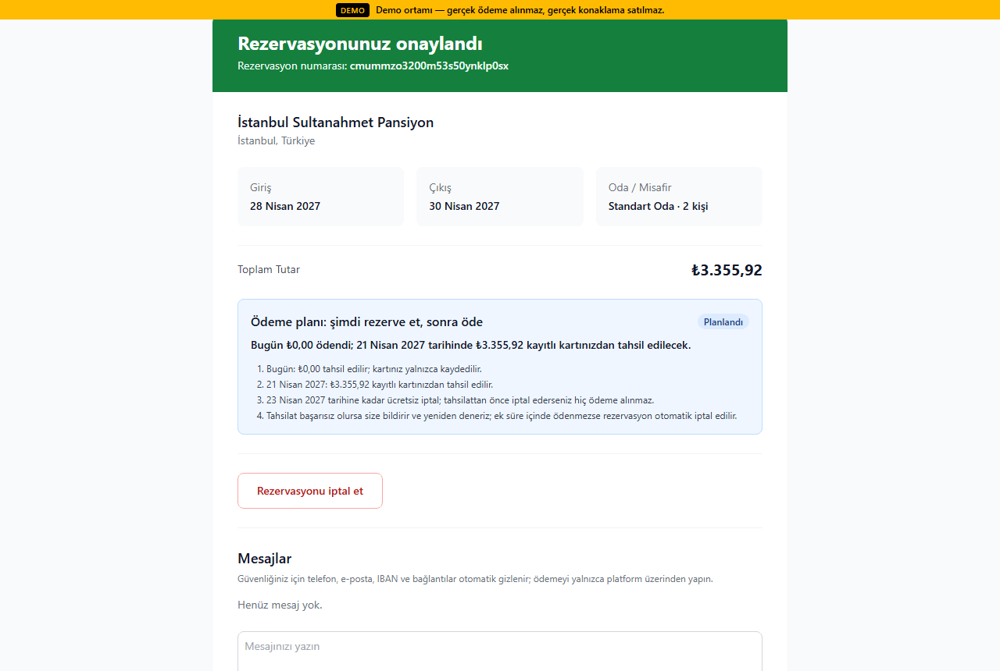          |
| **AI destek sohbeti + "İnsana bağlan" devri**                   | **Admin destek kuyruğu (insan temsilci)**         |
| 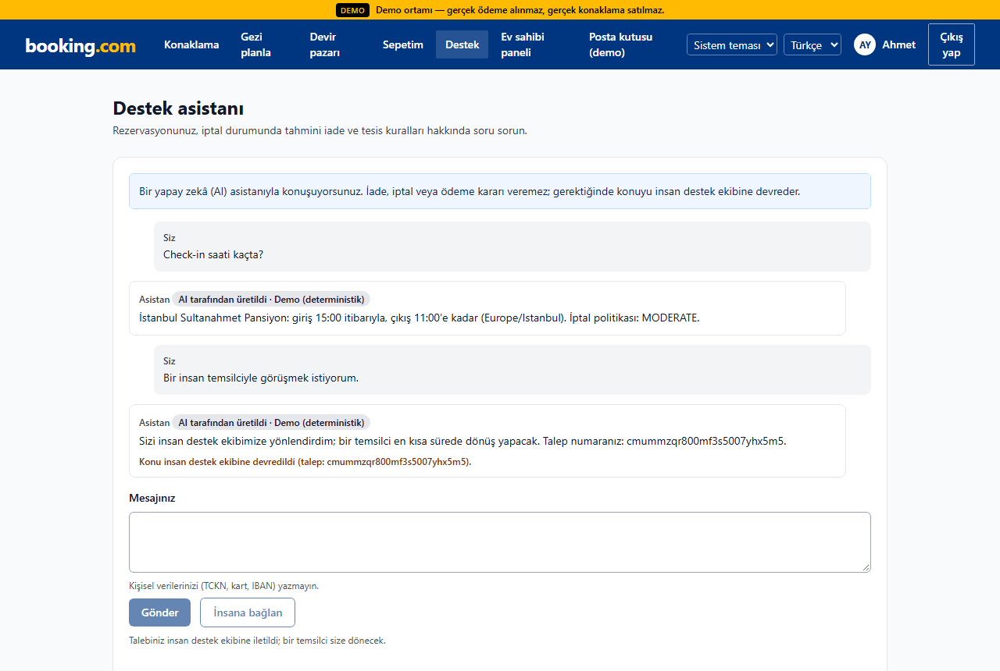                 | 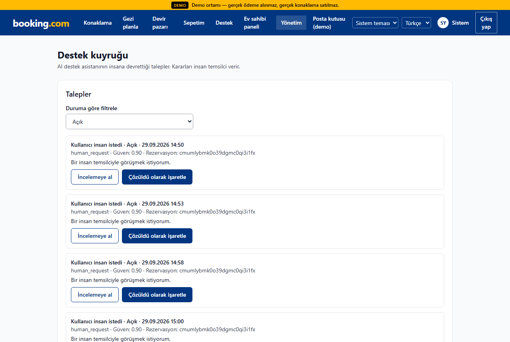  |
| **Güven merkezi (SBOM, JWKS, OpenAPI, Scorecard)**              | **PDP'de kayıt/belge numarası**                   |
| 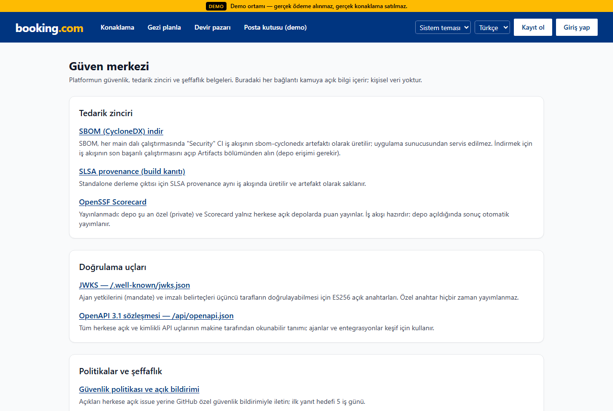                         |  |

#### v4

| Grup sepeti (iki tesis, tümü-ya-hiç)                            | Sepet checkout'u (odalar tutuldu, tek ödeme)                |
| --------------------------------------------------------------- | ----------------------------------------------------------- |
| 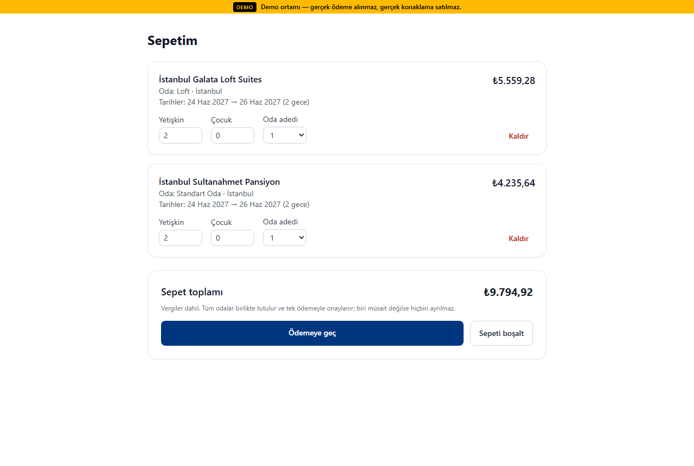                            | 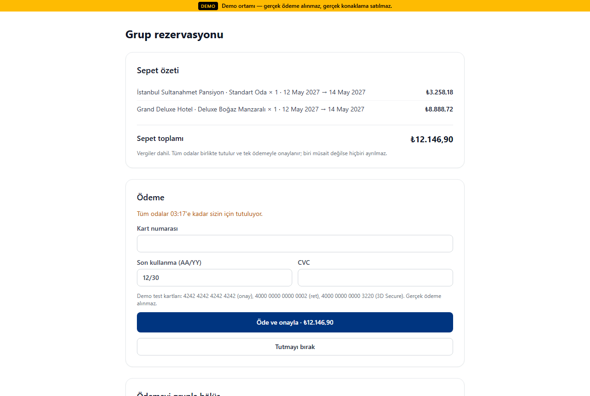            |
| **Bölünmüş ödeme (organizatör + 2 katılımcı, son ödeme saati)** | **PDP fiyat takvimi (gecelik en düşük fiyat, vergi dahil)** |
| 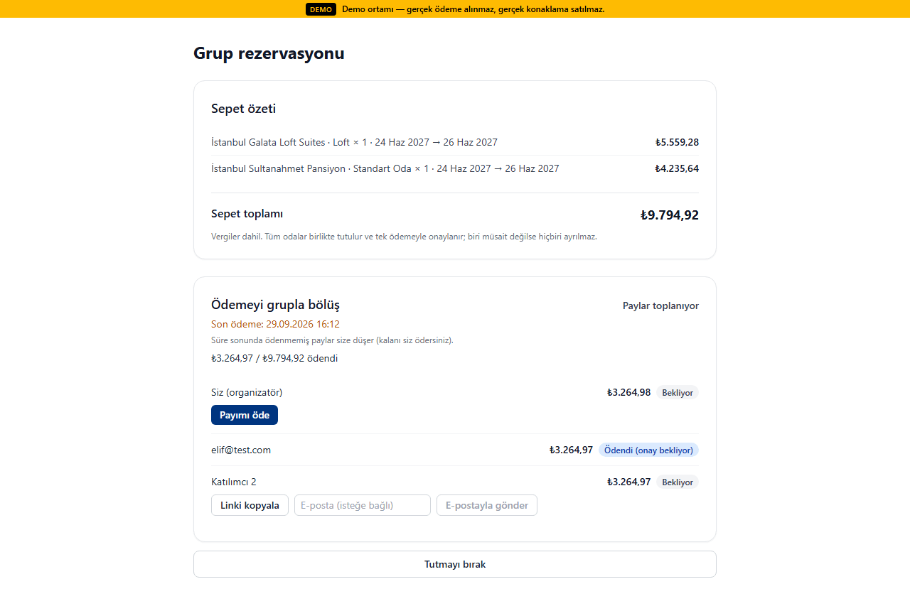                | 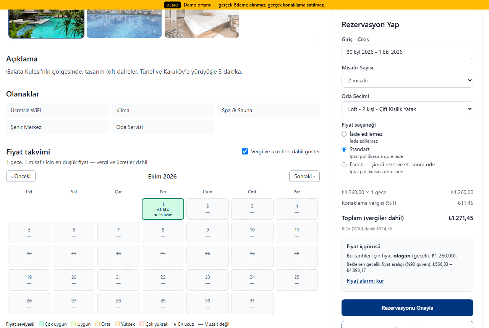            |
| **İlan karşılaştırma (teklif motoru toplamı + AI yorumu)**      | **Çözüm merkezi — yönetici talep kuyruğu**                  |
| 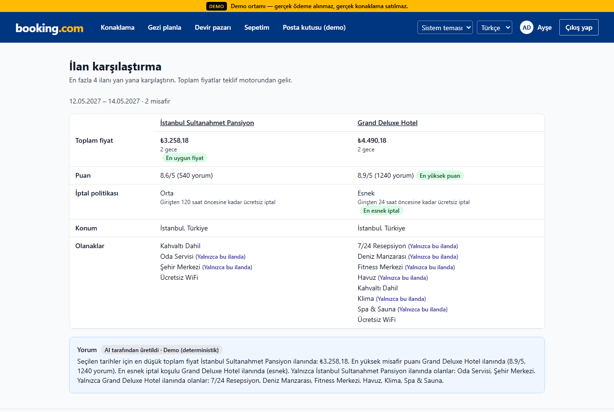                       | 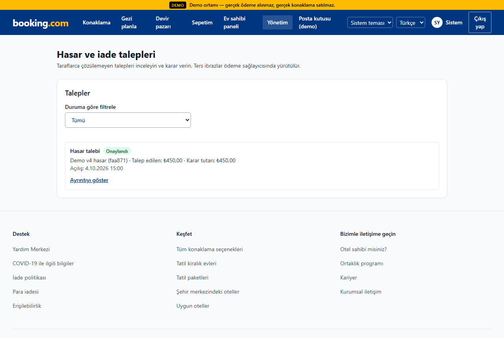                |
| **Cüzdan ve sadakat (`/account`)**                              | **Ev sahibi payout paneli (emanet / serbest / rezerv)**     |
| 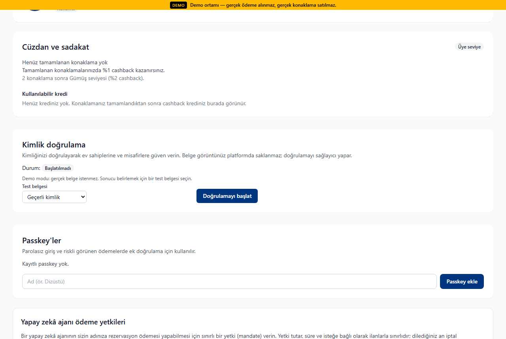                               | 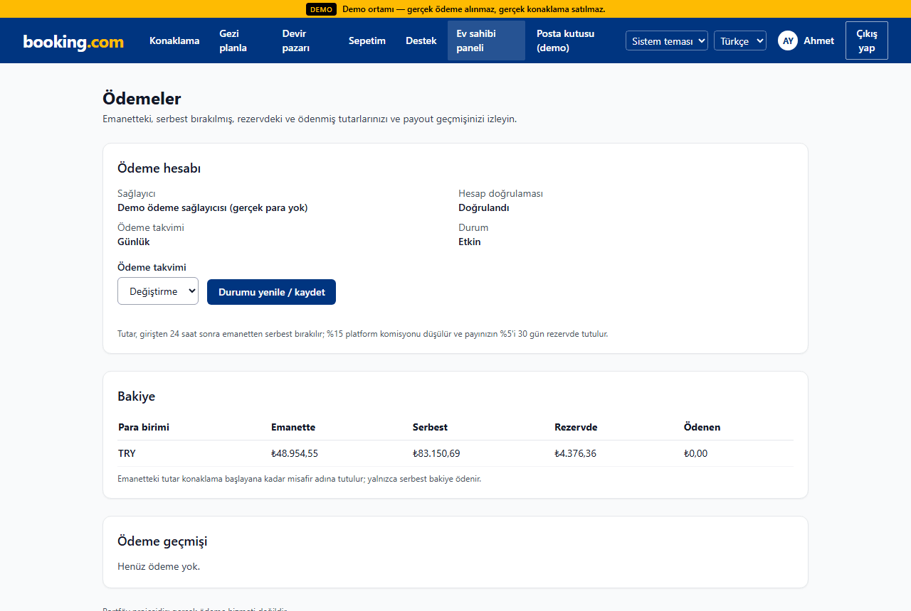              |
| **Koyu tema (`prefers-color-scheme: dark`)**                    |                                                             |
|                          |                                                             |

<details>
<summary><strong>v3 ekran görüntüleri ve MCP kartı</strong></summary>

#### v3

| Satır kalemli checkout (gece, konaklama vergisi, dahil KDV) | PDP fiyat içgörüsü (conformal aralık, "olağan" etiketi) |
| ----------------------------------------------------------- | ------------------------------------------------------- |
|  |            |
| **Host gelir paneli (`/host/revenue`)**                     | **Rezervasyon mesajlaşması (telefon numarası maskeli)** |
|                   |                    |
| **Akıllı filtre (doğal dil → filtre çipleri)**              | **Mülk sayfası (galeri, fiyat, atıflı yorum özeti)**    |
|            |                            |
| **Çok şehirli trip-planner (araçlı, grounded)**             | **Host extranet**                                       |
|                   |                      |
| **Ana sayfa**                                               | **Admin paneli (outbox, moderasyon, deney, fraud)**     |
|                              |                             |

**MCP `ui://booking/stay-card` widget'ı:**


</details>

Görüntüler compose demo yığınından (seed'li, LLM demo modu) `npm run docs:screenshots` ile üretilir ([scripts/screenshots.ts](scripts/screenshots.ts)). Dürüstlük notları:

- MCP kartı gerçek `POST /api/mcp` yanıtlarından (`resources/read ui://booking/stay-card` + `tools/call search_stays`) çizilir, ancak ChatGPT/Claude istemcisinin ekran görüntüsü **değildir**: şablon, Apps SDK'nın sağladığı `window.openai.toolOutput` ile aynı biçimde beslenerek boş bir sayfada render edilir.
- v4 kümesi `SCREENSHOT_SET=v4 npm run docs:screenshots` ile üretilir; betik demo yığınında örnek bir sepet ve bölünmüş ödeme planı oluşturur (bir katılımcı payını ödemiştir). Çözüm merkezi görüntüsündeki hasar talebi `npm run demo:scenarios` senaryo 10'dan gelir (canlı demoda konaklama başlamadan talep açılamaz). Demo misafirinin tamamlanmış konaklaması olmadığından cüzdan boş görünür; cashback → kredi akışı senaryo 14'te doğrulanır. Seed fiyatları düz olduğundan fiyat takviminde tüm günler aynı seviyededir.
- Gelir paneli görüntüsündeki mülkte seçilen pencerede satış olmadığı için metrikler sıfırdır.

<p align="right">(<a href="#readme-top">back to top</a>)</p>

## Özellikler (v5)

- **Şimdi rezerve et, sonra öde (RNPL):** bugün 0 ₺; tahsilat ücretsiz iptal bitiminden önce zamanlanır (`rnpl-charge` + yedek süpürücü), başarısızsa rezervasyon otomatik iptal olur ([ADR 0028](docs/adr/0028-reserve-now-pay-later.md)).
- **AI destek ajanı + insana devir:** `/support` sohbeti salt-okur araçlarla yanıtlar; düşük güven, kullanıcı talebi veya hassas konu `/admin/support` kuyruğuna insan temsilciye devredilir ([ADR 0029](docs/adr/0029-support-agent-human-handoff.md)).
- **LLM eval ve telemetri:** `npm run llm:eval` (promptfoo, 28 vaka, 10'u red-team, CI'da %95 eşik), OTel `gen_ai.*` span'ları, Grafana LLM panelleri ([ADR 0030](docs/adr/0030-llm-evals-genai-telemetry.md)).
- **Pazar kural motoru:** indirim referans dönemi TR 10 gün / AB 30 gün, kayıt/belge numarası kuralı ([ADR 0032](docs/adr/0032-market-rules-engine.md)).
- **Doğrulanabilir ajan ticareti:** ES256 mandate, `/.well-known/jwks.json`, `npm run mandate:verify`, kalıcı nonce kaydı, MCP Apps `ui://` kartı ([ADR 0025](docs/adr/0025-asymmetric-mandate-signing.md), [0035](docs/adr/0035-verifiable-agent-commerce.md), [0036](docs/adr/0036-mcp-apps-stay-card.md)).
- **Güven merkezi `/trust`:** SBOM, JWKS, OpenAPI, Scorecard durumu ("yayınlanmadı" — private repo) ve politika bağlantıları.
- **Runbook'lu alarmlar:** 29 alarmın her biri [docs/runbooks/](docs/runbooks/README.md)'a bağlı, `promtool` birim testleri CI'da, çok pencereli burn-rate SLO'ları.
- **Kaos ve yük raporları:** [v5-cart](docs/perf/v5-cart.md) (sepet sıcak noktası), [v5-chaos](docs/perf/v5-chaos.md) (Toxiproxy ile Redis/Postgres kesintisi), [v5-rnpl-storm](docs/perf/v5-rnpl-storm.md) (RNPL tahsilat fırtınası).
- **OpenAPI 3.1:** `/api/openapi.json`, 2xx yanıt şemaları ve gerçek yanıtları şemaya karşı doğrulayan kontrat testleri.
- **Para ve güvenlik:** her PSP hareketi jurnalde (niyet işareti + süpürücü, [ADR 0026](docs/adr/0026-compensation-journal-intent-marker.md)), ödeme servisi ayrımı ([ADR 0027](docs/adr/0027-payment-service-split.md)), KYC fail-closed, Caddy ters vekil ile güvenilir istemci IP'si, v5#1–#20 düzeltmeleri ([SECURITY](docs/SECURITY.md)).

### v4'ten devralınanlar

- **Güvenlik düzeltmeleri v4#1–#20** — her biri `regression: v4#N` testiyle ([SECURITY §5](docs/SECURITY.md)): devir capture-önce-commit sagası, recent-auth ve işleme bağlı step-up, LLM bütçe/eşzamanlılık, anonim rate-limit anahtarı, güvenli compose varsayılanları, doğrulanmış e-posta zorunluluğu, iptal–capture yarışı, geç webhook mutabakatı, idempotency gövde bağı, SSRF, PoW'lu giriş sertleştirmesi, 3DS deneme sınırı, cursor sayfalama, minor-unit para, webhook sağlayıcı ayrımı, son admin koruması, HLL görüntülenme sayacı, ARI para doğrulaması, `.env.*` ignore.
- **Para çekirdeği:** `BigInt` minor-unit (ADR 0019), çift girişli defter + günlük mutabakat + `GET /api/admin/reconciliation` (ADR 0020).
- **Grup sepeti ve bölünmüş ödeme** (`/cart`, `/checkout/cart`, `/pay/share/[token]`), sepet geç-başarı uzlaştırması.
- **Escrow, payout, rezerv, DAC7** (`/host/payouts`, `/admin/payouts`, `npm run dac7:export`) ve **hasar depozitosu + çözüm merkezi** (`/resolution`, `/admin/claims`) (ADR 0021).
- **Güven & emniyet:** KYC, mesaj dolandırıcılık taraması, parti riski paneli.
- **Sadakat ve cüzdan**, **promosyon motoru + kupon + Omnibus referansı**.
- **Esnek tarih fiyat takvimi** ve aramada ±N gün önerisi.
- **AI yorum öne çıkanları** (alıntı guard'lı) ve **ilan karşılaştırma** (`/compare`).
- **Görsel zekâ:** fotoğraf kalite skoru, pHash duplikat, CLIP görsel arama (ADR 0022).
- **Ajan ticareti v2:** ACP SPT, UCP, AP2 mandate (ADR 0023).
- **PWA + Web Push:** offline seyahat planı, QR kartı, fiyat düşüşü/check-in bildirimleri.
- **Uyum otomasyonu:** 7565 24 saat SLA, DSA bildirim/karar/itiraz + şeffaflık raporu, UBL-TR, erişilebilirlik özellikleri, veri saklama işi ([COMPLIANCE](docs/COMPLIANCE.md)).
- **Hesap:** oturum listesi ve uzaktan çıkış (`/account/sessions`), yeni cihaz bildirimi (ADR 0024); koyu tema; WCAG 2.2 AA.
- **Demo:** 7 yeni süreç içi v4 senaryosu, isteğe bağlı Inside Airbnb içe aktarımı.

### Neyi kanıtlıyor?

Aşağıdaki iddiaların her biri gerçek PostgreSQL + Redis (testcontainers) üzerinde koşan entegrasyon testleriyle korunur:

| İddia                                                                                                      | Test                                                                                                                                                                                                                                    |
| ---------------------------------------------------------------------------------------------------------- | --------------------------------------------------------------------------------------------------------------------------------------------------------------------------------------------------------------------------------------- |
| Son oda için eşzamanlı iki istekten yalnız biri kazanır                                                    | [booking-concurrency.test.ts](tests/integration/booking-concurrency.test.ts) — "aynı oda ve tarih için iki eşzamanlı istekten yalnız biri rezervasyon yaratır"; "aynı Idempotency-Key ile tekrar eden istek aynı rezervasyonu döndürür" |
| Oda tipi sayaçları aşırı satış yapmaz                                                                      | [v3-inventory.test.ts](tests/integration/v3-inventory.test.ts) — "P0-2: units=3 oda tipine 100 paralel rezervasyon → tam 3 başarılı, kalanlar 409 SOLD_OUT/ROOM_BUSY"                                                                   |
| Çift tahsilat yoktur                                                                                       | [v3-payment-race.test.ts](tests/integration/v3-payment-race.test.ts) — "regression: v3#1 50 paralel ödeme (farklı Idempotency-Key) → tam 1 capture, defter = toplam"                                                                    |
| Saganın her adımındaki hata telafi edilir, para asılı kalmaz                                               | [v3-saga.test.ts](tests/integration/v3-saga.test.ts) — hold, authorize, capture, confirm adımlarında hata → tutma bırakılır, para iade/void, defter dengede                                                                             |
| Ters sıralı 100 paralel sepet aşırı satmaz ve tümü-ya-hiç tutar                                            | [v4-cart.test.ts](tests/integration/v4-cart.test.ts)                                                                                                                                                                                    |
| Her para akışında mizan dengede, mutabakat farkı 0                                                         | [v4-ledger-flows.test.ts](tests/integration/v4-ledger-flows.test.ts) (ödeme → kısmi iade → iptal → devir → payout; fast-check rastgele akışlar), [ledger-templates.test.ts](tests/unit/ledger/ledger-templates.test.ts)                 |
| Gösterilen = tahsil edilen = defter: arama kartı = `/api/quote` = PSP capture (+ kredi) = tahsilat jurnali | [v5-price-invariant.test.ts](tests/integration/v5-price-invariant.test.ts) — fast-check 200 rastgele ilan/tarih/promosyon/vergi/FX/kredi örneği, 0 karşı örnek                                                                          |
| Bölünmüş ödemede çift ödeme ve süre sonu yarışları tutarlı                                                 | [v4-split-payment.test.ts](tests/integration/v4-split-payment.test.ts)                                                                                                                                                                  |
| Escrow süresinden önce payout yok; iade/serbest bırakma sonrası host eksiye düşmez                         | [v4-payouts.test.ts](tests/integration/v4-payouts.test.ts), [v4-resolution.test.ts](tests/integration/v4-resolution.test.ts), [v4-fix-sweep-2.test.ts](tests/integration/v4-fix-sweep-2.test.ts)                                        |
| Mandate'siz / aşan / tekrar oynatılan ajan ödemesi reddedilir                                              | [p1-11-agentic-mandates.test.ts](tests/integration/p1-11-agentic-mandates.test.ts)                                                                                                                                                      |
| Çalınan oturum hassas işlem yapamaz; kurban onu uzaktan kapatır                                            | [v4-sessions.test.ts](tests/integration/v4-sessions.test.ts), [v4-recent-auth.test.ts](tests/integration/v4-recent-auth.test.ts)                                                                                                        |
| Para yalnız BigInt minor-unit (KWD/JPY dahil; şemada Decimal yok)                                          | [v4-15-minor-unit-money.test.ts](tests/unit/regressions/v4-15-minor-unit-money.test.ts), [currencies.test.ts](tests/unit/money/currencies.test.ts)                                                                                      |

Yük ve kaos ölçümleri: [docs/perf/](docs/perf/). Arama kalitesi ([docs/perf/ltr.md](docs/perf/ltr.md)): 30 sorguluk altın kümede nDCG@10 v2 0.2377 → hibrit RRF 0.8733; sentetik tıklama verisinde LTR 0.7343 → 0.8130. **LTR verisi sentetiktir**, gerçek kullanıcı davranışını temsil etmez.

<p align="right">(<a href="#readme-top">back to top</a>)</p>

## Testler ve betikler

| Paket                       | Sonuç                                                     |
| --------------------------- | --------------------------------------------------------- |
| Unit                        | 1282 test (v5, `npm run test:unit`)                       |
| Integration                 | 418 test (90 dosya)                                       |
| E2E (+ axe)                 | 43 test (7 dosya, axe dahil)                              |
| Kapsam (unit + integration) | satır %90,25 · dal %79,27 (v5 ölçümü)                     |
| LLM eval (demo sağlayıcı)   | 28/28 vaka, 10/10 red-team (`evals/results/summary.json`) |

```bash
npm run check          # lint + typecheck + prettier --check + unit testler (altyapısız)
npm run test:unit      # tests/unit/** — Docker gerekmez
npm run test:int       # tests/integration/** — Docker gerekir (testcontainers)
npm run test:coverage  # unit + integration, kapsam eşiği (Docker gerekir)
npm run test:e2e       # Playwright + axe, demo yığınına karşı (+ docker-compose.e2e.yml: LLM demo)
```

| Script                                           | Ne yapar                                                                                |
| ------------------------------------------------ | --------------------------------------------------------------------------------------- |
| `dev` / `build` / `start`                        | Next.js geliştirme / derleme / çalıştırma                                               |
| `lint` / `typecheck` / `format` / `format:check` | ESLint (0 uyarı), `tsc --noEmit`, Prettier                                              |
| `db:up` / `db:migrate` / `db:seed`               | Dev compose (Postgres + Redis), `prisma migrate deploy`, seed                           |
| `worker`                                         | BullMQ worker (bakım, fiyat, saga, uyum, çözüm kuyrukları + outbox relay)               |
| `grpc:server`                                    | gRPC `BookingService` + `AriService`                                                    |
| `mcp:server` / `mcp:smoke`                       | stdio MCP sunucusu / duman testi (mandate'li rezervasyon + ret yolları)                 |
| `llm:smoke`                                      | Canlı LLM için 1 JSON + 1 metin çağrısı (anahtar yoksa atlanır)                         |
| `llm:eval`                                       | promptfoo LLM eval'i (28 vaka; varsayılan ağsız demo, `-- --live` yalnız yerel)         |
| `mandate:verify`                                 | Bir AP2 mandate'ini `/.well-known/jwks.json` ile üçüncü taraf gözüyle doğrular          |
| `demo:reset` / `demo:scenarios`                  | Demo verisini sıfırlar / 20 senaryoyu koşar (7 HTTP + 13 v4/v5 süreç içi, özet tablo)   |
| `import:insideairbnb`                            | Inside Airbnb İstanbul alt kümesi + opsiyonel OSM POI içe aktarımı (ağ yoksa atlar)     |
| `docs:screenshots`                               | README ekran görüntülerini üretir                                                       |
| `embeddings:backfill`                            | Mülk embedding'lerini yeniden üretir                                                    |
| `vision:download` / `vision:backfill`            | CLIP modelini indirir (opsiyonel) / fotoğraf kalite, pHash ve embedding'lerini doldurur |
| `ltr:clicks` / `ltr:train`                       | Sentetik tıklama günlüğü üretir / LightGBM lambdarank → ONNX eğitir (Python)            |
| `availability:rollover`                          | Envanter ufkunu ileri taşır                                                             |
| `data:retention`                                 | Saklama politikası budaması (denetim, webhook, outbox, fiyat geçmişi …)                 |
| `sdep:export` / `dac7:export`                    | AB 2024/1028 SDEP CSV / DAC7 ev sahibi raporu (JSON/CSV, takma adlı seçenek)            |
| `i18n:check`                                     | tr/en mesaj anahtarı eşitliği                                                           |

Entegrasyon testleri hiçbir zaman `DATABASE_URL`'e yazmaz; container'ın URL'ini kullanır. Testler ağa çıkmaz (`tests/setup.ts` global `fetch`'i engeller). CI: [.github/workflows/ci.yml](.github/workflows/ci.yml) (lint, typecheck, unit, integration, e2e, `llm:eval`, actionlint, `promtool`) ve [security.yml](.github/workflows/security.yml).

<p align="right">(<a href="#readme-top">back to top</a>)</p>

## Gözlemlenebilirlik

```bash
docker compose --profile observability up --build
```

Prometheus <http://127.0.0.1:9090>, Grafana <http://127.0.0.1:3001> (dashboard: `docs/observability/grafana-dashboard.json`), Tempo (OTLP). `/api/metrics` `METRICS_TOKEN` ile korunur; worker metrikleri 9464 portundadır (ör. `saga_compensation_total`, `ledger_imbalance_total`, `takedown_sla_breach_total`). `/api/health` (liveness) ve `/api/ready` (DB + Redis) açıktır. LLM çağrıları OTel GenAI semantic conventions'a göre `gen_ai.*` span'ları üretir; Grafana'da LLM çağrı/gecikme/token ve eval geçme oranı panelleri vardır.

Alarmlar (`docker/observability/alerts.yml`): SLO'lar için çok pencereli burn-rate alarmları; her alarmın runbook'u [docs/runbooks/](docs/runbooks/README.md), birim testleri `alerts.test.yml` (`promtool test rules`, CI). Tedarik zinciri: `security.yml` (Semgrep, gitleaks, OSV-Scanner, CycloneDX SBOM; CodeQL, SLSA provenance ve OpenSSF Scorecard yalnız public repoda koşar, repo şu an private) — bildirim politikası [SECURITY.md](SECURITY.md), karar [ADR 0031](docs/adr/0031-supply-chain-provenance.md).

<p align="right">(<a href="#readme-top">back to top</a>)</p>

## Yol haritası

Tamamlananlar (v5):

- [x] RNPL (şimdi rezerve et, sonra öde) ve başarısız tahsilatta otomatik iptal
- [x] AI destek ajanı + insana devir kuyruğu
- [x] LLM eval (promptfoo, CI) ve OTel `gen_ai.*` telemetrisi
- [x] Pazar kural motoru (TR 10 gün / AB 30 gün) ve "gösterilen = tahsil edilen = defter" property testi
- [x] AP2 mandate'leri için ES256 + JWKS ve üçüncü taraf doğrulama betiği
- [x] CI iş akışının güncellenmesi, `security.yml` tedarik zinciri taramaları, dependabot
- [x] Runbook'lu alarmlar, `promtool` testleri, kaos ve yük raporları
- [x] Caddy ters vekil ile güvenilir istemci IP'si; OpenAPI 3.1 sözleşmesi
- [x] Güvenlik düzeltmeleri v5#1–#20

Tamamlananlar (v4):

- [x] Güvenlik düzeltmeleri v4#1–#20, her biri regresyon testiyle
- [x] `BigInt` minor-unit para, çift girişli defter ve günlük mutabakat
- [x] Grup sepeti (tümü-ya-hiç tutma) ve bölünmüş ödeme
- [x] Escrow, payout, rezerv ve DAC7 dışa aktarımı
- [x] Hasar depozitosu ve çözüm merkezi (talepler, chargeback senkronu)
- [x] Güven & emniyet: KYC, mesaj dolandırıcılık taraması, parti riski paneli
- [x] Sadakat ve cüzdan; promosyon motoru, kupon ve Omnibus referansı
- [x] Esnek tarih fiyat takvimi ve aramada ±N gün önerisi
- [x] AI yorum öne çıkanları (alıntı guard'lı) ve ilan karşılaştırma
- [x] Görsel zekâ: kalite skoru, pHash duplikat, CLIP görsel arama
- [x] Ajan ticareti v2: ACP SPT, UCP, AP2 mandate
- [x] PWA + Web Push
- [x] Uyum otomasyonu: 7565 SLA, DSA bildirim/karar/itiraz, şeffaflık raporu, UBL-TR, saklama işi
- [x] Hesap güvenliği: recent-auth, işleme bağlı step-up, oturum listesi + uzaktan çıkış, yeni cihaz bildirimi

Açık / ertelenenler (aşağıdaki [dürüstlük notu](#dürüstlük-notu-mock--demo-olanlar), [ARCHITECTURE §18](docs/ARCHITECTURE.md#18-bilinen-sınırlamalar) ve [COMPLIANCE §6](docs/COMPLIANCE.md#6-sınırlar) sınırlarından):

- [ ] Sepet tutma p95 ≤ 2 s hedefi 100 VU'da (şu an 8,40 s; [v5-cart](docs/perf/v5-cart.md))
- [ ] Repo public olduğunda SLSA provenance, CodeQL ve OpenSSF Scorecard'ın çalıştırılması (ve ancak o zaman Scorecard rozeti)
- [ ] RNPL'nin Stripe Payment Element yolunda desteklenmesi
- [ ] Stripe test modu hesabıyla canlı smoke: SPT (ACP), Connect, off-session depozito, Stripe Identity
- [ ] Stripe Connect onboarding linki ve payout webhook'ları
- [ ] Sepet ve bölünmüş ödemede Stripe Payment Element, passkey step-up, cüzdan kredisi ve kupon
- [ ] Parti riski için ev sahibi onay adımı (şu an yalnız uyarı + panel)
- [ ] DSA: bildirenin kabul edilen itirazıyla kaldırılan ilana ev sahibinin yeniden itirazı
- [ ] GİB/özel entegratör, Bakanlık ve AB kayıt servisi entegrasyonları; UBL-TR XSD doğrulaması
- [ ] 6502 ön bilgilendirme formu ve cayma istisnası beyanı arayüzü
- [ ] Erişilebilirlik: manuel ekran okuyucu testi ve erişilebilirlik beyanı sayfası
- [ ] LTR modelinin gerçek (sentetik olmayan) tıklama verisiyle eğitilmesi

<p align="right">(<a href="#readme-top">back to top</a>)</p>

## Dürüstlük notu: mock / demo olanlar

Aşağıdakiler gerçek bir dış servise **bağlı değildir** ya da yalnızca ağsız sahte (fake) istemcilerle test edilmiştir:

| Bileşen                                                         | Durum                                                                                                                                                                                      |
| --------------------------------------------------------------- | ------------------------------------------------------------------------------------------------------------------------------------------------------------------------------------------ |
| Ödeme                                                           | Varsayılan **`MockPsp`** (`PAYMENT_PROVIDER=mock`). Stripe PaymentIntent/webhook sağlayıcısı kodda; testler kayıtlı yanıtlarla ve ağsız `tests/support/stripe-fake.ts` ile                 |
| Stripe SPT (ACP), Stripe Connect, Customer/off-session depozito | Yalnız ağsız fake ile test edildi; Stripe test modu hesabıyla canlı smoke **yapılmadı**. SPT uç/parametre adları önizleme API'sine göre modellendi                                         |
| KYC                                                             | **Mock yalnız demo modunda** (`MockIdentityProvider`, test belgeleri); demo dışında Stripe Identity hazır değilse fail-closed (503 `KYC_UNAVAILABLE`). Stripe Identity canlı test edilmedi |
| Payout                                                          | Varsayılan **`MockPayoutProvider`** (`acct_mock_`, `po_mock_`); Stripe Connect onboarding linki ve payout webhook'ları yok                                                                 |
| e-Arşiv / e-Fatura                                              | PDF "DEMO — mali değeri yoktur"; UBL-TR XML üreticisi + **mock entegratör** (`MockEInvoiceIntegrator`); GİB/özel entegratör bağlantısı yok, XSD doğrulaması yok                            |
| Lisans / kayıt no, 7565 talepleri, SDEP                         | Bakanlık ve AB kayıt servisleri **mock**; resmî yazılar elle girilir; SDEP ve DAC7 yalnız dosyaya dışa aktarılır                                                                           |
| Görsel arama (CLIP)                                             | `@huggingface/transformers` **opsiyonel** bağımlılık, varsayılan `VISION_CLIP_ENABLED=false`; model yoksa özellik gerekçe koduyla kapalı                                                   |
| Embedding / LTR                                                 | Varsayılan embedding hash (`hash-fnv1a-128-syn`); LTR **sentetik** tıklamalarla eğitildi                                                                                                   |
| LLM                                                             | Anahtar yoksa DEMO; demo çıktıları deterministik şablonlardır                                                                                                                              |
| Web Push                                                        | VAPID anahtarı yoksa kapalı (`/api/push/subscription` 503 `PUSH_DISABLED`)                                                                                                                 |
| AP2 mandate                                                     | v5'te ES256 + JWKS; üçüncü taraf `npm run mandate:verify` ile doğrulayabilir. Gerçek bir ajan platformuyla (ChatGPT/Google) uçtan uca entegrasyon testi yok                                |
| MCP Apps kartı                                                  | `ui://booking/stay-card` MCP Apps biçiminde sunulur; istemci desteği sınırlı, kart gerçek bir ChatGPT/Claude istemcisinde değil, SDK biçimiyle beslenerek doğrulandı                       |
| RNPL                                                            | Arayüzde yalnız mock ödeme formunda sunulur (kart PSP'de kaydedilir, vadede kayıtlı karttan tahsil edilir); Stripe Payment Element formunda RNPL seçeneği yok                              |
| Destek ajanı                                                    | Salt-okur araçlar; işlem yapmaz. Anahtar yoksa DEMO şablon yanıtları; eval skoru demo sağlayıcısıyla ölçüldü                                                                               |
| Tedarik zinciri                                                 | SLSA provenance, CodeQL ve OpenSSF Scorecard iş akışında tanımlı ama repo private olduğundan koşmuyor; Scorecard rozeti yok                                                                |
| Sepet performansı                                               | 100 VU sepet tutma p95 8,40 s — 2 s hedefi tutmadı (20 VU'da 1,87 s)                                                                                                                       |
| Parti riski                                                     | Yalnız uyarı + panel; ev sahibi onay adımı yok                                                                                                                                             |
| Harita, FX                                                      | İnternet yoksa statik `data/fx-rates.json`                                                                                                                                                 |

Bilinen sınırlamaların tamamı: [docs/ARCHITECTURE.md §18](docs/ARCHITECTURE.md#18-bilinen-sınırlamalar), [docs/SECURITY.md](docs/SECURITY.md), [docs/COMPLIANCE.md](docs/COMPLIANCE.md).

<p align="right">(<a href="#readme-top">back to top</a>)</p>

## Dokümantasyon

| Doküman                                      | İçerik                                                                                              |
| -------------------------------------------- | --------------------------------------------------------------------------------------------------- |
| [ARCHITECTURE](docs/ARCHITECTURE.md)         | Bounded context'ler, envanter v2, saga, defter, sepet, escrow/payout/depozito, mandate diyagramları |
| [adr/](docs/adr/)                            | Mimari karar kayıtları 0001–0036 (aşağıda)                                                          |
| [runbooks/](docs/runbooks/README.md)         | Her alarm için belirti, panel, sorgu, müdahale, geri alma                                           |
| [MODEL_CARD](docs/MODEL_CARD.md)             | LLM görevleri, LTR (sentetik veri uyarısı), conformal aralık, fotoğraf kalite skoru ve CLIP         |
| [METHODOLOGY](docs/METHODOLOGY.md)           | Vergi, conformal prediction, RRF, fraud, promosyon, yorum öne çıkanları guard'ı, parti riski        |
| [COMPLIANCE](docs/COMPLIANCE.md)             | TR/AB/ABD/PCI eşleme tablosu, "kodda nerede" referanslı (hukuki görüş değildir)                     |
| [SECURITY](docs/SECURITY.md)                 | STRIDE + v4 tehdit modeli, v3 ve v4#1–#20 düzeltme tabloları                                        |
| [DEMO_SCRIPT](docs/DEMO_SCRIPT.md)           | 3 dakikalık demo akışı + demo senaryoları                                                           |
| [FINAL_REPORT](docs/FINAL_REPORT.md)         | Faz faz yapılanlar, metrikler, sınırlamalar                                                         |
| [api-contract](docs/api-contract.md)         | Uç nokta sözleşmesi (v3 ve v4 bölümleri, hata kodları)                                              |
| [perf/](docs/perf/) · [chaos](load/chaos.md) | Performans, yük, kaos ve sıralama ölçümleri                                                         |
| [CHANGELOG](CHANGELOG.md)                    | Sürüm notları                                                                                       |

<details>
<summary><strong>Mimari karar kayıtları (ADR 0001–0036)</strong></summary>

ADR'ler: [0001 modüler monolit](docs/adr/0001-modular-monolith.md) · [0002 iki katmanlı kilit](docs/adr/0002-two-layer-locking.md) · [0003 transactional outbox](docs/adr/0003-transactional-outbox.md) · [0004 minor-unit para ve quote](docs/adr/0004-minor-unit-money-quote.md) · [0005 LLM sözleşmesi](docs/adr/0005-llm-contract.md) · [0006 availability partisyonu](docs/adr/0006-availability-partitioning.md) · [0007 devir claim linki ve escrow](docs/adr/0007-transfer-claim-link-escrow.md) · [0008 hash vs gerçek embedding](docs/adr/0008-hash-vs-real-embedding.md) · [0009 Next 16 yükseltmesi](docs/adr/0009-framework-upgrade-next16.md) · [0010 oda tipi envanteri](docs/adr/0010-room-type-inventory-counters.md) · [0011 tesis saat dilimi](docs/adr/0011-property-time-zone-temporal.md) · [0012 vergi motoru ve kalıcı FX](docs/adr/0012-tax-engine-and-persistent-fx.md) · [0013 ödeme sagası](docs/adr/0013-payment-saga.md) · [0014 hibrit arama ve LTR](docs/adr/0014-hybrid-search-ltr-experiments.md) · [0015 ajan rezervasyonu ve gelir paneli](docs/adr/0015-agentic-booking-channel-revenue.md) · [0016 legacy fiyat ve pazarlık](docs/adr/0016-legacy-pricing-and-negotiation.md) · [0017 mesajlaşma, moderasyon, step-up](docs/adr/0017-messaging-moderation-step-up.md) · [0018 i18n](docs/adr/0018-i18n-namespaces-and-formatting.md) · [0019 BigInt minor-unit para](docs/adr/0019-minor-unit-bigint-money.md) · [0020 çift girişli defter ve mutabakat](docs/adr/0020-double-entry-ledger.md) · [0021 escrow, payout, rezerv, depozito](docs/adr/0021-escrow-payout-deposit.md) · [0022 çok-modlu arama](docs/adr/0022-multimodal-search.md) · [0023 ajan ticareti ve mandate'ler](docs/adr/0023-agentic-commerce-mandates.md) · [0024 recent-auth ve step-up bağlama](docs/adr/0024-recent-auth-step-up-binding.md) · [0025 asimetrik mandate imzası ve JWKS](docs/adr/0025-asymmetric-mandate-signing.md) · [0026 telafi jurnali niyet işareti](docs/adr/0026-compensation-journal-intent-marker.md) · [0027 ödeme servisi ayrımı](docs/adr/0027-payment-service-split.md) · [0028 şimdi rezerve et, sonra öde](docs/adr/0028-reserve-now-pay-later.md) · [0029 destek ajanı ve insana devir](docs/adr/0029-support-agent-human-handoff.md) · [0030 LLM eval ve GenAI telemetrisi](docs/adr/0030-llm-evals-genai-telemetry.md) · [0031 tedarik zinciri ve provenance](docs/adr/0031-supply-chain-provenance.md) · [0032 pazar kural motoru](docs/adr/0032-market-rules-engine.md) · [0033 eski defter ve ondalık alanların kaldırılması](docs/adr/0033-legacy-ledger-contract.md) · [0034 ters vekil ve istemci IP'si](docs/adr/0034-reverse-proxy-client-ip.md) · [0035 doğrulanabilir ajan ticareti](docs/adr/0035-verifiable-agent-commerce.md) · [0036 MCP Apps konaklama kartı](docs/adr/0036-mcp-apps-stay-card.md)

</details>

<p align="right">(<a href="#readme-top">back to top</a>)</p>

## Katkı

Bu bir portföy projesidir; öneri ve hata bildirimleri memnuniyetle karşılanır.

1. Repoyu fork'layın ve bir özellik dalı açın (`git checkout -b feat/kisa-aciklama`).
2. Commit mesajlarında [Conventional Commits](https://www.conventionalcommits.org/) kullanın (ör. `feat(cart): …`, `fix(security): …`, `docs(readme): …`).
3. Göndermeden önce `npm run check` (lint + typecheck + format:check + unit testler) yeşil olmalı; altyapıya dokunan değişikliklerde `npm run test:int` de koşun.
4. Dala push edip bir pull request açın.

<p align="right">(<a href="#readme-top">back to top</a>)</p>

## Lisans

[MIT](LICENSE) lisansı ile dağıtılır. Ayrıntı için [LICENSE](LICENSE) dosyasına bakın.

<p align="right">(<a href="#readme-top">back to top</a>)</p>

<a id="contact"></a>

## İletişim

- GitHub: [@tunadeniz1304](https://github.com/tunadeniz1304)
- Proje: <https://github.com/tunadeniz1304/booking-platform>

<p align="right">(<a href="#readme-top">back to top</a>)</p>

## Teşekkürler ve atıflar

- Harita/konum verisi: © OpenStreetMap katkıda bulunanları, [ODbL](https://opendatacommons.org/licenses/odbl/) lisansıyla.
- Görseller: [Unsplash](https://unsplash.com) (Unsplash License); fotoğraflar sahiplerine aittir. Ağ yoksa seed, sharp ile üretilmiş sentetik sahneler kullanır.
- Seed verisi (kullanıcılar, yorumlar, fiyat geçmişi) ve LTR tıklama günlüğü deterministik olarak üretilmiş kurgusal veridir.
- Üzerine inşa edilen açık kaynak projeler: [Next.js](https://nextjs.org), [React](https://react.dev), [Prisma](https://www.prisma.io), [PostgreSQL](https://www.postgresql.org), [pgvector](https://github.com/pgvector/pgvector), [Redis](https://redis.io), [BullMQ](https://docs.bullmq.io), [Model Context Protocol](https://modelcontextprotocol.io), [next-intl](https://next-intl.dev), [OpenTelemetry](https://opentelemetry.io), [Prometheus](https://prometheus.io), [Vitest](https://vitest.dev), [Testcontainers](https://testcontainers.com), [fast-check](https://fast-check.dev), [Playwright](https://playwright.dev), [axe-core](https://github.com/dequelabs/axe-core), [k6](https://k6.io).
- README yapısı: [Best-README-Template](https://github.com/othneildrew/Best-README-Template); rozetler: [Shields.io](https://shields.io).

### Veri atfı (Inside Airbnb)

`npm run import:insideairbnb` ile isteğe bağlı içe aktarılan İstanbul ilanları [Inside Airbnb](https://insideairbnb.com/get-the-data/) verisinden uyarlanmıştır ve [CC BY 4.0](https://creativecommons.org/licenses/by/4.0/) lisansına tabidir: alt küme alınır, alanlar platform modeline eşlenir, ev sahibi adı/kimliği gibi kişisel alanlar içe alınmaz; her ilanın açıklamasında kaynak belirtilir. Veri repoya eklenmez (betik dosya/URL ile çalışır). `--osm` ile eklenen "yakındaki yerler" bilgisi © OpenStreetMap katkıda bulunanları, ODbL.

<p align="right">(<a href="#readme-top">back to top</a>)</p>

## Yasal uyarı

**Portföy/demo projesidir; gerçek ödeme alınmaz, gerçek konaklama satılmaz; vergi, fatura, DAC7, KYC ve diğer regülasyon uygulamaları eğitim amaçlıdır, hukuki/mali tavsiye değildir.** Mock e-Arşiv faturalarda "DEMO — mali değeri yoktur" yazar. Uyum dokümanı hukuki görüş değildir. Demo yığını internete açık bir ortamda çalıştırılmamalıdır.

---

## English summary

**booking-platform** is a portfolio-grade online travel agency (OTA) built with Next.js 16, PostgreSQL + pgvector, Redis and BullMQ. Money is stored as `BigInt` minor units (ISO 4217 exponents) and every capture, refund, escrow release, payout, damage deposit, wallet credit and lost chargeback posts a balanced double-entry journal (a deferred DB trigger enforces Σ=0), reconciled daily against PSP state. Group carts hold N room types all-or-nothing under ordered locks and can be paid by several people (split payment with deadline fallback); payouts are released 24 h after check-in with commission and a rolling reserve.

Agents book through MCP, ACP (Stripe Shared Payment Token path) or UCP endpoints that run the same saga as the web checkout, and every agent payment needs a user-signed, time- and amount-bound (optionally listing-bound), single-use AP2 intent mandate. Sensitive account actions require recent authentication; step-up tokens are bound to booking + amount + nonce. The LLM only explains and summarises (quote-guarded review highlights, listing comparison, a read-only support agent that hands off to a human queue); without a key it runs a deterministic demo mode. v5 adds reserve-now-pay-later, ES256 mandates verifiable by third parties via `/.well-known/jwks.json` and `npm run mandate:verify`, a market rules engine (TR 10-day / EU 30-day reference price), an LLM eval suite (28 cases, CI), `gen_ai.*` OpenTelemetry spans, runbook-linked alerts, an OpenAPI 3.1 document and a Caddy reverse proxy. A fast-check property test (200 samples) proves shown price = charged amount = ledger. Not met: cart hold p95 at 100 VU is 8.40 s (target 2 s). SLSA provenance and Scorecard only run on a public repo (this one is private). Still mock by default: payments (`MockPsp`), payouts, KYC (mock only in demo mode; fail-closed otherwise), e-Arşiv integrator, license/STR registries; Stripe SPT/Connect/deposit paths are tested only against a network-less fake; CLIP visual search is optional.

Run it: `cp .env.example .env && docker compose -f docker-compose.yml -f docker-compose.demo.yml up --build`, then open <http://localhost:3000>. Demo accounts (`guest@`, `host@`, `admin@booking.test`, password `Password123!`) exist **only with the demo override**. No real payments are taken and no real stays are sold; tax and regulatory features are for education only. Optional Inside Airbnb data is CC BY 4.0.

<p align="right">(<a href="#readme-top">back to top</a>)</p>
