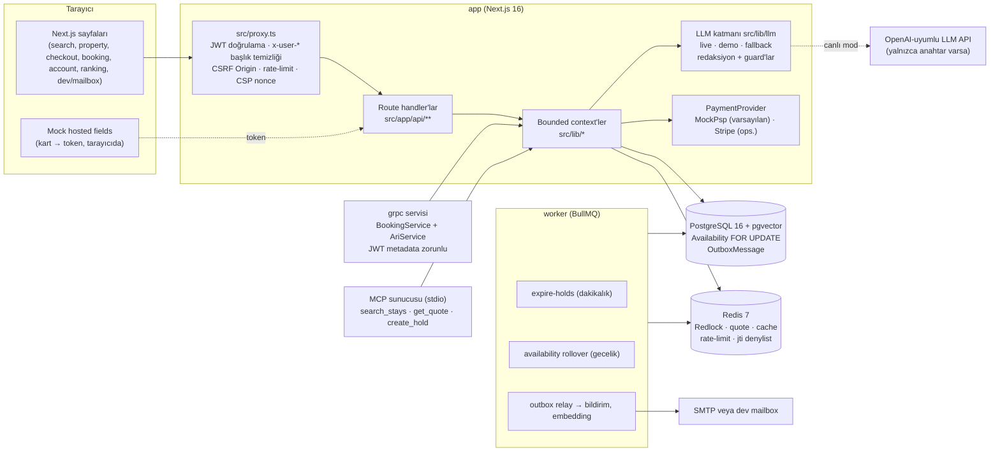

# booking-platform

**Çift rezervasyonu kanıtlanabilir biçimde imkânsız kılan, parayı kuruşu kuruşuna tamsayı olarak hesaplayan ve GenAI'ı yalnızca açıklama/özetleme için — anahtar ve internet olmadan da çalışacak şekilde — kullanan bir konaklama rezervasyon (OTA) platformu.**

> **Portföy/demo projesidir; gerçek ödeme alınmaz, gerçek konaklama satılmaz.**

Next.js 16 (App Router) · React 19 · TypeScript strict · PostgreSQL 16 + pgvector · Prisma 5 · Redis 7 · BullMQ · gRPC · jose · pino · OpenTelemetry · Prometheus · Vitest + testcontainers + fast-check

---

## Mimari



Ayrıntılar: [docs/ARCHITECTURE.md](docs/ARCHITECTURE.md) · kararlar: [docs/adr/](docs/adr/)

## Sektör kıyası

| Yetkinlik          | Sektör liderleri                                        | Bu repoda (v2.0.0)                                                                                                                                      |
| ------------------ | ------------------------------------------------------- | ------------------------------------------------------------------------------------------------------------------------------------------------------- |
| Çift rezervasyon   | Gecelik envanter + kilit/constraint + hold              | Redlock + `SELECT … FOR UPDATE` + SERIALIZABLE, `HELD` + TTL, `expire-holds` job'ı; 100 paralel istek → 1 başarı / 99 `SOLD_OUT` (ADR 0002)             |
| Ödeme              | 3DS2/SCA, auth → capture, iade                          | `PaymentProvider` + `MockPsp` (authorize/capture/refund, 3DS simülasyonu, HMAC imzalı idempotent webhook), opsiyonel `StripeProvider`                   |
| İptal & iade       | Sürümlü politika, rezervasyona snapshot                 | `CancellationPolicy` (NON_REFUNDABLE/FLEXIBLE/MODERATE/STRICT) + `Booking.policySnapshot` + `computeRefund()`                                           |
| Fiyat şeffaflığı   | All-in fiyat (FTC 16 CFR 464, Omnibus)                  | Tek `computeTotal()` (kart = PDP = checkout = tahsilat), minor-unit tamsayı, konaklama vergisi `ACCOMMODATION_TAX_RATE` (%1), fast-check                |
| Arama & sıralama   | Facet, açıklanabilir sıralama (DSA)                     | Ağırlıklı ve `explain` alanlı skor, `/ranking` şeffaflık sayfası, MapLibre harita görünümü (kümeleme yok)                                               |
| GenAI arama        | Booking Smart Filter, Expedia Romie, Trip.com TripGenie | Smart Filter (NL → izinli facet'ler), araçlı ve grounded trip-planner (`POST /api/ai/trip-plan`), MCP sunucusu                                          |
| Yorumlar           | Doğrulanmış konaklama, AI özeti                         | Yalnızca tamamlanmış konaklama sahibi yorum yazar, host yanıtı, atıflı özet (`[r:<id>]` guard'lı)                                                       |
| Partner extranet   | Oda/fiyat/ARI takvimi                                   | Host API'leri (mülk, oda, toplu ARI, rezervasyonlar, ilan copilot'u) ve `/host` paneli                                                                  |
| Kanal yönetimi     | OTA XML / iCal                                          | iCal export/import + gRPC `AriService.PushAvailability` (sıra numaralı, idempotent)                                                                     |
| Dinamik fiyat      | Açıklanabilir yield, olay sinyalleri                    | Faktör kırılımı `Availability.priceExplanation`, olay sinyali önerisi → admin onayı → [floor, ceiling] sınırlı, idempotent yeniden fiyatlama            |
| Güvenlik           | RBAC, fraud skoru, ATO koruması                         | jose JWT 15 dk + rotating refresh, CSRF Origin kontrolü, kimliğe bağlı rate-limit, iç uç koruması, gRPC JWT, kural tabanlı fraud skoru                  |
| Gözlemlenebilirlik | Trace + metrik + SLO                                    | pino, OpenTelemetry (Prisma/ioredis), `/api/metrics` (Prometheus), Grafana dashboard JSON, `observability` compose profili                              |
| Uyum               | KVKK/GDPR, WCAG, STR kayıt no                           | Veri dışa aktarım/silme API'si (`/api/account`), `Property.licenseNumber`, LLM'e giden metinde KVKK redaksiyonu — bkz. [COMPLIANCE](docs/COMPLIANCE.md) |
| Test & CI          | Yüksek kapsam, e2e, yük                                 | Vitest unit + testcontainers entegrasyon, Playwright e2e + axe, k6 yük testi ([docs/perf](docs/perf/)), GitHub Actions CI                               |

## 30 saniyede çalıştır

Gereksinim: Docker (Compose v2).

```bash
cp .env.example .env && docker compose up --build
```

→ <http://localhost:3000>

- **Sırlar otomatik üretilir.** `secrets-init` servisi ilk açılışta JWT, iç API, transfer imza, webhook, metrik, Postgres ve Redis sırlarını rastgele üretip `booking_secrets` volume'una yazar. İmajlarda sır yoktur; build argümanı olarak da geçilmez.
- **Demo verisi:** `migrate` servisi `prisma migrate deploy` çalıştırır, ardından `DEMO_SEED` açıksa (compose varsayılanı `true`) ve veritabanı boşsa seed yükler. Production'da `DEMO_SEED` açıkça verilmedikçe seed çalışmaz (`src/lib/config/seed-guard.ts`).
- **Eski volume uyarısı:** v2 öncesi compose ile oluşturulmuş bir `postgres_data` volume'unuz varsa veritabanı parolası artık üretilmiş sırdan geldiği için bağlantı başarısız olur. Bir kez `docker compose down -v` çalıştırın (demo verisi yeniden yüklenir).
- Postgres ve Redis host'a açılmaz. Yerel geliştirme için: `npm run db:up` (dev compose) → `npm run db:migrate && npm run db:seed` → `npm run dev` ve ayrı terminalde `npm run worker`.

### Demo kullanıcılar

> **UYARI — YALNIZCA DEMO.** Bu hesaplar seed ile oluşturulur ve herkes tarafından bilinen bir parola kullanır. Production'da seed devre dışıdır.

| Rol     | E-posta              | Parola         |
| ------- | -------------------- | -------------- |
| Misafir | `guest@booking.test` | `Password123!` |
| Host    | `host@booking.test`  | `Password123!` |
| Admin   | `admin@booking.test` | `Password123!` |

Test kartları (mock hosted fields, tarayıcıda token'a çevrilir): `4242 4242 4242 4242` onay, `4000 0000 0000 0002` ret, `4000 0000 0000 3220` 3DS (doğrulama kodu `123456`). Onay e-postaları SMTP yapılandırılmamışsa <http://localhost:3000/dev/mailbox> sayfasına düşer.

3 dakikalık demo akışı: [docs/DEMO_SCRIPT.md](docs/DEMO_SCRIPT.md)

### Ekran görüntüleri

| Akıllı filtre (doğal dil → filtre çipleri)        | Mülk sayfası (galeri, fiyat, atıflı yorum özeti) |
| ------------------------------------------------- | ------------------------------------------------ |
|  |                     |
| **Çok şehirli trip-planner (araçlı, grounded)**   | **Host extranet**                                |
|         |               |
| **Ana sayfa**                                     | **Admin paneli (outbox, olay sinyali, fraud)**   |
|                    |                      |

Görüntüler compose demo yığınından (LLM demo modu) `npm run docs:screenshots` ile üretilir (`scripts/screenshots.ts`).

## LLM modu

Tüm LLM erişimi `src/lib/llm/` sözleşmesinden geçer ([ADR 0005](docs/adr/0005-llm-contract.md), [MODEL_CARD](docs/MODEL_CARD.md)).

| Mod                  | Ne zaman                                                  | Davranış                                                                                          |
| -------------------- | --------------------------------------------------------- | ------------------------------------------------------------------------------------------------- |
| **DEMO**             | Anahtar yok veya `LLM_MODE` = `demo`                      | Ağa hiç çıkmaz; görev başına deterministik üreticiler gerçek verilerden Türkçe çıktı üretir       |
| **CANLI**            | `.env` içinde `LLM_API_KEY` tanımlı (`LLM_MODE` = `auto`) | OpenAI-uyumlu Chat Completions (varsayılan model `deepseek-v4-flash`, `LLM_BASE_URL` ile değişir) |
| **fallback** (çağrı) | Canlı çağrıda timeout / 429 / 5xx / geçersiz JSON / guard | O çağrı için demo çıktısı, `llmMode: "fallback"` + kısa `reason` kodu; API yine 200 döner         |

- Başlangıç logu: `LLM: DEMO modu` veya `LLM: CANLI (<model> @ <host>)`.
- `GET /api/llm/status` (giriş gerekli): `mode`, `effectiveMode`, `model`, `baseUrlHost`, `hasKey`, `jsonModeSupported`, `lastError`. Anahtarın kendisi hiçbir yanıtta, logda veya telemetride görünmez.
- `npm run llm:smoke`: 1 JSON + 1 metin çağrısı; anahtar yoksa "DEMO — smoke atlandı" ile 0 çıkış kodu, anahtar varken canlı başarısızlıkta 1.
- LLM **asla** fiyat, uygunluk, iade veya sıralama kararı vermez; LLM'e giden her metin KVKK redaksiyonundan geçer (TCKN, IBAN, telefon, e-posta, kart, kişi adı).

### MCP sunucusu

`npm run mcp:server` platformu [Model Context Protocol](https://modelcontextprotocol.io) üzerinden (stdio) LLM istemcilerine açar (`services/mcp/`):

| Araç           | Yetki                         | Ne yapar                                                                           |
| -------------- | ----------------------------- | ---------------------------------------------------------------------------------- |
| `search_stays` | anonim                        | Deterministik arama; tarih verilirse en ucuz odanın vergi dahil teklifi            |
| `get_quote`    | anonim                        | `computeTotal()` teklifi (`quoteId`, gece gece fiyat, vergi, toplam)               |
| `create_hold`  | kullanıcı access token'ı şart | Odayı `HELD` olarak tutar; **ödeme almaz** — ödenmezse süre dolunca `EXPIRED` olur |

Token `accessToken` argümanıyla veya `MCP_ACCESS_TOKEN` ortam değişkeniyle verilir; yoksa `create_hold` `UNAUTHORIZED` ile reddedilir ve kullanıcı yalnızca token'dan türetilir. Loglar stderr'e gider (stdout JSON-RPC'ye ayrılmıştır). İnceleme: `npx @modelcontextprotocol/inspector npm run mcp:server`; duman testi: `npm run mcp:smoke`.

## Mühendislik öne çıkanları

- **Çift rezervasyon yok, kanıtlı:** `tests/integration/booking-core.test.ts` aynı son oda için 100 paralel `createBooking` çalıştırır → tam 1 başarı, 99 `SOLD_OUT`; ardından SQL ile gece başına en fazla bir aktif rezervasyon olduğu doğrulanır (overbooking = 0). Katmanlar: Redlock (fencing token) → SERIALIZABLE işlem → `SELECT … FOR UPDATE` gecelik `Availability` satırları → sürüm koşullu durum geçişi.
- **Para tamsayıdır:** `src/lib/money/money.ts` minor-unit `number` + `allocate` (kalan kuruş dağıtımı); tek `computeTotal()` (`src/lib/pricing/quote.ts`) arama kartı, PDP, checkout ve `Payment.amount` için aynı sonucu verir — `fast-check` property testleriyle (`tests/unit/money`, `tests/unit/pricing`). Quote Redis'te 15 dk saklanır; fiyat değiştiyse `409 PRICE_CHANGED`.
- **Durum makinesi:** `PENDING → HELD → CONFIRMED → COMPLETED | CANCELLED | EXPIRED` saf geçiş tablosu (`src/lib/booking/state-machine.ts`); ödenmeyen hold'lar `expire-holds` job'ı ile envantere geri döner.
- **Refresh-token rotasyonu:** jose HS256 access token 15 dk, rotating refresh token 7 gün (aile/`jti` Redis'te), logout `jti` denylist'e yazar; sabit zamanlı login.
- **Transactional outbox:** olaylar iş verisiyle aynı transaction'da yazılır; relay `UPDATE … WHERE id IN (SELECT … FOR UPDATE SKIP LOCKED) RETURNING *` ile atomik kiralar, lease süresi dolan mesajlar geri alınır, `OUTBOX_MAX_ATTEMPTS` sonrası `DEAD` (ADR 0003).
- **CSP nonce:** her istekte yeni nonce, `script-src 'nonce-…' 'strict-dynamic'`, HSTS, `Referrer-Policy`, `Permissions-Policy` (`src/lib/security/headers.ts`).
- **Eksiksiz yetki matrisi:** her route × her rol × anonim beklenen durum kodu (`tests/unit/security/role-matrix.test.ts`); başkasının kaynağına erişim (IDOR) 404 döner (entegrasyon testleri).

### Algoritmaların gerçek adları

| Özellik          | Algoritma                                                                                                                                     |
| ---------------- | --------------------------------------------------------------------------------------------------------------------------------------------- |
| Çok şehirli rota | n ≤ 10: **Held-Karp** dinamik programlama O(n²·2ⁿ); n > 10: en yakın komşu + **2-opt** ve **or-opt** yerel arama (asimetrik maliyete güvenli) |
| "Semantik" arama | Varsayılan: 128 boyutlu **feature hashing** (FNV-1a bag-of-words) + pgvector kosinüs; opsiyonel gerçek embedding modeli (ADR 0008)            |
| Olay sinyalleri  | Onaylı olay etkisi → sınırlı çarpan formülü; duygu analizi (sentiment) yapan bir model **yoktur**                                             |
| Sıralama         | Ağırlıklı doğrusal skor + Bayes düzeltilmiş puan                                                                                              |
| Fraud            | Kural tabanlı puanlama (Redis hız sayaçları)                                                                                                  |

Rota optimizasyonu klasik kombinatorik optimizasyondur; neden bu şekilde adlandırıldığı: [METHODOLOGY — Neden "quantum" değil](docs/METHODOLOGY.md#neden-quantum-değil).

## Testler

```bash
npm run check        # lint + typecheck + prettier --check + unit testler (altyapısız)
npm run test:unit    # tests/unit/** — Docker gerekmez
npm run test:int     # tests/integration/** — Docker gerekir (testcontainers: pgvector/pgvector:pg16 + redis:7-alpine)
npm run test:coverage # unit + integration birlikte, src/lib için ≥ %80 satır eşiği (Docker gerekir)
```

Entegrasyon testleri hiçbir zaman `DATABASE_URL`'e yazmaz; container'ın URL'ini kullanır. Docker yoksa suite açık bir mesajla atlanır. Testler ağa çıkmaz (`tests/setup.ts` global `fetch`'i engeller).

CI (`.github/workflows/ci.yml`): lint → typecheck → format → unit → unit + integration + coverage eşiği (≥ %80 satır) → `next build` → `docker compose build` → `npm audit --audit-level=high` → Playwright e2e (compose demo yığınına karşı, `npm run test:e2e`). Eski `deploy.yml` kaldırıldı: gerçek bir deploy hedefi yoktu ve sırları build argümanı olarak imaja geçiriyordu (ADR 0001).

## Gözlemlenebilirlik

```bash
docker compose --profile observability up --build
```

Prometheus <http://127.0.0.1:9090>, Grafana <http://127.0.0.1:3001> (dashboard: `docs/observability/grafana-dashboard.json`), Tempo (OTLP). İz göndermek için `.env` içinde `OTEL_EXPORTER_OTLP_ENDPOINT` değişkenini `http://tempo:4318` yapın. `/api/metrics` `METRICS_TOKEN` ile korunur; `/api/health` (liveness) ve `/api/ready` (DB + Redis) açıktır.

## Dokümantasyon

| Doküman                              | İçerik                                                              |
| ------------------------------------ | ------------------------------------------------------------------- |
| [ARCHITECTURE](docs/ARCHITECTURE.md) | Bounded context'ler, sekans/durum/ER diyagramları, güvenlik modeli  |
| [adr/](docs/adr/)                    | Mimari karar kayıtları 0001–0009                                    |
| [METHODOLOGY](docs/METHODOLOGY.md)   | Fiyat, olay sinyali, sıralama, fraud, rota, Smart Filter golden set |
| [MODEL_CARD](docs/MODEL_CARD.md)     | LLM görevleri, şemalar, guard'lar, sınırlamalar                     |
| [COMPLIANCE](docs/COMPLIANCE.md)     | KVKK/GDPR/DSA/FTC/PCI eşleme tablosu (hukuki görüş değildir)        |
| [DEMO_SCRIPT](docs/DEMO_SCRIPT.md)   | 3 dakikalık demo akışı                                              |
| [CHANGELOG](CHANGELOG.md)            | Sürüm notları                                                       |

## Yasal uyarı ve atıflar

**Portföy/demo projesidir; gerçek ödeme alınmaz, gerçek konaklama satılmaz.** Uyum dokümanı hukuki görüş değildir.

- Harita/konum verisi: © OpenStreetMap katkıda bulunanları, [ODbL](https://opendatacommons.org/licenses/odbl/) lisansıyla.
- Görseller: [Unsplash](https://unsplash.com) (Unsplash License); fotoğraflar sahiplerine aittir.
- Seed verisi (kullanıcılar, yorumlar, fiyat geçmişi) deterministik olarak üretilmiş kurgusal veridir.

Lisans: [MIT](LICENSE)

---

## English summary

**booking-platform** is a portfolio-grade online travel agency (OTA) backend and web app built with Next.js 16, PostgreSQL + pgvector, Redis and BullMQ. Double booking is provably impossible (Redlock + `SELECT … FOR UPDATE` + SERIALIZABLE; 100 parallel requests for the last room yield exactly 1 success and 99 `SOLD_OUT`, verified in SQL). Money is integer minor units priced by a single `computeTotal()` checked with fast-check property tests. Bookings follow a `PENDING → HELD → CONFIRMED → COMPLETED | CANCELLED | EXPIRED` state machine with automatic hold expiry, a mock PSP with 3DS/capture/refund and signed webhooks, versioned cancellation policies, and a transactional outbox (SKIP LOCKED leases, DEAD letter state).

The LLM layer is used only for explanation, summarisation and natural-language-to-filter translation (Smart Filter, cited review summaries, grounded trip planner, listing copy, event extraction). Without an API key it runs a deterministic demo mode; on errors it falls back per call. It never decides prices or availability, and all outbound text is PII-redacted. An MCP server (`npm run mcp:server`) exposes search, quote and token-gated hold tools to LLM clients. Route optimisation is classic Held-Karp / 2-opt / or-opt; "semantic" search defaults to feature hashing.

Run it: `cp .env.example .env && docker compose up --build`, then open <http://localhost:3000>. Demo accounts (`guest@`, `host@`, `admin@booking.test`, password `Password123!`) are **demo only**. This is a demo project: no real payments are taken and no real stays are sold.
