# Mimari

> Bu doküman **gerçekten uygulanmış** durumu anlatır (v4). v2'deki `Availability` satır modeli, partisyonlama (ADR 0006), pazarlık motoru ve eski float fiyat motoru kaldırılmıştır. v4 ekleri: çift girişli defter (§13), grup sepeti ve bölünmüş ödeme (§14), escrow/payout/depozito (§15), ajan mandate akışı (§16). Kararların gerekçeleri [docs/adr/](adr/) altındadır; tam liste §17.

## 1. Genel bakış

booking-platform bir **modüler monolittir** ([ADR 0001](adr/0001-modular-monolith.md)): tek Next.js 16 uygulaması, aynı kod tabanından çalışan bir BullMQ worker'ı ve bir iç gRPC servisi. İş mantığı `src/lib/<context>/` altındaki bounded context'lerde yaşar; route handler'lar (`src/app/api/**`) incedir. Girdiyi `zod` ile doğrular, kimliği çözer, servisi çağırır ve hatayı `src/lib/http/errors.ts` ile HTTP'ye çevirir.

| Süreç          | Giriş noktası                        | Görev                                                                                                                                                       |
| -------------- | ------------------------------------ | ----------------------------------------------------------------------------------------------------------------------------------------------------------- |
| `app`          | Next.js (`src/proxy.ts` + `src/app`) | Sayfalar, REST API, MCP HTTP (`/api/mcp`), ACP (`/api/agentic/*`), UCP (`/.well-known/ucp`, `/api/ucp/*`), SSE akışları, PWA manifest + `public/sw.js`      |
| `worker`       | `src/worker/index.ts`                | BullMQ kuyrukları (`pricing`, `maintenance`, `saga`, `refund-retry`, `compliance`, `resolution`, `price-calendar`), outbox relay, metrik sunucusu (bkz. §9) |
| `grpc`         | `services/grpc/main.ts`              | `BookingService` + `AriService` (kanal ARI push); yalnızca compose iç ağında                                                                                |
| `mcp` (stdio)  | `services/mcp/main.ts`               | Yerel MCP sunucusu (stdio); HTTP taşıması uygulamanın içindedir (§7)                                                                                        |
| `migrate`      | `scripts/migrate-and-seed.ts`        | `prisma migrate deploy` + (`DEMO_SEED` ve boş DB ise) seed                                                                                                  |
| `secrets-init` | `scripts/gen-secrets.mjs`            | Eksik sırları rastgele üretip `booking_secrets` volume'una yazar                                                                                            |

Altyapı: PostgreSQL 16 + pgvector + `pg_trgm` (`pgvector/pgvector:pg16`), Redis 7 (`requirepass`, host'a kapalı). Opsiyonel compose profili: `observability` (Prometheus, Tempo, Grafana). `onnxruntime-node` opsiyoneldir; Alpine imajında yoktur (§6.3).

## 2. Bounded context'ler

| Context            | Klasör / dosyalar                                                                                                         | Sorumluluk                                                                                                                                                            |
| ------------------ | ------------------------------------------------------------------------------------------------------------------------- | --------------------------------------------------------------------------------------------------------------------------------------------------------------------- |
| Identity & Access  | `src/lib/auth/*`, `src/lib/security/*`, `src/proxy.ts`                                                                    | JWT, refresh rotasyonu, passkey (WebAuthn) ve step-up, RBAC, CSRF, rate-limit                                                                                         |
| Catalog            | `src/app/api/properties/**`, `src/lib/host/host-service.ts`                                                               | Mülk, oda tipi, rate plan, kısıt; lisans durumu (`licenseStatus`)                                                                                                     |
| Inventory          | `src/lib/booking/{inventory,restrictions,availability-rollover}.ts`, `src/lib/channel/{channel,ical-poller}.ts`           | `InventoryDay` sayaçları, 365 gün rollover + budama, iCal import/export ve polling, `ExternalBlock`                                                                   |
| Booking            | `src/lib/booking-service.ts`, `src/lib/booking/{state-machine,cancellation,complete-stays}.ts`                            | Hold, durum makinesi, iptal politikası snapshot'ı, iade hesabı                                                                                                        |
| Time               | `src/lib/time/nights.ts`                                                                                                  | Mülk saat dilimine göre gece ve check-in/out anları (Temporal)                                                                                                        |
| Pricing            | `src/lib/pricing/{quote,tax,event-signals,insight,price-alerts,revenue-engine,revenue,tr-holidays}.ts`, `src/lib/money/*` | Quote, vergi motoru, olay sinyalleri, fiyat aralığı (conformal), Omnibus, gelir önerisi                                                                               |
| FX                 | `src/lib/fx/store.ts`                                                                                                     | TCMB/ECB kur snapshot'ları (`FxRate`), statik fallback                                                                                                                |
| Payment & Saga     | `src/lib/payment/*`, `src/lib/saga/{saga,booking-saga}.ts`, `src/lib/invoice/*`                                           | `PaymentProvider` (`MockPsp` varsayılan, opsiyonel Stripe), saga, ledger, fatura, payout                                                                              |
| Transfer           | `src/lib/transfer/transfer-service.ts`                                                                                    | İmzalı claim linki + escrow ([ADR 0007](adr/0007-transfer-claim-link-escrow.md))                                                                                      |
| Search & Discovery | `src/lib/search.ts`, `src/lib/search/{hybrid,ltr,ranking,vector,fuzzy,map-cluster}.ts`, `src/lib/embedding/*`             | Hibrit arama (RRF), LTR, açıklanabilir sıralama, harita kümeleme, A/B deneyi                                                                                          |
| Messaging          | `src/lib/messaging/{message-service,mask,hub}.ts`                                                                         | Misafir–host mesajlaşma, PII maskeleme, Redis pub/sub + SSE                                                                                                           |
| Reviews            | `src/lib/reviews/*`                                                                                                       | Doğrulanmış yorum, raporlama, moderasyon kuyruğu                                                                                                                      |
| AI (LLM)           | `src/lib/ai/*`, `src/lib/llm/*`                                                                                           | LLM görevleri; karar yetkisi yok ([ADR 0005](adr/0005-llm-contract.md), [0017](adr/0017-messaging-moderation-step-up.md))                                             |
| Agentic            | `src/lib/mcp/{http,server}.ts`, `src/lib/agentic/{checkout,spt,mandate,ucp}.ts`                                           | MCP araçları, ACP `checkout_sessions`, SPT, AP2 mandate, UCP ([ADR 0015](adr/0015-agentic-booking-channel-revenue.md), [0023](adr/0023-agentic-commerce-mandates.md)) |
| Risk               | `src/lib/risk/{fraud,bin-table,device-fingerprint}.ts`                                                                    | Fraud v2 skoru, cihaz parmak izi                                                                                                                                      |
| Ledger             | `src/lib/ledger/*`                                                                                                        | Çift girişli jurnal, şablonlar, bakiye/mizan, mutabakat (§13, [ADR 0020](adr/0020-double-entry-ledger.md))                                                            |
| Cart & Split       | `src/lib/cart/*`, `src/lib/money/split.ts`                                                                                | Grup sepeti, tümü-ya-hiç tutma, sepet ödemesi, bölünmüş ödeme, geç webhook (§14)                                                                                      |
| Payout & Escrow    | `src/lib/payout/*`                                                                                                        | Escrow serbest bırakma, komisyon, rezerv, host payout motoru, DAC7 ([ADR 0021](adr/0021-escrow-payout-deposit.md))                                                    |
| Resolution         | `src/lib/resolution/*`                                                                                                    | Hasar depozitosu, talepler, kanıt, SLA, chargeback senkronu (§15)                                                                                                     |
| Trust & Safety     | `src/lib/trust/*`                                                                                                         | KYC sağlayıcıları, mesaj dolandırıcılık taraması, parti riski                                                                                                         |
| Wallet & Loyalty   | `src/lib/wallet/*`                                                                                                        | Seviyeler, cashback kredisi, FIFO lot, kredi ile kısmi ödeme                                                                                                          |
| Promotions         | `src/lib/pricing/{promotions,promotion-service,promotion-redemption,omnibus,price-calendar}.ts`                           | Promosyon motoru, kupon, Omnibus 30 gün referansı, esnek tarih fiyat takvimi                                                                                          |
| Vision             | `src/lib/vision/*`                                                                                                        | Fotoğraf kalite skoru, pHash, CLIP embedding, görsel arama ([ADR 0022](adr/0022-multimodal-search.md))                                                                |
| PWA & Push         | `src/lib/pwa/*`, `src/lib/push/*`, `public/sw.js`                                                                         | Manifest, offline seyahat planı, Web Push                                                                                                                             |
| Events / outbox    | `src/lib/cqrs/{outbox,event-bus}.ts`, `src/lib/queue.ts`                                                                  | Transactional outbox, olay yayını, BullMQ kuyruk tanımları                                                                                                            |
| Admin & Privacy    | `src/lib/admin/*`, `src/lib/privacy/*`, `src/lib/compliance/*`                                                            | Audit log, kuyruklar, KVKK dışa aktarım/anonimleştirme, saklama işi, 7565/DSA iş akışları, erişilebilirlik özellikleri                                                |
| Observability      | `src/lib/observability/*`, `src/instrumentation.ts`                                                                       | pino, OpenTelemetry, Prometheus, readiness                                                                                                                            |

Diğer: `resilience/circuit-breaker.ts`, `routing/optimizer.ts` (çok şehirli rota), `live/hub.ts` (canlı ısı haritası SSE'si ve bağlantı yuvaları), `flags/*` (OpenFeature), `i18n/*` ([ADR 0018](adr/0018-i18n-namespaces-and-formatting.md)).

## 3. Envanter v2 ([ADR 0010](adr/0010-room-type-inventory-counters.md))

v2'de her oda × gece için `isAvailable` bayraklı bir `Availability` satırı vardı. v3'te birim **oda tipidir** (`RoomType.units` adet özdeş oda); her gece için tek bir sayaç satırı tutulur.

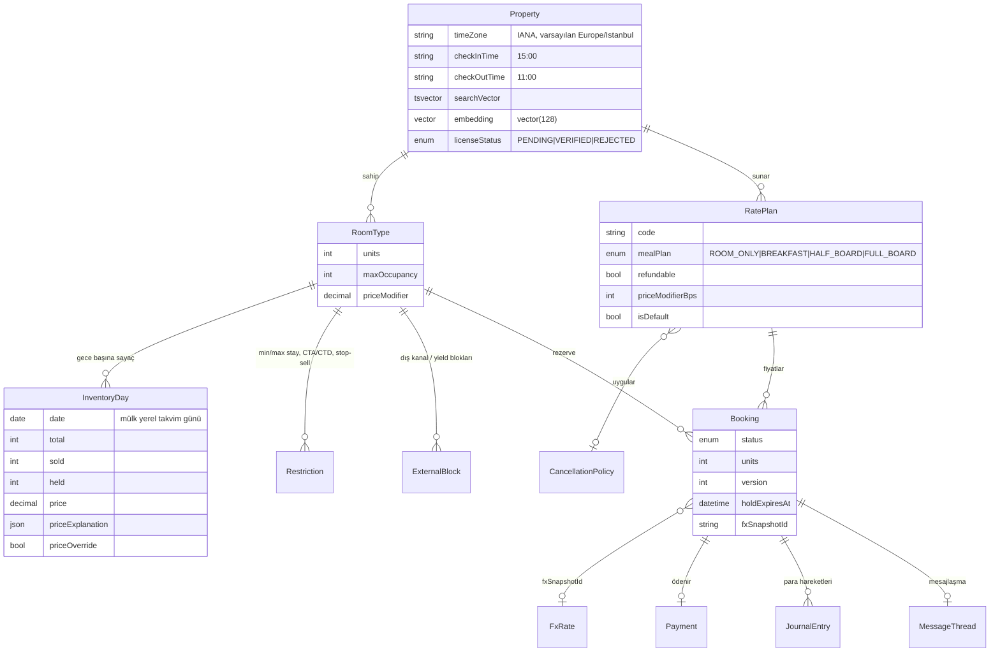

- **Sayaç invariantı** veritabanında zorunludur (`prisma/migrations/20260925010000_inventory_v2/migration.sql`):
  `CHECK ("sold" >= 0 AND "held" >= 0 AND "total" >= 0 AND "sold" + "held" <= "total")`. Aynı migration `RatePlan.priceModifierBps > -10000` ve `Booking.units >= 1` kısıtlarını ekler.
- **Hold koşullu güncellemedir:** `UPDATE "InventoryDay" SET held = held + $units WHERE … AND sold + held + $units <= total`. Güncellenen satır sayısı gece sayısına eşit değilse işlem geri alınır ve `SOLD_OUT` döner (`src/lib/booking/inventory.ts`).
- Geçişlere göre sayaç hareketi: HOLD → `held +u`; CONFIRM → `held −u, sold +u`; EXPIRE / HELD'den iptal → `held −u`; CONFIRMED'den iptal → `sold −u`.
- **ExternalBlock:** iCal import'undan (`source` + `uid`) veya onaylı olay için yield hold'dan (`source = "yield:<eventId>"`) gelen bloklar `sold` sayacına eklenir; bloğun kalkması sayacı geri alır.
- **RatePlan / Restriction:** `pickRatePlan` rate planı seçer; `checkRestrictions` (`src/lib/booking/restrictions.ts`) `minStay`, `maxStay`, `closedToArrival`, `closedToDeparture`, `stopSell` kurallarını uygular ve `RestrictionError` fırlatır.
- **Partisyonlama yok:** ADR 0006'daki opt-in partisyonlama kaldırıldı. Eski geceler `availability-rollover` işinde `pruneInventory` ile silinir (`INVENTORY_RETENTION_DAYS`, varsayılan 400).
- `Property.searchVector`: `setweight(A)` başlık ve `setweight(B)` açıklama, `simple` + `turkish` yapılandırmalarıyla; GIN indeksi `Property_searchVector_idx`.

## 4. Mülk saat dilimi ([ADR 0011](adr/0011-property-time-zone-temporal.md))

- Geceler mülkün **yerel takvim günleridir** (`@db.Date`, `IsoDate`). "Bugün" `todayIn(property.timeZone, now)` ile hesaplanır (`src/lib/time/nights.ts`, `@js-temporal/polyfill`).
- `checkInInstant` / `checkOutInstant` mülkün `checkInTime` / `checkOutTime` değerlerini o güne ait gerçek bir ana çevirir. İade penceresi, transfer kesim zamanı ve `complete-stays` bu anları kullanır. Süreler `ZonedDateTime` farkıyla hesaplanır, bu yüzden DST geçişlerinde doğrudur.
- iCal: `DATE` değerleri takvim günü olarak alınır; `DATE-TIME` değerleri mülkün dilimine çevrilir.
- v2'deki global `CHECKIN_HOUR_UTC` kaldırıldı. Temporal, `date-fns-tz`'ye tercih edildi (gerekçe ADR'de).

## 5. Rezervasyon ve ödeme

### 5.1 Booking durum makinesi

Saf geçiş tablosu `src/lib/booking/state-machine.ts` içindedir. Yazım, hesaplanan hedef durumu mevcut `status` ve `version` koşuluyla (`updateMany`) yapar; eşzamanlı iki geçişten yalnızca biri kazanır.

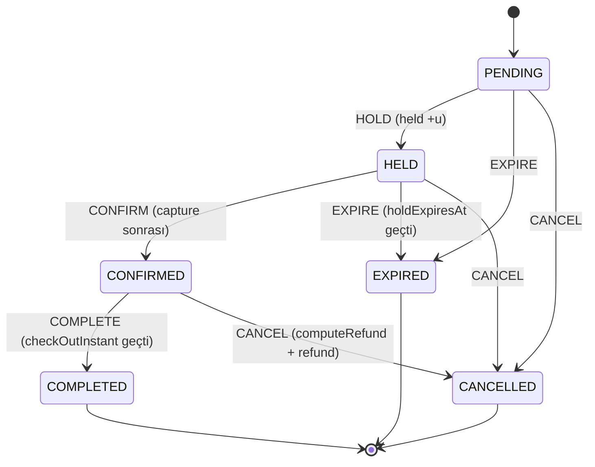

`HELD` süresi `BOOKING_HOLD_TTL_MINUTES` (varsayılan 15).

### 5.2 Ödeme saga'sı ([ADR 0013](adr/0013-payment-saga.md))

Kod: `src/lib/payment/payment-service.ts` (`payForBooking` → `payLocked` → `captureAndConfirm`) ve `src/lib/saga/booking-saga.ts`. Adımlar `SAGA_STEPS`: `hold`, `authorize`, `capture`, `confirm`, `invoice`, `notify`. Ödeme saga'sı (`booking_payment`) yetkilendirmeden sonra `capture` adımından başlar (`runSaga(..., { from: SAGA_STEPS.capture })`). Pivot adım `confirm`'dür; ondan önce bir adım başarısız olursa tamamlanmış adımlar ters sırada telafi edilir.

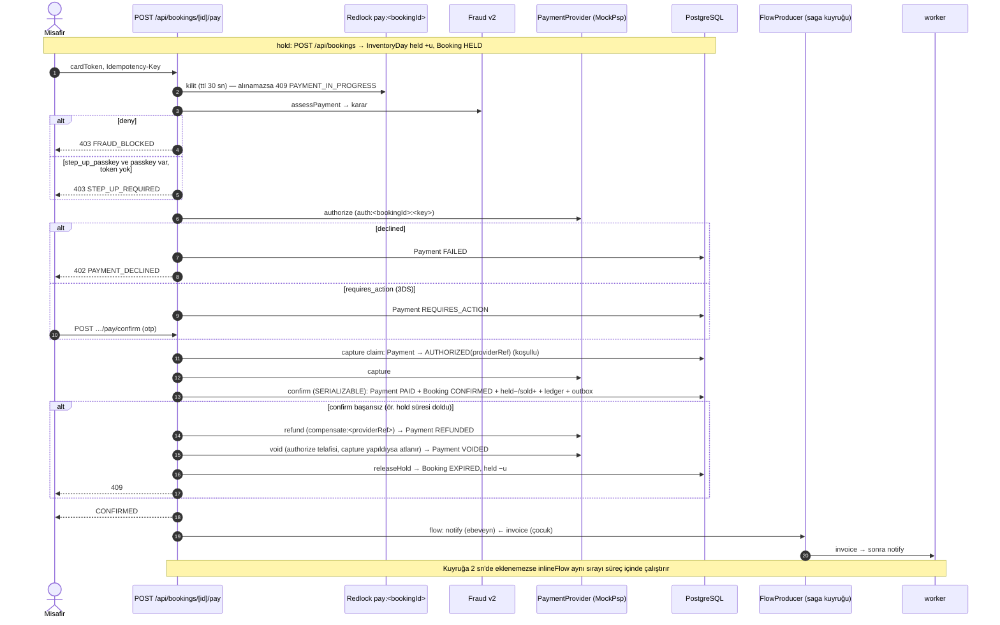

- **Telafiler** (`src/lib/saga/saga.ts`: `from` öncesindeki adımlar çalıştırılmaz ama hata durumunda her zaman telafi edilir; sıra tersinedir): `capture` → `refund` (idempotency `compensate:<providerRef>`, Payment `REFUNDED`, `failureCode = BOOKING_NOT_CONFIRMABLE`); `authorize` → `provider.void` (Payment `VOIDED`, `failureCode = saga_aborted`; para çekildiyse atlanır); `hold` → `releaseHold` (HELD → EXPIRED).
- **Capture, confirm'den önce** yapılır: `CONFIRMED` durumu "para alındı" demektir.
- **Yarış:** Aynı rezervasyon için iki yetkilendirmeden tahsil hakkını koşullu `updateMany` ile yalnızca biri alır; kaybeden `voidLoser` ile bırakılır (`payment_capture_race_total{action}`). Telafiler `saga_compensation_total{saga,step,outcome}` ile sayılır.
- **Fulfilment saga'sı** (`booking_fulfilment`): BullMQ `FlowProducer`, ebeveyn `notify` ve çocuk `invoice` ile `QUEUE_NAMES.saga` kuyruğunda çalışır. `jobId = <adım>:<bookingId>`, 5 deneme, üstel backoff 5000 ms. İptal edilmiş rezervasyonda (`ConflictError`) fatura atlanır.
- Temporal (workflow motoru) değerlendirildi ve reddedildi (ADR 0013).
- **Hâlâ mock/demo:** `MockPsp` varsayılan sağlayıcıdır (Stripe opsiyonel). e-Arşiv faturası "DEMO — mali değeri yoktur" işaretli bir mock PDF'tir. Payout'lar `po_mock_` referanslı mock kayıtlardır.

### 5.3 Payment durum makinesi

Ödeme satırı ilk yazımda doğrudan hedef duruma oluşturulur (`transitionPayment`); şemadaki `PENDING` varsayılanı "açık" durumlardan sayılır. Açık durumlar: `PENDING`, `REQUIRES_ACTION`, `FAILED`, `VOIDED` (yeniden denenebilir). Kapanmış durumlar: `PAID`, `PARTIALLY_REFUNDED`, `REFUNDED`.

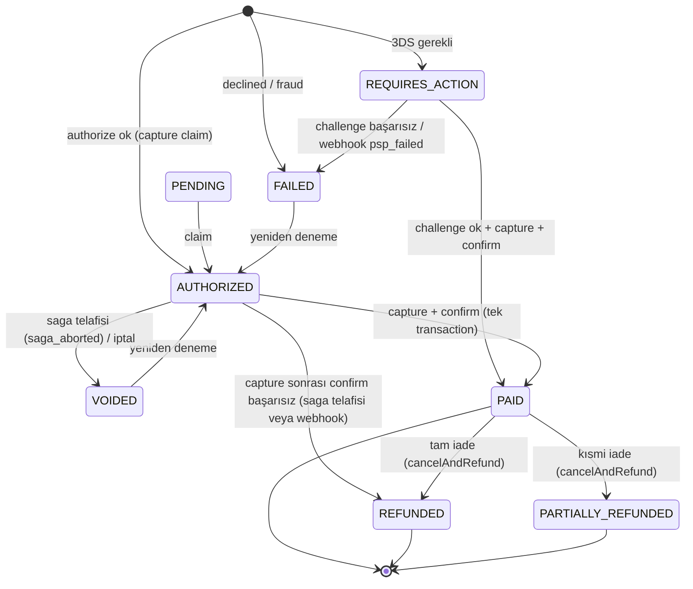

## 6. Arama

### 6.1 Hibrit sorgu ve RRF ([ADR 0014](adr/0014-hybrid-search-ltr-experiments.md))

`src/lib/search/hybrid.ts` tek bir SQL'de dört aday kanalı üretir ve Reciprocal Rank Fusion ile birleştirir. Gerçek CTE yapısı (sadeleştirilmiş):

```sql
WITH base AS (
  SELECT p.id, p.title, p.description, l.city,
         coalesce(p."searchVector", ''::tsvector)
           || to_tsvector('simple', l.city || ' ' || l.country) AS doc,
         p.embedding
  FROM "Property" p JOIN "Location" l ON l.id = p."locationId"
  WHERE p."isActive" AND p."licenseStatus" = 'VERIFIED' /* + filtreler */
),
lex AS (   -- tam metin: simple || turkish tsquery, ts_rank_cd
  SELECT id, score, row_number() OVER (ORDER BY score DESC, id) AS rank FROM (
    SELECT b.id, ts_rank_cd(b.doc, q.q) AS score
    FROM base b, (SELECT to_tsquery('simple', $tsq) || to_tsquery('turkish', $tsq) AS q) q
    WHERE b.doc @@ q.q ORDER BY score DESC, b.id LIMIT $limit) s
),
vec AS (   -- pgvector kosinüs, sim >= SEARCH_HYBRID_MIN_SIMILARITY
  SELECT id, sim, row_number() OVER (ORDER BY sim DESC, id) AS rank FROM (
    SELECT b.id, 1 - (b.embedding <=> $v::vector) AS sim
    FROM base b ORDER BY b.embedding <=> $v::vector LIMIT $limit) s
  WHERE sim >= $minSimilarity
),
trg AS (   -- pg_trgm word_similarity (başlık/şehir), sim >= SEARCH_HYBRID_MIN_TRGM
  SELECT id, sim, row_number() OVER (ORDER BY sim DESC, id) AS rank FROM (
    SELECT b.id, max(greatest(word_similarity(w, b.title), word_similarity(w, b.city))) AS sim
    FROM base b, unnest($words::text[]) w GROUP BY b.id) s
  WHERE sim >= $minTrgm LIMIT $limit
),
phr AS (   -- tam ifade eşleşmesi, sabit rank 1
  SELECT b.id, 1::bigint AS rank FROM base b
  WHERE position($phrase IN lower(b.title || ' ' || b.description || ' ' || b.city)) > 0 LIMIT $limit
),
fused AS (
  SELECT id, SUM(1.0 / ($k + rank)) AS rrf
  FROM (SELECT id, rank FROM lex UNION ALL SELECT id, rank FROM vec
        UNION ALL SELECT id, rank FROM trg UNION ALL SELECT id, rank FROM phr) u
  GROUP BY id
)
SELECT f.id, f.rrf, lex.rank, lex.score, vec.rank, vec.sim, trg.sim
FROM fused f LEFT JOIN lex USING (id) LEFT JOIN vec USING (id) LEFT JOIN trg USING (id)
ORDER BY f.rrf DESC, f.id;
```

Parametreler: `SEARCH_RRF_K` (60), `SEARCH_HYBRID_CANDIDATES` (200), `SEARCH_HYBRID_MIN_SIMILARITY` (0.2), `SEARCH_HYBRID_MIN_TRGM` (0.45). Sorgu en fazla 8 kelimeye kesilir; ≥ 3 harfli kelimelere önek (`:*`) eklenir; trigram kanalı ≥ 4 harfli kelimeleri kullanır. Eş anlamlılar `expandSynonyms` ile genişletilir. Hibrit SQL hata verirse arama v2 alt-dize eşleşmesine düşer. Formül için bkz. [METHODOLOGY §7.1](METHODOLOGY.md).

### 6.2 Sıralama ve deney

RRF adayları `src/lib/search/ranking.ts` ile açıklanabilir ağırlıklı skora veya `src/lib/search/ltr.ts` ile LTR modeline sokulur. `search-ranking` deneyi (`ranking.weighted` / `ranking.ltr`) kullanıcıyı `exp_sid` çerezinin murmurhash3 değeri mod 10000 ile bir kola atar ve `ExperimentExposure` kaydeder; sonuçlar Wilson aralığıyla `GET /api/admin/experiments` üzerinden okunur.

### 6.3 LTR çalışma zamanı

`models/ranker.onnx`, `onnxruntime-node` ile tembel (lazy) yüklenir. Model dosyası yoksa, yükleme başarısız olursa, çıktı boyutu yanlışsa veya sonlu değilse ağırlıklı sıralamaya düşülür (`mode: "weighted"`). Alpine Docker imajı onnxruntime'ı içermez (`next.config.ts` → `outputFileTracingExcludes`); orada `ltr` kolu fiilen ağırlıklı sıralama gibi davranır. Ayrıntı: [MODEL_CARD](MODEL_CARD.md).

## 7. Ajan kanalı: MCP HTTP + ACP + UCP ([ADR 0015](adr/0015-agentic-booking-channel-revenue.md), [ADR 0023](adr/0023-agentic-commerce-mandates.md))

- **MCP HTTP:** `/api/mcp` (`src/app/api/mcp/route.ts` → `src/lib/mcp/http.ts`). Durumsuz `WebStandardStreamableHTTPServerTransport`, JSON yanıt; yalnızca `POST` (diğerleri 405). `Authorization: Bearer <JWT>` zorunludur; yoksa 401 + `WWW-Authenticate: Bearer realm="booking-mcp"`. stdio'daki `MCP_ACCESS_TOKEN` ortam fallback'i HTTP'de kapalıdır.
- **Araçlar** (`src/lib/mcp/server.ts`): `search_stays`, `get_quote`, `create_hold`, `checkout_stay` (SPT + mandate, v4), `get_price_insight`, `list_my_bookings`, `cancel_booking` (`confirm: true` zorunlu). `create_hold` ve `checkout_stay` doğrulanmış e-posta ister. `ui://booking/stay-card` kaynağı (MCP Apps, `text/html;profile=mcp-app`; CSP ile ağa kapalı, ilan adı kaçışlı, vergi dahil toplam + AI etiketi — ADR 0036) yalnızca görüntüleme içindir.
- **ACP** (`src/lib/agentic/checkout.ts`):
  - `POST /api/agentic/checkout_sessions`, `GET`/`POST /api/agentic/checkout_sessions/[id]`, `POST /api/agentic/checkout_sessions/[id]/complete`.
  - Durumlar: `ready_for_payment`, `in_progress`, `completed`, `canceled`. Oturum ömrü `CHECKOUT_SESSION_TTL_MINUTES` (30).
  - `Idempotency-Key` zorunlu; aynı anahtar farklı gövdeyle gelirse 409 (`requestHash`). Oturumu yalnızca sahibi görür, başkasına 404.
  - `complete`: `createQuote` → `createBooking` (idempotency `acs:<id>`) → `payForBooking`, yani aynı saga.
  - **Ödeme token'ı:** Stripe aktifken `spt_…` Stripe Shared Payment Token'ı olarak doğrulanır (`src/lib/agentic/spt.ts`; etkinlik, para birimi, `max_amount` → 402 `SPT_*`); Stripe yoksa `spt_mock_<ok|decline|3ds>` MockPsp senaryolarına eşlenir. SPT yolu yalnız ağsız fake ile test edildi.
  - **Mandate (v4):** `complete` PSP'den önce AP2 intent mandate'ini doğrular (`AGENT_MANDATE_REQUIRED`, varsayılan açık); akış §16.
  - Her okumada oturum rezervasyon durumuyla uzlaştırılır; süresi dolmuş tutmada oturum `canceled` olur (v4#10).
- **UCP** (`src/lib/agentic/ucp.ts`): `GET /.well-known/ucp` profil belgesi; `/api/ucp/checkout-sessions` (POST, `[id]` GET/PUT, `[id]/complete` POST) yalnız UCP lodging şemasını ACP servislerine eşler.
- Rate-limit: `agentic` kategorisi (`RATE_LIMIT_AGENTIC_MAX`, 30), Redis hatasında fail-closed (`src/lib/security/rate-limit.ts`).
- **Kanal yöneticisi:** `ical-poll` işi ETag / `If-Modified-Since` kullanır; yalnızca https ve SSRF korumalıdır (`ICAL_MAX_BYTES` 1e6, `ICAL_FETCH_TIMEOUT_MS` 10000, `ICAL_POLL_BATCH` 50). Feed token'ları `ChannelFeed.tokenVersion` ile iptal edilebilir. Fiyat paritesi (`CHANNEL_PARITY_TOLERANCE_BPS`, 100) yalnızca uyarı üretir.

## 8. Mesajlaşma ve SSE

- **Model:** `MessageThread` / `Message` (rezervasyon başına bir konu). Uçlar: `GET`/`POST /api/bookings/[id]/messages`, `POST /api/bookings/[id]/messages/draft` (yalnızca HOST, LLM taslağı), `GET /api/bookings/[id]/messages/stream` (SSE).
- **Maskeleme:** `maskMessage` (`src/lib/messaging/mask.ts`) telefon, e-posta, IBAN, URL, kart ve TCKN'yi **kaydetmeden önce** maskeler; desenler LLM redaksiyonuyla (`src/lib/llm/redaction.ts`) ortaktır. Maskelenen türler `maskedKinds` alanında tutulur.
- **Dağıtım:** `src/lib/messaging/hub.ts` her süreçte tek bir Redis aboneliği açar (`msg:thread:<bookingId>`) ve mesajları yerel dinleyicilere dağıtır; kanala yalnızca maskelenmiş gövde yayınlanır.
- **Erişim ve limitler:** `resolveThreadAccess` yalnızca misafir veya host'a izin verir (diğerlerine 404). Bağlantı yuvası `acquireConnectionSlot` (`src/lib/live/hub.ts`) canlı ısı haritasıyla (`GET /api/rooms/[roomId]/live`) paylaşılır: IP başına `LIVE_MAX_CONNECTIONS_PER_IP` (3), aşılırsa 429 `TOO_MANY_STREAMS`. Heartbeat `MESSAGE_SSE_HEARTBEAT_MS` (25000). Mesaj en fazla `MESSAGE_MAX_LENGTH` (2000) karakterdir.

## 9. Worker işleri (`src/worker/index.ts`)

| Kuyruk / döngü   | İş                                               | Zamanlama                                                    | Görev                                                                                           |
| ---------------- | ------------------------------------------------ | ------------------------------------------------------------ | ----------------------------------------------------------------------------------------------- |
| `pricing`        | fiyat işi                                        | olay/istek ile                                               | `updateAvailabilityPrices` (`src/lib/pricing-service.ts`, `priceNights`)                        |
| `maintenance`    | `expire-holds`                                   | 60 sn                                                        | Süresi dolan hold'lar, 100'lük partiler (en fazla 10 parti); `held` sayacı geri alınır          |
| `maintenance`    | `complete-stays`                                 | 15 dk                                                        | `checkOutInstant` geçmiş CONFIRMED → COMPLETED                                                  |
| `maintenance`    | `availability-rollover`                          | `30 2 * * *` (UTC)                                           | `rollAvailabilityForward(365)` + `pruneInventory` (`INVENTORY_RETENTION_DAYS`)                  |
| `maintenance`    | `fx-refresh`                                     | `FX_REFRESH_CRON` (`45 12 * * *`)                            | TCMB/ECB kur snapshot'ı + eski FX satırlarının budanması                                        |
| `maintenance`    | `price-alerts`                                   | `PRICE_ALERT_CRON` (`15 6 * * *`)                            | Fiyat gözlemi, Omnibus referansının altına düşüşte `price.dropped` outbox olayı                 |
| `maintenance`    | `payouts`                                        | `PAYOUT_CRON` (`*/15 * * * *`)                               | Payout motoru: devir payout'ları + `HostPayout` (mock / Stripe Connect), `payoutReleased`       |
| `maintenance`    | `escrow-release`                                 | `ESCROW_RELEASE_CRON` (`*/30 * * * *`)                       | Check-in + `PAYOUT_RELEASE_HOURS` sonrası `escrowReleased` (komisyon + rezerv), rezerv açılması |
| `maintenance`    | `ledger-reconcile`                               | `LEDGER_RECONCILE_CRON` (`45 2 * * *`)                       | Dünün mutabakatı, `ledger.reconciliation` audit'i                                               |
| `maintenance`    | `transfer-sweep`                                 | `TRANSFER_SWEEP_CRON` (`*/5 * * * *`)                        | `CAPTURE_PENDING`'de takılan devirleri FAILED + void/iade (v4#1)                                |
| `maintenance`    | `split-pay-deadline`                             | gecikmeli iş + `expire-holds` süpürmesi                      | Bölünmüş ödeme süre sonu: organizatör yedeği veya tam iade                                      |
| `maintenance`    | `wallet-sweep`                                   | `WALLET_SWEEP_CRON` (`*/30 * * * *`)                         | Vadesi gelen cashback, kredi süre dolumu, bayat rezervler                                       |
| `maintenance`    | `push-checkin-reminders`                         | `PUSH_CHECKIN_REMINDER_CRON` (`0 7 * * *`)                   | Check-in hatırlatma push'u (VAPID varsa)                                                        |
| `maintenance`    | `data-retention`                                 | `RETENTION_CRON` (`15 3 * * *`)                              | Saklama politikası budaması ([COMPLIANCE §7](COMPLIANCE.md))                                    |
| `refund-retry`   | `refund-<bookingId>`                             | üstel geri çekilme                                           | `REFUND_FAILED` iadeleri yeniden dener (v4#7); admin kuyruğu `/api/admin/refunds`               |
| `compliance`     | `takedown-sla-check` / `takedown-sla-sweep`      | gecikmeli iş + `TAKEDOWN_SLA_SWEEP_CRON`                     | 7565 kaldırma talebi 24 saat SLA denetimi                                                       |
| `resolution`     | `claim-sla-check`, `deposit-void`, süpürücüler   | gecikmeli iş + `CLAIM_SLA_SWEEP_CRON` / `DEPOSIT_SWEEP_CRON` | Talep yanıt SLA'sı, depozito provizyon/void                                                     |
| `price-calendar` | `price-calendar-refresh` / `price-calendar-full` | olay (debounce) + `PRICE_CALENDAR_REFRESH_CRON`              | `MinPriceByDate` yenileme                                                                       |
| `maintenance`    | `ical-poll`                                      | `ICAL_POLL_MINUTES` (30)                                     | iCal abonelikleri → `ExternalBlock`                                                             |
| `saga`           | fulfilment                                       | FlowProducer                                                 | `processFulfilmentJob`: `invoice` → `notify`                                                    |
| döngü            | outbox relay                                     | 5000 ms, parti 100                                           | `OutboxMessage` → olay işleyicileri (`registerEventHandlers`)                                   |

Worker ayrıca `WORKER_METRICS_PORT` (9464) üzerinde yetkili (`metricsAuthorized`) bir Prometheus uç noktası açar ve `registerTracing("booking-worker")` ile trace üretir.

## 10. Eşzamanlılık ve tutarlılık

- **Çift katmanlı kilit** ([ADR 0002](adr/0002-two-layer-locking.md)): Redlock (fencing token, hızlı çatışma) → SERIALIZABLE transaction + koşullu sayaç güncellemesi (yetkili kaynak). P2034 hataları `withSerializableRetry` ile yeniden denenir (`DB_SERIALIZABLE_RETRY_ATTEMPTS` 6, taban `DB_SERIALIZABLE_RETRY_BASE_MS` 15).
- **Idempotency:** `Booking(userId, idempotencyKey)` unique; ödeme yetkilendirmesi `auth:<bookingId>:<key>`, ACP `acs:<id>`.
- **Outbox** ([ADR 0003](adr/0003-transactional-outbox.md)): olay iş verisiyle aynı transaction'da yazılır; worker `FOR UPDATE SKIP LOCKED` + lease ile kiralar (`OUTBOX_MAX_ATTEMPTS` 8).
- **Para:** tüm hesaplar minor-unit tamsayıyla yapılır ([ADR 0004](adr/0004-minor-unit-money-quote.md)). Rezervasyon kur snapshot'ını `fxSnapshotId` ile sabitler ([ADR 0012](adr/0012-tax-engine-and-persistent-fx.md)).
- **Cache:** arama sonuçları `search:v{n}:…` sürüm anahtarlarıyla tutulur; yazımda `INCR search:version`.

## 11. Güvenlik modeli

| Katman        | Uygulama                                                                                                                                                                                                                                                                                                                                                                |
| ------------- | ----------------------------------------------------------------------------------------------------------------------------------------------------------------------------------------------------------------------------------------------------------------------------------------------------------------------------------------------------------------------- |
| Kimlik        | `jose` HS256 access JWT (`ACCESS_TOKEN_TTL_SECONDS`, varsayılan 300 sn); opak rotating refresh token (`REFRESH_TOKEN_TTL_SECONDS`, 7 gün), Redis'te yalnızca SHA-256 özeti, yeniden kullanımda tüm aile iptal. httpOnly çerez.                                                                                                                                          |
| Passkey       | WebAuthn kayıt/giriş (`/api/auth/passkey/*`) ve ödeme için step-up (`/api/auth/step-up/*`, `STEP_UP_TTL_SECONDS` 300) ([ADR 0017](adr/0017-messaging-moderation-step-up.md)); v4: step-up token'ı rezervasyon + tutar + nonce'a bağlı, `GETDEL` ile tek kullanımlık; yeni passkey 24 saat step-up'ta kullanılamaz ([ADR 0024](adr/0024-recent-auth-step-up-binding.md)) |
| Recent-auth   | `auth_time` claim'i; passkey ekleme/silme, hesap silme, uzaktan çıkış ve mandate verme `requireRecentAuth` ister (5 dk), aksi 403 `REAUTH_REQUIRED` → `POST /api/auth/reauth`; `UserSession` + `sid` claim'i ile oturum listesi ve uzaktan çıkış ([ADR 0024](adr/0024-recent-auth-step-up-binding.md))                                                                  |
| Başlık güveni | `src/proxy.ts` gelen `x-user-id`/`x-user-role` başlıklarını siler, yalnızca doğrulanmış token'dan yeniden yazar                                                                                                                                                                                                                                                         |
| RBAC          | `requireRole()`; sahiplik kontrolleri (`security/ownership.ts`) başkasının kaynağında 404                                                                                                                                                                                                                                                                               |
| CSRF          | Çerezle kimliği doğrulanan durum değiştiren isteklerde `Origin`/`Referer` kontrolü (`src/lib/security/csrf.ts`); `Bearer` ile gelen istekler (MCP, ACP) muaf                                                                                                                                                                                                            |
| Rate-limit    | Redis sabit pencere (Lua). Kategoriler: `auth`, `booking`, `payment`, `agentic`, `ai`, `search`, `default`. Redis hatasında `auth`/`booking`/`payment`/`agentic` fail-closed                                                                                                                                                                                            |
| İç uçlar      | `/api/internal/*`: `x-internal-secret` timing-safe karşılaştırma veya ADMIN JWT                                                                                                                                                                                                                                                                                         |
| gRPC          | `authorization: Bearer <JWT>` zorunlu; kullanıcı token'dan türetilir; compose'da host'a port açılmaz                                                                                                                                                                                                                                                                    |
| Ödeme verisi  | Kart numarası sunucuya gelmez (`tok_mock_*` / `spt_mock_*`); webhook HMAC (`PSP_WEBHOOK_SECRET`), olay id'si ile idempotent                                                                                                                                                                                                                                             |
| Fraud         | Ödeme öncesi fraud v2: `challenge_3ds`/`review` → 3DS zorunlu, `step_up_passkey` → passkey step-up, `deny` → 403 ([METHODOLOGY §5](METHODOLOGY.md))                                                                                                                                                                                                                     |
| Mesaj PII     | Kaydetmeden önce maskeleme (§8)                                                                                                                                                                                                                                                                                                                                         |

## 12. Gözlemlenebilirlik

- **Log:** pino (`src/lib/observability/logger.ts`), `requestId`/`traceId` korelasyonu, hassas alan redaksiyonu.
- **Trace:** `src/instrumentation.ts` (`@vercel/otel` + Prisma/ioredis); worker `registerTracing("booking-worker")`. `OTEL_EXPORTER_OTLP_ENDPOINT` yoksa no-op.
- **Metrik:** `/api/metrics` (`METRICS_TOKEN`) ve worker `WORKER_METRICS_PORT`. v3 ile gelenler arasında `payment_capture_race_total{action}` ve `saga_compensation_total{saga,step,outcome}` vardır.
- **Sağlık:** `/api/health` (liveness), `/api/ready` (DB + Redis ping).
- **Dashboard:** `docs/observability/grafana-dashboard.json`; `docker compose --profile observability up`.

## 13. Çift girişli defter ([ADR 0020](adr/0020-double-entry-ledger.md))

v4'te para hareketi yapan her iş kaydı, **aynı** `withSerializableRetry` işleminde `src/lib/ledger` üzerinden bir jurnal girişi yazar (`postJournal` / `post.<şablon>`; ham `journalEntry.create` yasak). `JournalEntry.idempotencyKey` iş anahtarından türer (`booking-captured:<paymentId>`, `refund-issued:cancel:<bookingId>`, `escrow-released:<bookingId>` …); aynı anahtar farklı içerikle 409 `LEDGER_IDEMPOTENCY_CONFLICT`. Tutarlar `BigInt` minor-unit ([ADR 0019](adr/0019-minor-unit-bigint-money.md)).

- **DB güvenceleri:** DEFERRED constraint trigger para birimi başına Σ borç = Σ alacak ve ≥ 2 satır ister; ayrı tetik `JournalLine`/`JournalEntry` üzerinde UPDATE/DELETE'i reddeder (append-only). `postJournal` sonunda kısıtları IMMEDIATE'e çekerek ihlali çağırana iletir.
- **Hesap planı** (`src/lib/ledger/accounts.ts`): `psp_clearing` (varlık), `escrow`, `tax_payable`, `host_payable:<id>`, `host_reserve:<id>`, `guest_credit:<id>` (yükümlülük), `platform_revenue` (gelir), `platform_loss` (gider).
- **Mutabakat:** `reconcile(date)` jurnali PSP gerçeği sayılan `Payment`/`CartPayment`/`PaymentShare`/devir/payout/depozito/itiraz kayıtlarıyla karşılaştırır; `GET /api/admin/reconciliation?date=` ve gece `ledger-reconcile` işi (`LEDGER_RECONCILE_CRON`), metrik `ledger_imbalance_total{source}`.

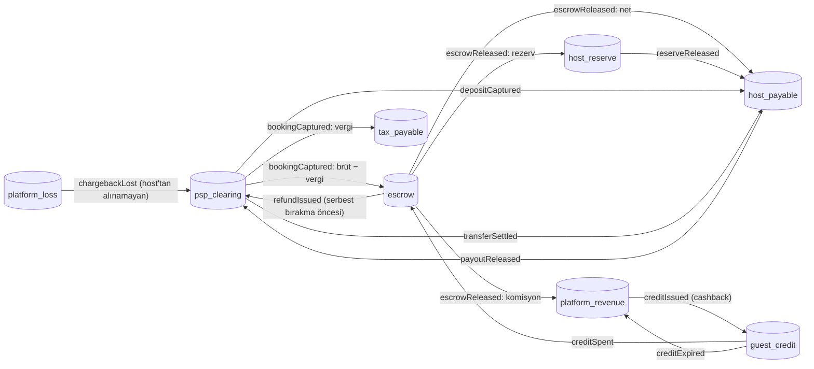

Oklar borç → alacak yönündedir (kaynak hesap borçlanır). Serbest bırakma sonrası iade (`refundIssued` `from: "released"`) önce `host_reserve`, sonra ödenmemiş `host_payable`, kalan için `platform_revenue` kullanır; ev sahibi bakiyesi eksiye düşmez. Kaybedilen itiraz (`chargebackLost`) aynı sırayı izler, kalan `platform_loss`'a yazılır. Kanıt: `tests/unit/ledger/ledger-templates.test.ts` (fast-check), `tests/integration/v4-ledger-flows.test.ts`.

## 14. Grup sepeti ve bölünmüş ödeme

`src/lib/cart/*`. `Cart` (kullanıcı başına tek aktif OPEN/HELD, kısmi unique indeks), `CartItem` (oda tipi × plan × tarih × doluluk), `CartPayment` (sepetin tek tahsilatı). Tutma, tekil rezervasyonla **aynı** kilit anahtarlarını (`booking:lock:room:<id>`) artan sırada alır (`withOrderedLocks`; ters sıralı eşzamanlı sepetlerde kilitlenme yok) ve tüm kalemleri tek SERIALIZABLE işlemde `reserveBookingInTx` ile tutar: biri sığmazsa hiçbiri tutulmaz (409, `details.itemId`).

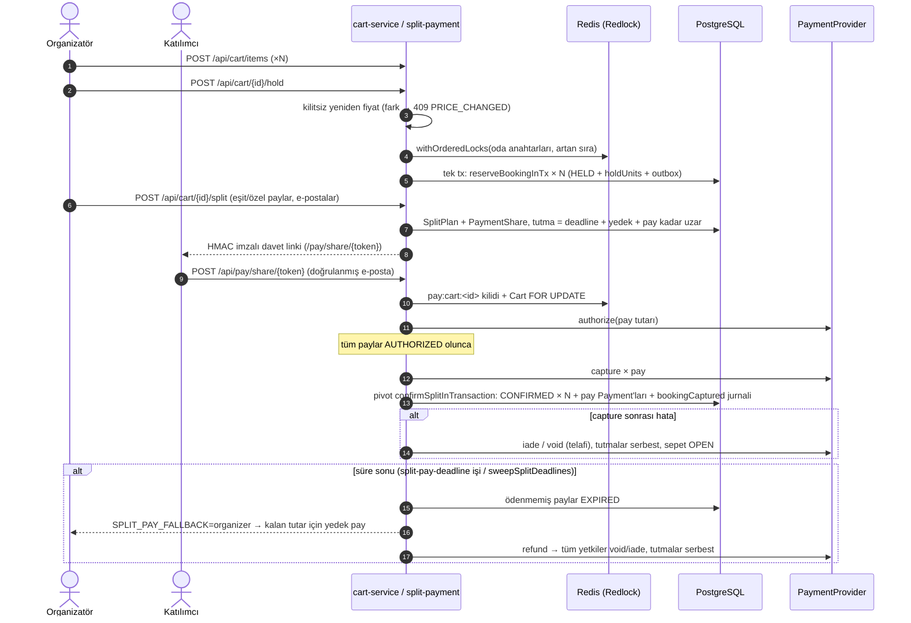

- Tek ödeme yolunda `POST /api/cart/{id}/pay` aynı saga adımlarını (hold → authorize → capture → confirm) sepet toplamı için bir kez koşar; kalem bazlı `Payment` satırları `cartPaymentId` ile bağlanır. Sepet kalemi `/api/bookings/[id]/pay` ile ödenemez (409 `CART_BOOKING`).
- Kalem iptali iadeyi sepetin PSP işleminden ya da (bölünmüş ödemede) paylara `allocateCapped` ile dağıtarak yapar (`PaymentShareRefund`, anahtar `refund:<bookingId>:<shareId>`).
- Geç gelen başarılı webhook (`src/lib/cart/cart-webhook.ts`): sepet/pay hâlâ onaylanabiliyorsa yeniden tutup onaylar, değilse iade eder (`cart_late_success_total`).
- Kanıt: `tests/integration/v4-cart.test.ts`, `tests/integration/v4-split-payment.test.ts`, `tests/unit/money/split.test.ts`.

## 15. Escrow, payout, rezerv ve hasar depozitosu ([ADR 0021](adr/0021-escrow-payout-deposit.md))

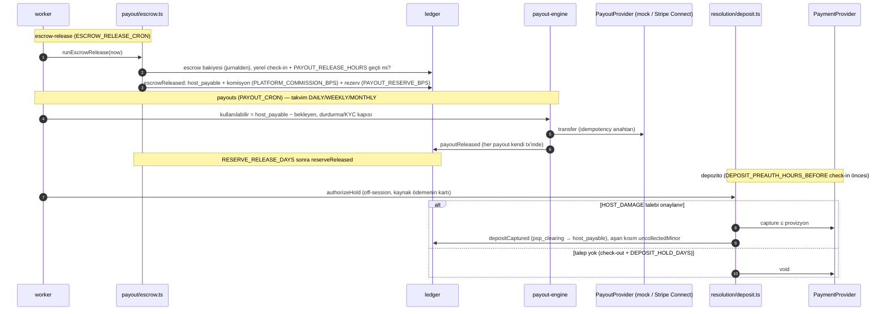

- Çözüm merkezi (`src/lib/resolution/claims.ts`): `GUEST_REFUND` / `HOST_DAMAGE` / `CHARGEBACK` talepleri, mesaj ve kanıt (magic-byte kontrolü, WebP'ye yeniden kodlama, metadata yok), yanıt SLA'sı (`CLAIM_RESPONSE_SLA_HOURS`, gecikmeli `claim-sla-check` + süpürücü), admin kararı `POST /api/admin/claims/[id]/decision` (`pay:<bookingId>` kilidi altında).
- PSP itirazları `dispute.*` olaylarıyla `src/lib/resolution/disputes.ts`'e gelir; kaybedilen itiraz `chargebackLost` jurnali yazar.
- Kanıt: `tests/integration/v4-payouts.test.ts`, `tests/integration/v4-resolution.test.ts`, `tests/integration/v4-fix-sweep-2.test.ts`, `tests/integration/v4-stripe-deposit.test.ts`.

## 16. Ajan mandate akışı ([ADR 0023](adr/0023-agentic-commerce-mandates.md))

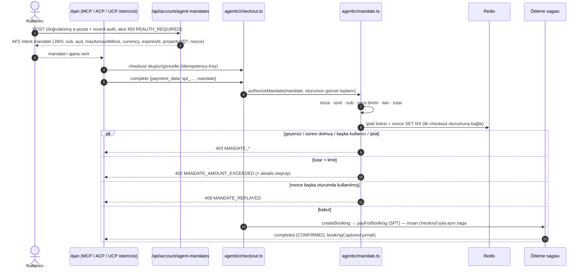

UCP uçları (`/api/ucp/checkout-sessions/*`) yalnız şema eşler ve ACP servislerini çağırır; MCP `checkout_stay` aynı `completeCheckoutSession` yolunu kullanır. Kullanıcı `GET /api/account/agent-mandates` ile verdiği mandate'leri görür, `DELETE …/[nonce]` ile iptal eder (sonrasında 403 `MANDATE_REVOKED`). Kanıt: `tests/integration/p1-11-agentic-mandates.test.ts`, `tests/unit/agentic/mandate.test.ts`, `npm run mcp:smoke`.

## 17. Mimari karar kayıtları

| ADR                                                    | Konu                                                 |
| ------------------------------------------------------ | ---------------------------------------------------- |
| [0001](adr/0001-modular-monolith.md)                   | Modüler monolit                                      |
| [0002](adr/0002-two-layer-locking.md)                  | İki katmanlı kilit (Redlock + SERIALIZABLE)          |
| [0003](adr/0003-transactional-outbox.md)               | Transactional outbox                                 |
| [0004](adr/0004-minor-unit-money-quote.md)             | Minor-unit para ve quote                             |
| [0005](adr/0005-llm-contract.md)                       | LLM sözleşmesi                                       |
| [0006](adr/0006-availability-partitioning.md)          | Availability partisyonu (v3'te kaldırıldı)           |
| [0007](adr/0007-transfer-claim-link-escrow.md)         | Devir claim linki ve escrow                          |
| [0008](adr/0008-hash-vs-real-embedding.md)             | Hash vs gerçek embedding                             |
| [0009](adr/0009-framework-upgrade-next16.md)           | Next.js 16 yükseltmesi                               |
| [0010](adr/0010-room-type-inventory-counters.md)       | Oda tipi envanter sayaçları                          |
| [0011](adr/0011-property-time-zone-temporal.md)        | Tesis saat dilimi (Temporal)                         |
| [0012](adr/0012-tax-engine-and-persistent-fx.md)       | Vergi motoru ve kalıcı FX                            |
| [0013](adr/0013-payment-saga.md)                       | Ödeme sagası                                         |
| [0014](adr/0014-hybrid-search-ltr-experiments.md)      | Hibrit arama, LTR, deneyler                          |
| [0015](adr/0015-agentic-booking-channel-revenue.md)    | Ajan rezervasyon kanalı ve gelir paneli              |
| [0016](adr/0016-legacy-pricing-and-negotiation.md)     | Legacy fiyat ve pazarlık                             |
| [0017](adr/0017-messaging-moderation-step-up.md)       | Mesajlaşma, moderasyon, step-up                      |
| [0018](adr/0018-i18n-namespaces-and-formatting.md)     | i18n ad alanları ve biçimlendirme                    |
| [0019](adr/0019-minor-unit-bigint-money.md)            | `BigInt` minor-unit para ve ISO 4217 üs tablosu      |
| [0020](adr/0020-double-entry-ledger.md)                | Çift girişli defter ve günlük mutabakat              |
| [0021](adr/0021-escrow-payout-deposit.md)              | Escrow, payout, rezerv, hasar depozitosu             |
| [0022](adr/0022-multimodal-search.md)                  | Görsel zekâ ve çok-modlu arama                       |
| [0023](adr/0023-agentic-commerce-mandates.md)          | Ajan ticareti: ACP SPT, UCP, AP2 mandate             |
| [0024](adr/0024-recent-auth-step-up-binding.md)        | Recent-auth, işleme bağlı step-up, oturum yönetimi   |
| [0025](adr/0025-asymmetric-mandate-signing.md)         | AP2 mandate ES256 imzası, JWKS ve anahtar rotasyonu  |
| [0026](adr/0026-compensation-journal-intent-marker.md) | Telafi iadelerinin jurnali ve niyet işareti          |
| [0027](adr/0027-payment-service-split.md)              | `payment-service.ts`'in sorumluluklara bölünmesi     |
| [0028](adr/0028-reserve-now-pay-later.md)              | Şimdi rezerve et, sonra öde (RNPL)                   |
| [0029](adr/0029-support-agent-human-handoff.md)        | AI destek ajanı ve insana devir                      |
| [0030](adr/0030-llm-evals-genai-telemetry.md)          | LLM eval paketi ve GenAI telemetrisi                 |
| [0031](adr/0031-supply-chain-provenance.md)            | Tedarik zinciri: SHA pin, SAST, SBOM, provenance     |
| [0032](adr/0032-market-rules-engine.md)                | Pazar bazlı uyum kural motoru                        |
| [0033](adr/0033-legacy-ledger-contract.md)             | Eski defter ve ondalık para alanlarının kaldırılması |
| [0034](adr/0034-reverse-proxy-client-ip.md)            | Ters vekil (Caddy) ve güvenilir istemci IP'si        |
| [0035](adr/0035-verifiable-agent-commerce.md)          | Kalıcı nonce, RFC 9421, harici mandate doğrulayıcı   |
| [0036](adr/0036-mcp-apps-stay-card.md)                 | MCP Apps arayüz kaynağı `ui://booking/stay-card`     |

## 18. Bilinen sınırlamalar

- Ödeme sağlayıcısı (MockPsp), payout sağlayıcısı, KYC, e-Arşiv entegratörü ve lisans/kayıt servisleri varsayılan olarak mock/demo'dur; Stripe SPT, Connect ve depozito (Customer + `setup_future_usage`) yolları yalnız ağsız fake ile test edildi (§5.2, §7, §15).
- Sepet ve bölünmüş ödemede Stripe Payment Element, passkey step-up ve cüzdan kredisi yoktur; sepette kupon yoktur.
- Sepet tahsilatında itiraz ilk rezervasyona bağlanır; aşan tutar `uncollectedMinor` olarak elle işlenir.
- AP2 mandate ES256 + `kid` ile imzalanır; açık anahtarlar `/.well-known/jwks.json`'da, ajan/PSP bağımsız doğrular ([ADR 0025](adr/0025-asymmetric-mandate-signing.md)); verme/iptal `AuditLog`'da, kullanım kalıcı `AgentMandateUse` tablosunda tutulur (Redis yalnız önbellek, [ADR 0035](adr/0035-verifiable-agent-commerce.md)); SD-JWT + key binding ertelendi.
- RNPL yalnız tekil (sepetsiz), iade edilebilir tarifede ve fraud kararı `allow` iken sunulur; cüzdan kredisiyle birleşmez; tahsilat off-session kart kaydına dayanır, gerçek Stripe SetupIntent yalnız fake ile test edildi (§19).
- Telafi niyet işareti yalnız capture kesinken ya da iade başarılı olduktan sonra yazılır; "işaret var, jurnal yok" farkı süpürücü/yeniden deneme tamamlayana dek mutabakat raporunda görünür (§20).
- Destek ajanı tek turludur, ham sohbet saklanmaz; iade/iptal kararı her zaman insandadır (§21).
- IP bilinemeyen doğrudan dağıtımda (`ALLOW_DIRECT_EXPOSURE=true`) auth uçları IP kovası yerine e-posta kovası + PoW ile yavaşlatılır; `Vary` başlığı yalnız Caddy arkasında doğru eklenir (§22).
- RFC 9421 HTTP imzası opsiyoneldir (`AGENT_HTTP_SIGNATURE_KEYS` boşsa kapalı) ve kimlik yerine geçmez (§23).
- LTR modeli sentetik tıklamalarla eğitilmiştir; embedding varsayılanı hash tabanlıdır; CLIP opsiyoneldir ([MODEL_CARD](MODEL_CARD.md)).
- Yük ve kaos testleri tek makinede koşuldu; sonuçlar [docs/perf/](perf/) ve `load/chaos.md` altında.

## 19. RNPL: şimdi rezerve et, sonra öde ([ADR 0028](adr/0028-reserve-now-pay-later.md))

Amaç: ücretsiz iptal süresi bitmeden kartı kaydedip tahsilatı son güvenli ana ertelemek. Uygunluk saf fonksiyondadır (`src/lib/payment/rnpl-terms.ts`: `rnplTerms`, `freeCancellationDeadline`); vade = ücretsiz iptal bitişi − `RNPL_CHARGE_DAYS_BEFORE_DEADLINE` gün. Akış `src/lib/payment/rnpl.ts`'tedir (`reserveNowPayLater`, `scheduleRnplCharge`, `chargeRnplSchedule`, `sweepRnplCharges`, `cancelRnplScheduleInTx`).

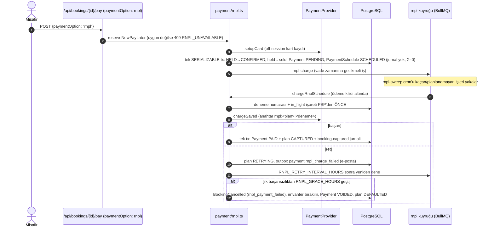

Çökme sonrası aynı deneme numarası ve aynı idempotency anahtarı kullanılır (çift tahsilat yok); başarısız denemeden sonra yeni anahtar alınır. Tahsilattan önce misafir iptali açık planı aynı işlemde `CANCELLED` yapar ve PSP çağrılmaz. Metrik: `rnpl_charge_total{outcome}`.

## 20. Telafi-jurnal akışı ([ADR 0026](adr/0026-compensation-journal-intent-marker.md))

Amaç: capture edilmiş paranın iadesi (telafi) PSP'de gerçekleşip defterde kaybolmasın. Tüm telafiler `postCaptureCompensation` (`src/lib/ledger/booking-money.ts`) ile capture + iadeyi tek jurnalde yazar; niyet işareti `markCompensationIntent` (`src/lib/ledger/reconcile.ts`) `PaymentEvent` satırı `comp:<providerRef>` olarak idempotent yazılır. Çağıranlar: `src/lib/cart/cart-payment.ts`, `src/lib/cart/cart-webhook.ts`, `src/lib/cart/split-payment.ts`, `src/lib/transfer/transfer-service.ts`.

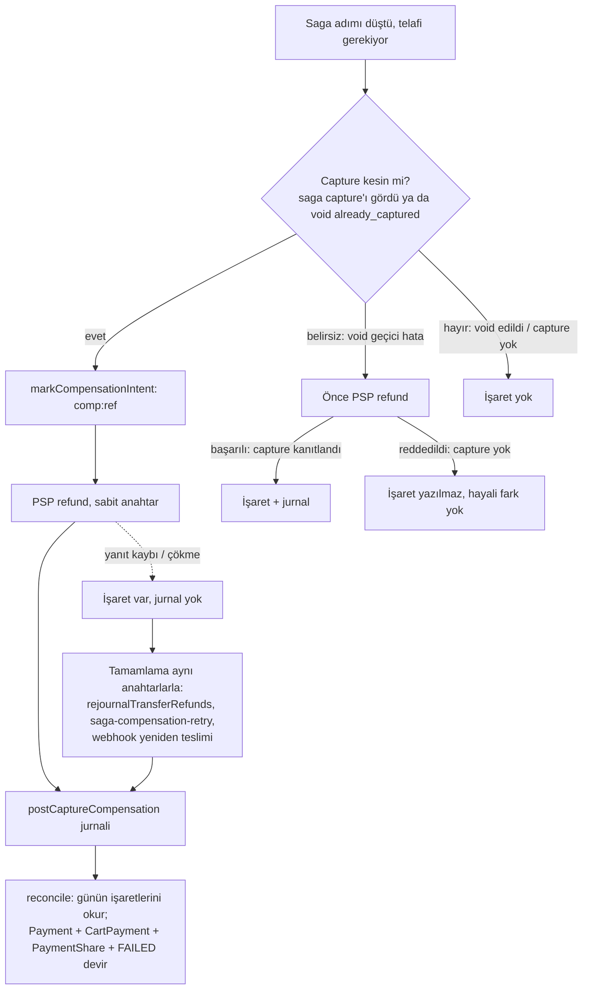

Mutabakat (`reconcile`) telafi edilen ödemenin PSP tarafını jurnalden değil işaretten bilir; fark yalnız tamamlama gerçekten başarısızsa raporlanır. Sepet/pay telafisinin yeniden denemesi `src/lib/saga/compensation-retry.ts`, devir süpürücüsü `sweepStuckTransfers` içindeki `rejournalTransferRefunds`'tur.

**Hasar depozitosu iki aşamalı capture** (`src/lib/resolution/deposit.ts`, `captureDeposit`): tx1 `AUTHORIZED → CAPTURING` (tutar + talep), PSP `capture(ref, tutar, "deposit-capture:<id>")`, tx2 `CAPTURING → CAPTURED(_PARTIAL)` + `depositCaptured` jurnali + çağıranın `finalize`'ı. PSP belirsiz düşerse ya da tx2 başarısız olursa kayıt `CAPTURING` kalır; `deposit-capture-sweep` işi (`sweepCapturingDeposits`) aynı anahtarla capture'ı yineler (PSP tek işlem sayar) ve tx2'yi tamamlar. PSP kesin reddederse niyet `AUTHORIZED`'a geri alınır.

## 21. Destek ajanı ve insana devir ([ADR 0029](adr/0029-support-agent-human-handoff.md))

Amaç: sık soruları (rezervasyon durumu, iptal iadesi tahmini, tesis kuralları) AI ile yanıtlamak; para, hukuk ve belirsiz durumları insana devretmek. Kod: `src/lib/support/*` (`intent.ts`, `agent.ts`, `tools.ts`, `repo.ts`, `metrics.ts`), uç `src/app/api/support/chat/route.ts`, kuyruk `src/app/admin/support/page.tsx` + `src/app/api/admin/support/*`.

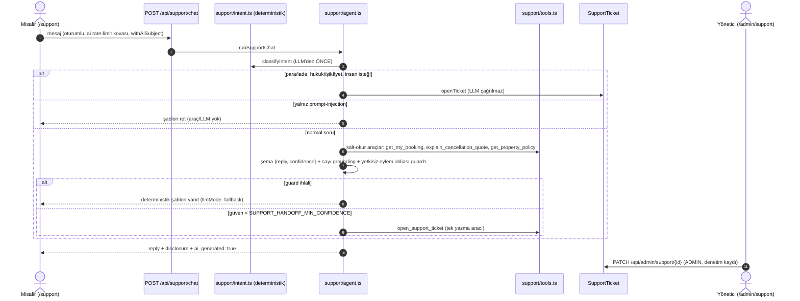

Ajan iade/iptal/ödeme eylemi yapamaz (`SUPPORT_TOOL_ACCESS` kodda sabit, birim testiyle korunur); iade tahmini politika anlık görüntüsü + `computeRefund` ile hesaplanır. Talep KVKK redakte özet saklar, ham sohbet saklanmaz. Metrikler: `support_handoff_total{reason}`, `support_chat_total{intent,outcome}`.

## 22. Ters vekil ve istemci IP'si ([ADR 0034](adr/0034-reverse-proxy-client-ip.md))

Amaç: rate-limit ve denetim kayıtlarında istemci IP'sinin sahtelenememesi. Compose'da tek giriş noktası Caddy'dir (`docker/Caddyfile`); uygulama host'a port açmaz. IP çözümü `src/lib/security/ip.ts` (`resolveClientIp`, `clientKey`), yapılandırma denetimi `src/lib/security/exposure.ts` (`directExposureProblem`), auth yavaşlatması `src/lib/security/auth-degraded.ts`, giriş kapısı `src/proxy.ts`.

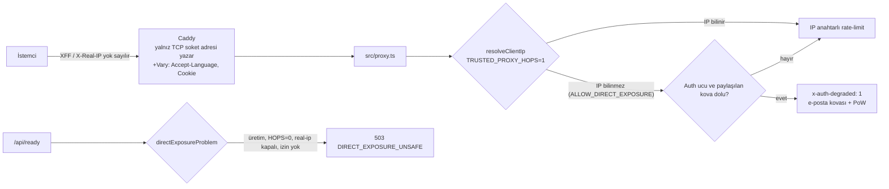

`TRUSTED_PROXY_HOPS` zincirin sondan kaçıncı halkasına güvenileceğini söyler; compose ortak ortamında `"1"` sabittir. Yanlış yapılandırılmış üretim örneği `/api/ready`'de 503 döner ve başlangıçta ERROR loglanır, böylece orkestratör trafiği ona yönlendirmez. İstemcinin gönderdiği `x-auth-degraded` başlığı proxy'de silinir. `Vary` başlığı Caddy'de (`header @pages { +Vary … defer }`) eklenir: Next 16 app-page işleyicisi `Vary`'yi `setHeader` ile ezdiği için `proxy.ts`'te eklenen değer kaybolur.

## 23. Mandate doğrulama sekansı ([ADR 0025](adr/0025-asymmetric-mandate-signing.md), [ADR 0035](adr/0035-verifiable-agent-commerce.md))

Amaç: AP2 intent mandate'inin ajan/PSP tarafından sır paylaşmadan doğrulanabilmesi ve tekrar oynatılamaması. İmza ve anahtarlar `src/lib/agentic/mandate-keys.ts` (`MANDATE_ALG = "ES256"`, `mandateKeyRing`, `publicJwks`), JWKS ucu `src/app/.well-known/jwks.json/route.ts`, doğrulama/bağlama `src/lib/agentic/mandate.ts` (`verifyMandateToken`, `authorizeMandate`), opsiyonel RFC 9421 `src/lib/agentic/http-signature.ts` (`assertAgentHttpSignature`), harici doğrulayıcı `scripts/verify-mandate.ts` (`npm run mandate:verify`).

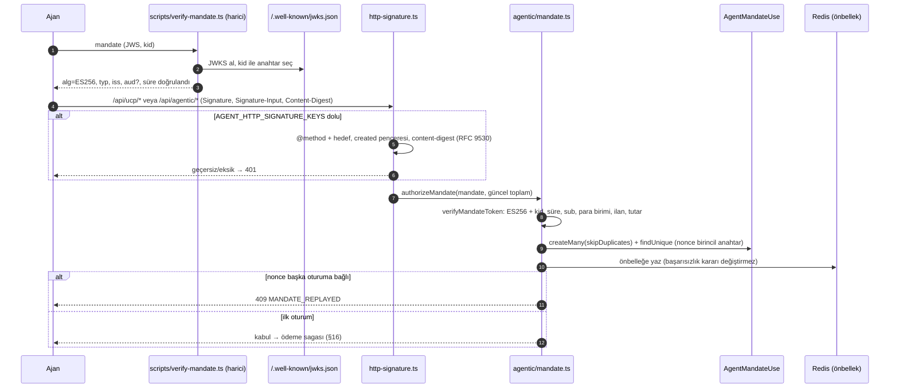

HTTP imzası kimlik değildir; kullanıcı kimliği bearer token'dan gelir. UCP profili (`/.well-known/ucp`) `signing.jwks_uri`, `signing.mandate_alg` ve `signing.http_message_signatures` alanlarıyla bu yetenekleri ilan eder.

## 24. Payment modül bölünmesi ve LLM eval/telemetri

**Payment modül bölünmesi ([ADR 0027](adr/0027-payment-service-split.md)).** `src/lib/payment/payment-service.ts` davranış değişikliği olmadan sorumluluklara bölündü ve artık yalnız yeniden-export eder: `payment-core.ts` (hatalar, `PayOutcome`, void/iade yardımcıları, tekil telafi jurnali, `pay:<bookingId>` kilidi), `confirm.ts` (saga, `captureAndConfirm`, `applyConfirmation`), `pay.ts` (`payForBooking`, step-up/3DS), `webhook-handler.ts`, `late-success.ts`, `refund.ts` (`cancelAndRefund`). Bağımlılık yönü `payment-core ← confirm ← {pay, late-success} ← webhook-handler` ve `payment-core ← refund`'tur; sepet modülleri barrel yerine doğrudan `payment-core`/`confirm`'ü içe aktarır. Döngüsüzlük `npm run deps:circular` (madge) ile kapıdadır.

**LLM eval ve GenAI telemetrisi ([ADR 0030](adr/0030-llm-evals-genai-telemetry.md)).** `npm run llm:eval` promptfoo ile `evals/provider.ts` üzerinden uygulamanın saf LLM çekirdeklerini (yorum özeti, ev sahibi yanıt taslağı, gezi planı anlatımı, destek ajanı) varsayılan olarak ağsız demo modunda koşar; aynı vakalar `tests/unit/evals/llm-eval.test.ts`'te süreç içi de çalışır. İddialar şema, sayı grounding'i, PII yokluğu, dil ve red-team'dir; `LLM_EVAL_MIN_PASS_RATE` altı CI'ı kırar, sonuç `llm_eval_score{task,mode}` göstergesine yansır. Telemetride (`src/lib/llm/telemetry.ts`) her SDK isteği `chat <model>` CLIENT span'i içinde çalışır ve OpenTelemetry GenAI semantic conventions v1.37.0 öznitelikleri (`gen_ai.operation.name`, `gen_ai.provider.name`, `gen_ai.request.model`, `gen_ai.usage.input_tokens` …) yazılır.
