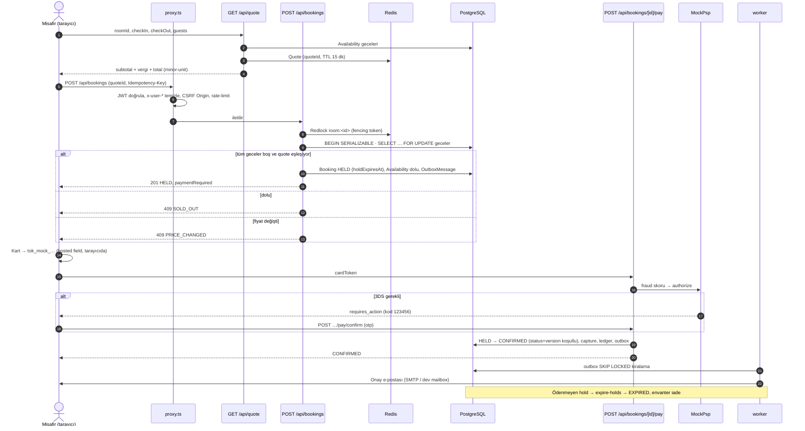
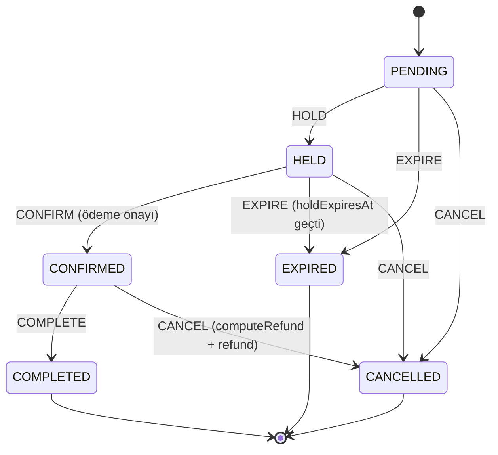
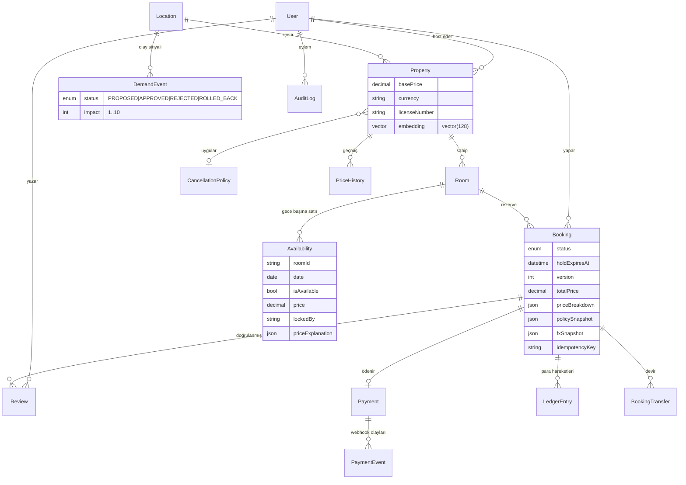

# Mimari

> Bu doküman eski `docs/architecture.md` ve `docs/architecture-phase2.md` dosyalarının yerini alır ve v2.0.0'da **gerçekten uygulanmış** durumu anlatır. Kararların gerekçeleri [docs/adr/](adr/) altındadır.

## 1. Genel bakış

booking-platform bir **modüler monolittir** ([ADR 0001](adr/0001-modular-monolith.md)): tek Next.js 16 uygulaması, aynı kod tabanından çalışan bir BullMQ worker'ı ve bir iç gRPC servisi. İş mantığı `src/lib/<context>/` altındaki bounded context'lerde yaşar; route handler'lar (`src/app/api/**`) incedir — girdiyi `zod` ile doğrular, kimliği çözer, servis çağırır, hatayı `src/lib/http/errors.ts` ile HTTP'ye çevirir.

| Süreç          | Giriş noktası                        | Görev                                                                                          |
| -------------- | ------------------------------------ | ---------------------------------------------------------------------------------------------- |
| `app`          | Next.js (`src/proxy.ts` + `src/app`) | Sayfalar ve REST API                                                                           |
| `worker`       | `src/worker/index.ts`                | `expire-holds` (dakikalık), availability rollover (gecelik), outbox relay, bildirim, embedding |
| `grpc`         | `services/grpc/main.ts`              | `BookingService` + `AriService` (kanal ARI push); yalnızca compose iç ağında                   |
| `migrate`      | `scripts/migrate-and-seed.ts`        | `prisma migrate deploy` + (`DEMO_SEED` ve boş DB ise) seed                                     |
| `secrets-init` | `scripts/gen-secrets.mjs`            | Eksik sırları rastgele üretip `booking_secrets` volume'una yazar                               |

Altyapı: PostgreSQL 16 + pgvector (`pgvector/pgvector:pg16`), Redis 7 (`requirepass`, host'a kapalı). Opsiyonel compose profilleri: `search` (Elasticsearch; kullanılmazsa Postgres arama yolu), `observability` (Prometheus, Tempo, Grafana).

## 2. Bounded context'ler

| Context            | Klasör / dosyalar                                                                              | Sorumluluk                                                                                                 |
| ------------------ | ---------------------------------------------------------------------------------------------- | ---------------------------------------------------------------------------------------------------------- |
| Identity & Access  | `src/lib/auth/*`, `src/lib/security/*`, `src/proxy.ts`                                         | JWT, refresh rotasyonu, RBAC (`USER`/`HOST`/`ADMIN`), CSRF, rate-limit, güvenlik başlıkları                |
| Catalog            | `src/app/api/properties/**`, `src/lib/host/host-service.ts`                                    | Mülk, oda, olanak, `licenseNumber`; host'un kendi mülkleri                                                 |
| Inventory          | `Availability`, `src/lib/booking/availability-rollover.ts`, `src/lib/channel/channel.ts`       | Gecelik envanter/fiyat satırları, 365 gün rollover, iCal import/export, ARI sıra numaraları                |
| Booking            | `src/lib/booking-service.ts`, `src/lib/booking/{state-machine,cancellation}.ts`                | Hold, durum makinesi, iptal politikası snapshot'ı, iade hesabı                                             |
| Pricing            | `src/lib/pricing/{quote,engine,event-signals}.ts`, `src/lib/money/*`                           | `computeTotal()`, minor-unit para, dinamik fiyat faktörleri, olay sinyalleri, FX görüntüleme               |
| Payment            | `src/lib/payment/*`                                                                            | `PaymentProvider`, `MockPsp`, opsiyonel Stripe, webhook doğrulama, ledger                                  |
| Transfer           | `src/lib/transfer/transfer-service.ts`                                                         | İmzalı claim linki + escrow ödemeli rezervasyon devri ([ADR 0007](adr/0007-transfer-claim-link-escrow.md)) |
| Search & Discovery | `src/lib/search.ts`, `src/lib/search/{ranking,vector,fuzzy,elastic}.ts`, `src/lib/embedding/*` | Filtre, sürüm anahtarlı cache, açıklanabilir sıralama, pgvector benzerlik                                  |
| Reviews            | `src/lib/reviews/review-service.ts`                                                            | Doğrulanmış konaklama yorumu, host yanıtı, özet cache sürümü                                               |
| AI (LLM kullanan)  | `src/lib/ai/*` → `src/lib/llm/*`                                                               | Smart Filter, yorum özeti, trip-planner, ilan metni, olay çıkarımı ([ADR 0005](adr/0005-llm-contract.md))  |
| Risk               | `src/lib/risk/fraud.ts`                                                                        | Kural tabanlı fraud skoru                                                                                  |
| Notifications      | `src/lib/notifications/*`                                                                      | Türkçe e-posta şablonları; SMTP veya dev mailbox (`/dev/mailbox`)                                          |
| Messaging          | `src/lib/cqrs/{outbox,event-bus}.ts`, `src/lib/queue.ts`                                       | Transactional outbox, olay yayını, BullMQ kuyruk tanımları (producer ≠ worker)                             |
| Admin & Privacy    | `src/lib/admin/audit.ts`, `src/lib/privacy/privacy-service.ts`                                 | Audit log, outbox/fraud/olay kuyrukları, KVKK veri dışa aktarım ve anonimleştirme                          |
| Observability      | `src/lib/observability/*`, `src/instrumentation.ts`                                            | pino, OpenTelemetry, Prometheus metrikleri, readiness                                                      |

Diğer: `negotiation/engine.ts` (kural tabanlı pazarlık), `resilience/circuit-breaker.ts`, `routing/optimizer.ts` (çok şehirli rota), `live/hub.ts` (tek paylaşılan poller + Redis pub/sub ile SSE).

## 3. Rezervasyon akışı

## 4. Durum makinesi

Saf geçiş tablosu: `src/lib/booking/state-machine.ts`. Veritabanına yazım, hesaplanan hedef durumu mevcut `status` ve `version` koşuluyla (`updateMany`) yapar; eşzamanlı iki geçişten yalnızca biri kazanır.

Envanteri tutan durumlar: `PENDING`, `HELD`, `CONFIRMED`. `HELD` süresi `BOOKING_HOLD_TTL_MINUTES` (varsayılan 15).

## 5. Veri modeli (ana modeller)

Diğer modeller: `Amenity`, `Favorite`, `Notification`, `OutboxMessage` (`PENDING/PROCESSING/DONE/FAILED/DEAD`, `lockedUntil`, `attempts`), `FraudCheck`, `ChannelSequence`. Veritabanında `Decimal` tutulur; tüm hesaplama minor-unit tamsayıyla yapılır ([ADR 0004](adr/0004-minor-unit-money-quote.md)). `Availability` partisyonlama opt-in'dir ([ADR 0006](adr/0006-availability-partitioning.md)).

## 6. Eşzamanlılık ve tutarlılık

- **Çift katmanlı kilit** ([ADR 0002](adr/0002-two-layer-locking.md)): Redlock (fencing token, hızlı çatışma) → SERIALIZABLE transaction + `SELECT … FOR UPDATE` (yetkili kaynak). P2034 serileştirme hataları `withSerializableRetry` ile yeniden denenir (`src/lib/db/transactions.ts`).
- **Idempotency:** `Booking(userId, idempotencyKey)` unique; aynı anahtarla gelen ikinci istek ilk rezervasyonu döner. Checkout anahtarı sayfa açılışında bir kez üretir.
- **Outbox** ([ADR 0003](adr/0003-transactional-outbox.md)): olay iş verisiyle aynı transaction'da yazılır; worker `FOR UPDATE SKIP LOCKED` + lease ile kiralar.
- **Cache:** arama sonuçları `search:v{n}:…` sürüm anahtarlarıyla; yazımda `INCR search:version` (bloklayan `KEYS` yok).

## 7. Güvenlik modeli

| Katman        | Uygulama                                                                                                                                                                                                                                                                                    |
| ------------- | ------------------------------------------------------------------------------------------------------------------------------------------------------------------------------------------------------------------------------------------------------------------------------------------- |
| Kimlik        | `jose` HS256 access JWT (`ACCESS_TOKEN_TTL_SECONDS`, varsayılan 15 dk); opak rotating refresh token (7 gün) — Redis'te yalnızca SHA-256 özeti, tek kullanımlık, yeniden kullanım tespitinde tüm aile iptal. Logout yalnızca POST, `jti` denylist. httpOnly çerez; localStorage kullanılmaz. |
| Parola        | bcrypt; kullanıcı yoksa sahte hash ile karşılaştırma (sabit zamanlı login, e-posta varlığı sızmaz)                                                                                                                                                                                          |
| Başlık güveni | `src/proxy.ts` gelen tüm `x-user-id`/`x-user-role` başlıklarını önce siler, yalnızca doğrulanmış token'dan yeniden yazar                                                                                                                                                                    |
| RBAC          | `requireRole()` tüm korumalı route'larda; 401/403; sahiplik kontrolleri (`security/ownership.ts`) başkasının kaynağında 404                                                                                                                                                                 |
| CSRF          | Çerezle kimliği doğrulanan durum değiştiren isteklerde `Origin`/`Referer` uygulama origin'i veya `APP_ORIGINS` olmalı; `Sec-Fetch-Site: cross-site` reddedilir. Webhook ve iç uçlar muaf (imza/sır ile korunur)                                                                             |
| Rate-limit    | Redis sabit pencere (Lua); anahtar yalnızca JWT `sub` veya `TRUSTED_PROXY_HOPS`'a göre çözülen IP. Kategoriler: auth, booking, payment, search, ai, default. Redis hatasında auth/booking/payment fail-closed                                                                               |
| İç uçlar      | `/api/internal/*`: `x-internal-secret` ile timing-safe karşılaştırma; sır yoksa, 32 karakterden kısaysa veya bilinen varsayılansa 503; alternatif olarak ADMIN JWT                                                                                                                          |
| gRPC          | `authorization: Bearer <JWT>` metadata zorunlu; işlemi yapan kullanıcı token'dan türetilir, gövdedeki `requester_id` farklıysa `PERMISSION_DENIED`; varsayılan bind `127.0.0.1`, compose'da host'a port açılmaz                                                                             |
| Başlıklar     | Nonce'lu CSP (`'strict-dynamic'`), HSTS, `X-Content-Type-Options`, `Referrer-Policy`, `Permissions-Policy`                                                                                                                                                                                  |
| Ödeme verisi  | Kart numarası sunucuya gelmez; tarayıcıda `tok_mock_<senaryo>_<son4>` token'ına çevrilir. Webhook HMAC (`PSP_WEBHOOK_SECRET`), timing-safe, olay id'si ile idempotent                                                                                                                       |
| Sırlar        | İmajda ve build argümanlarında sır yok; production'da zayıf/eksik `JWT_SECRET` ile uygulama açılmaz                                                                                                                                                                                         |
| Fraud         | Ödeme öncesi kural skoru: review → 3DS zorunlu + admin kuyruğu; block → ödeme reddedilir                                                                                                                                                                                                    |

## 8. Gözlemlenebilirlik

- **Log:** pino (`src/lib/observability/logger.ts`), `requestId`/`traceId` korelasyonu, `authorization`, `cookie`, `password`, `*.token` redaksiyonu. `src/` altında `console.*` yoktur.
- **Trace:** `src/instrumentation.ts` → `@vercel/otel` + Prisma ve ioredis instrumentation; `OTEL_EXPORTER_OTLP_ENDPOINT` yoksa no-op.
- **Metrik:** `/api/metrics` (`prom-client`, `METRICS_TOKEN`): `http_request_duration_seconds`, `booking_created_total{outcome}`, `llm_requests_total{task,mode,outcome}`, `llm_latency_seconds`, `llm_tokens_total` ve diğerleri. Worker kendi metriklerini `WORKER_METRICS_PORT`'tan sunar.
- **Sağlık:** `/api/health` (liveness), `/api/ready` (DB + Redis ping).
- **Sorgu istatistiği:** `ENABLE_QUERY_STATS` ile açılan Prisma sorgu profili (`/api/internal/stats`), varsayılan kapalı.
- **Dashboard:** `docs/observability/grafana-dashboard.json`; `docker compose --profile observability up`.

## 9. Bilinen sınırlamalar

- Harita görünümü (MapLibre) nokta kümelemesi (supercluster) içermez; çok sayıda sonuçta işaretçiler üst üste binebilir.
- k6 yük testi tek makinede (Docker Desktop) koşuldu; sonuçlar [docs/perf/k6-results.md](perf/k6-results.md).
