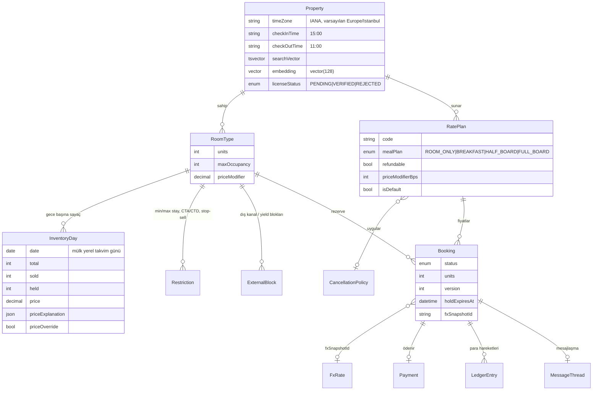
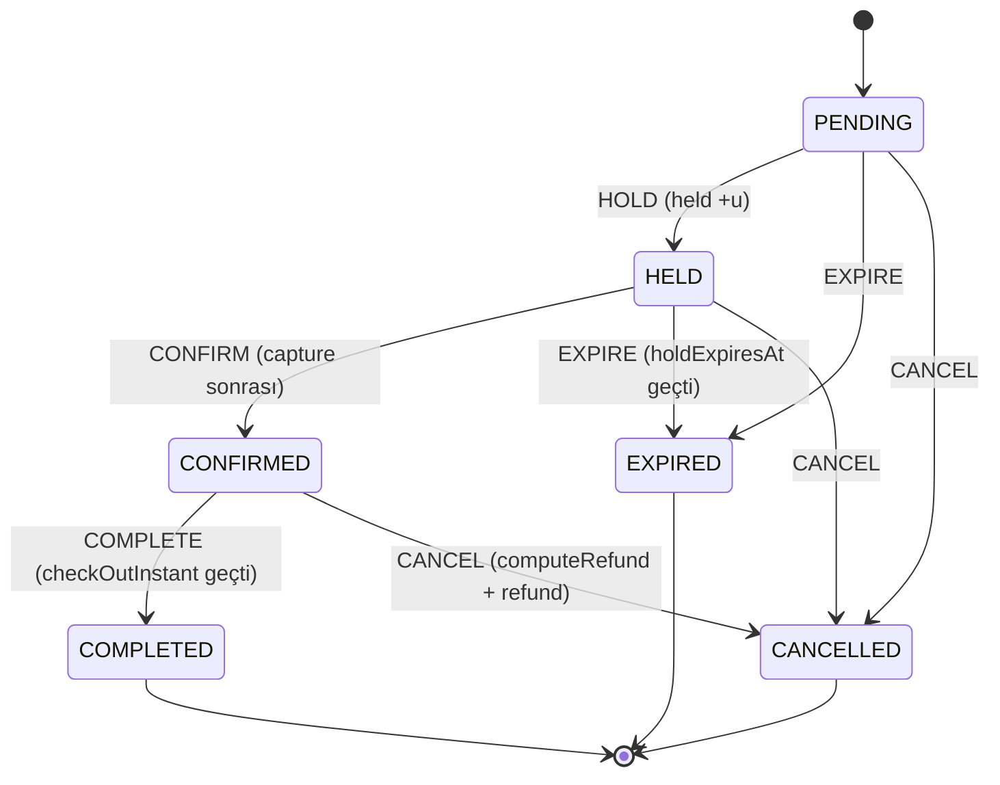
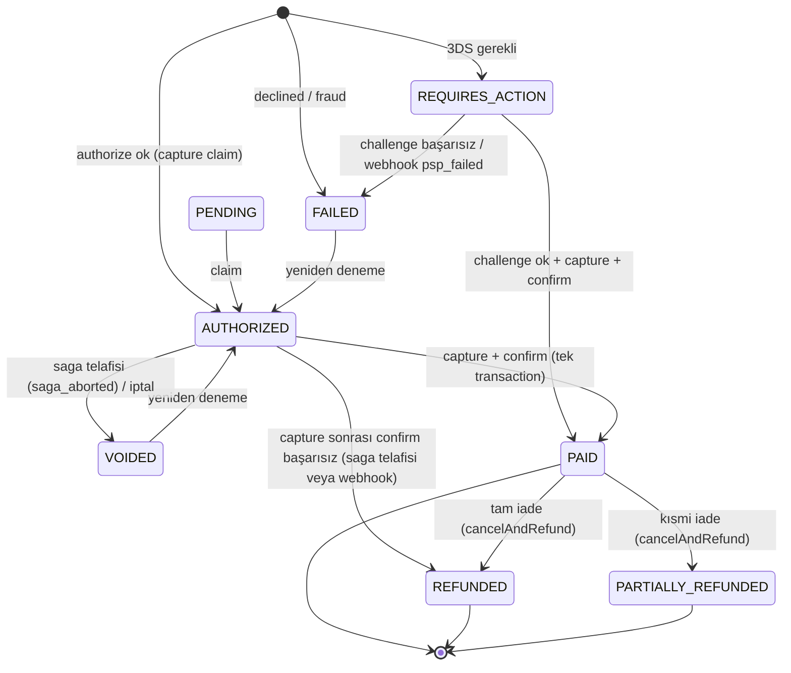

# Mimari

> Bu doküman v3'te **gerçekten uygulanmış** durumu anlatır; v2'deki `Availability` satır modeli, partisyonlama (ADR 0006), pazarlık motoru ve eski float fiyat motoru kaldırılmıştır. Kararların gerekçeleri [docs/adr/](adr/) altındadır (v3: [0010](adr/0010-room-type-inventory-counters.md)–[0018](adr/0018-i18n-namespaces-and-formatting.md)).

## 1. Genel bakış

booking-platform bir **modüler monolittir** ([ADR 0001](adr/0001-modular-monolith.md)): tek Next.js 16 uygulaması, aynı kod tabanından çalışan bir BullMQ worker'ı ve bir iç gRPC servisi. İş mantığı `src/lib/<context>/` altındaki bounded context'lerde yaşar; route handler'lar (`src/app/api/**`) incedir. Girdiyi `zod` ile doğrular, kimliği çözer, servisi çağırır ve hatayı `src/lib/http/errors.ts` ile HTTP'ye çevirir.

| Süreç          | Giriş noktası                        | Görev                                                                                         |
| -------------- | ------------------------------------ | --------------------------------------------------------------------------------------------- |
| `app`          | Next.js (`src/proxy.ts` + `src/app`) | Sayfalar, REST API, MCP HTTP (`/api/mcp`), ACP (`/api/agentic/*`), SSE akışları               |
| `worker`       | `src/worker/index.ts`                | BullMQ kuyrukları (`pricing`, `maintenance`, `saga`), outbox relay, metrik sunucusu (bkz. §9) |
| `grpc`         | `services/grpc/main.ts`              | `BookingService` + `AriService` (kanal ARI push); yalnızca compose iç ağında                  |
| `mcp` (stdio)  | `services/mcp/main.ts`               | Yerel MCP sunucusu (stdio); HTTP taşıması uygulamanın içindedir (§7)                          |
| `migrate`      | `scripts/migrate-and-seed.ts`        | `prisma migrate deploy` + (`DEMO_SEED` ve boş DB ise) seed                                    |
| `secrets-init` | `scripts/gen-secrets.mjs`            | Eksik sırları rastgele üretip `booking_secrets` volume'una yazar                              |

Altyapı: PostgreSQL 16 + pgvector + `pg_trgm` (`pgvector/pgvector:pg16`), Redis 7 (`requirepass`, host'a kapalı). Opsiyonel compose profili: `observability` (Prometheus, Tempo, Grafana). `onnxruntime-node` opsiyoneldir; Alpine imajında yoktur (§6.3).

## 2. Bounded context'ler

| Context            | Klasör / dosyalar                                                                                                         | Sorumluluk                                                                                                                |
| ------------------ | ------------------------------------------------------------------------------------------------------------------------- | ------------------------------------------------------------------------------------------------------------------------- |
| Identity & Access  | `src/lib/auth/*`, `src/lib/security/*`, `src/proxy.ts`                                                                    | JWT, refresh rotasyonu, passkey (WebAuthn) ve step-up, RBAC, CSRF, rate-limit                                             |
| Catalog            | `src/app/api/properties/**`, `src/lib/host/host-service.ts`                                                               | Mülk, oda tipi, rate plan, kısıt; lisans durumu (`licenseStatus`)                                                         |
| Inventory          | `src/lib/booking/{inventory,restrictions,availability-rollover}.ts`, `src/lib/channel/{channel,ical-poller}.ts`           | `InventoryDay` sayaçları, 365 gün rollover + budama, iCal import/export ve polling, `ExternalBlock`                       |
| Booking            | `src/lib/booking-service.ts`, `src/lib/booking/{state-machine,cancellation,complete-stays}.ts`                            | Hold, durum makinesi, iptal politikası snapshot'ı, iade hesabı                                                            |
| Time               | `src/lib/time/nights.ts`                                                                                                  | Mülk saat dilimine göre gece ve check-in/out anları (Temporal)                                                            |
| Pricing            | `src/lib/pricing/{quote,tax,event-signals,insight,price-alerts,revenue-engine,revenue,tr-holidays}.ts`, `src/lib/money/*` | Quote, vergi motoru, olay sinyalleri, fiyat aralığı (conformal), Omnibus, gelir önerisi                                   |
| FX                 | `src/lib/fx/store.ts`                                                                                                     | TCMB/ECB kur snapshot'ları (`FxRate`), statik fallback                                                                    |
| Payment & Saga     | `src/lib/payment/*`, `src/lib/saga/{saga,booking-saga}.ts`, `src/lib/invoice/*`                                           | `PaymentProvider` (`MockPsp` varsayılan, opsiyonel Stripe), saga, ledger, fatura, payout                                  |
| Transfer           | `src/lib/transfer/transfer-service.ts`                                                                                    | İmzalı claim linki + escrow ([ADR 0007](adr/0007-transfer-claim-link-escrow.md))                                          |
| Search & Discovery | `src/lib/search.ts`, `src/lib/search/{hybrid,ltr,ranking,vector,fuzzy,map-cluster}.ts`, `src/lib/embedding/*`             | Hibrit arama (RRF), LTR, açıklanabilir sıralama, harita kümeleme, A/B deneyi                                              |
| Messaging          | `src/lib/messaging/{message-service,mask,hub}.ts`                                                                         | Misafir–host mesajlaşma, PII maskeleme, Redis pub/sub + SSE                                                               |
| Reviews            | `src/lib/reviews/*`                                                                                                       | Doğrulanmış yorum, raporlama, moderasyon kuyruğu                                                                          |
| AI (LLM)           | `src/lib/ai/*`, `src/lib/llm/*`                                                                                           | LLM görevleri; karar yetkisi yok ([ADR 0005](adr/0005-llm-contract.md), [0017](adr/0017-messaging-moderation-step-up.md)) |
| Agentic            | `src/lib/mcp/{http,server}.ts`, `src/lib/agentic/checkout.ts`                                                             | MCP araçları, ACP `checkout_sessions` ([ADR 0015](adr/0015-agentic-booking-channel-revenue.md))                           |
| Risk               | `src/lib/risk/{fraud,bin-table,device-fingerprint}.ts`                                                                    | Fraud v2 skoru, cihaz parmak izi                                                                                          |
| Events / outbox    | `src/lib/cqrs/{outbox,event-bus}.ts`, `src/lib/queue.ts`                                                                  | Transactional outbox, olay yayını, BullMQ kuyruk tanımları                                                                |
| Admin & Privacy    | `src/lib/admin/*`, `src/lib/privacy/*`, `src/lib/compliance/*`                                                            | Audit log, kuyruklar, KVKK dışa aktarım/anonimleştirme                                                                    |
| Observability      | `src/lib/observability/*`, `src/instrumentation.ts`                                                                       | pino, OpenTelemetry, Prometheus, readiness                                                                                |

Diğer: `resilience/circuit-breaker.ts`, `routing/optimizer.ts` (çok şehirli rota), `live/hub.ts` (canlı ısı haritası SSE'si ve bağlantı yuvaları), `flags/*` (OpenFeature), `i18n/*` ([ADR 0018](adr/0018-i18n-namespaces-and-formatting.md)).

## 3. Envanter v2 ([ADR 0010](adr/0010-room-type-inventory-counters.md))

v2'de her oda × gece için `isAvailable` bayraklı bir `Availability` satırı vardı. v3'te birim **oda tipidir** (`RoomType.units` adet özdeş oda); her gece için tek bir sayaç satırı tutulur.



- **Sayaç invariantı** veritabanında zorunludur (`prisma/migrations/20260925010000_inventory_v2/migration.sql`):
  `CHECK ("sold" >= 0 AND "held" >= 0 AND "total" >= 0 AND "sold" + "held" <= "total")`. Aynı migration `RatePlan.priceModifierBps > -10000` ve `Booking.units >= 1` kısıtlarını ekler.
- **Hold koşullu güncellemedir:** `UPDATE "InventoryDay" SET held = held + $units WHERE … AND sold + held + $units <= total`. Güncellenen satır sayısı gece sayısına eşit değilse işlem geri alınır ve `SOLD_OUT` döner (`src/lib/booking/inventory.ts`).
- Geçişlere göre sayaç hareketi: HOLD → `held +u`; CONFIRM → `held −u, sold +u`; EXPIRE / HELD'den iptal → `held −u`; CONFIRMED'den iptal → `sold −u`.
- **ExternalBlock:** iCal import'undan (`source` + `uid`) veya onaylı olay için yield hold'dan (`source = "yield:<eventId>"`) gelen bloklar `sold` sayacına eklenir; bloğun kalkması sayacı geri alır.
- **RatePlan / Restriction:** `pickRatePlan` rate planı seçer; `checkRestrictions` (`src/lib/booking/restrictions.ts`) `minStay`, `maxStay`, `closedToArrival`, `closedToDeparture`, `stopSell` kurallarını uygular ve `RestrictionError` fırlatır.
- **Partisyonlama yok:** ADR 0006'daki opt-in partisyonlama kaldırıldı. Eski geceler `availability-rollover` işinde `pruneInventory` ile silinir (`INVENTORY_RETENTION_DAYS`, varsayılan 400).
- `Property.searchVector`: `setweight(A)` başlık ve `setweight(B)` açıklama, `simple` + `turkish` yapılandırmalarıyla; GIN indeksi `Property_searchVector_idx`.

## 4. Mülk saat dilimi ([ADR 0011](adr/0011-property-time-zone-temporal.md))

- Geceler mülkün **yerel takvim günleridir** (`@db.Date`, `IsoDate`). "Bugün" `todayIn(property.timeZone, now)` ile hesaplanır (`src/lib/time/nights.ts`, `@js-temporal/polyfill`).
- `checkInInstant` / `checkOutInstant` mülkün `checkInTime` / `checkOutTime` değerlerini o güne ait gerçek bir ana çevirir. İade penceresi, transfer kesim zamanı ve `complete-stays` bu anları kullanır. Süreler `ZonedDateTime` farkıyla hesaplanır, bu yüzden DST geçişlerinde doğrudur.
- iCal: `DATE` değerleri takvim günü olarak alınır; `DATE-TIME` değerleri mülkün dilimine çevrilir.
- v2'deki global `CHECKIN_HOUR_UTC` kaldırıldı. Temporal, `date-fns-tz`'ye tercih edildi (gerekçe ADR'de).

## 5. Rezervasyon ve ödeme

### 5.1 Booking durum makinesi

Saf geçiş tablosu `src/lib/booking/state-machine.ts` içindedir. Yazım, hesaplanan hedef durumu mevcut `status` ve `version` koşuluyla (`updateMany`) yapar; eşzamanlı iki geçişten yalnızca biri kazanır.



`HELD` süresi `BOOKING_HOLD_TTL_MINUTES` (varsayılan 15).

### 5.2 Ödeme saga'sı ([ADR 0013](adr/0013-payment-saga.md))

Kod: `src/lib/payment/payment-service.ts` (`payForBooking` → `payLocked` → `captureAndConfirm`) ve `src/lib/saga/booking-saga.ts`. Adımlar `SAGA_STEPS`: `hold`, `authorize`, `capture`, `confirm`, `invoice`, `notify`. Ödeme saga'sı (`booking_payment`) yetkilendirmeden sonra `capture` adımından başlar (`runSaga(..., { from: SAGA_STEPS.capture })`). Pivot adım `confirm`'dür; ondan önce bir adım başarısız olursa tamamlanmış adımlar ters sırada telafi edilir.

```mermaid
sequenceDiagram
  autonumber
  actor G as Misafir
  participant API as POST /api/bookings/[id]/pay
  participant L as Redlock pay:<bookingId>
  participant F as Fraud v2
  participant PSP as PaymentProvider (MockPsp)
  participant DB as PostgreSQL
  participant FP as FlowProducer (saga kuyruğu)
  participant W as worker

  Note over G,DB: hold: POST /api/bookings → InventoryDay held +u, Booking HELD
  G->>API: cardToken, Idempotency-Key
  API->>L: kilit (ttl 30 sn) — alınamazsa 409 PAYMENT_IN_PROGRESS
  API->>F: assessPayment → karar
  alt deny
    API-->>G: 403 FRAUD_BLOCKED
  else step_up_passkey ve passkey var, token yok
    API-->>G: 403 STEP_UP_REQUIRED
  end
  API->>PSP: authorize (auth:<bookingId>:<key>)
  alt declined
    API->>DB: Payment FAILED
    API-->>G: 402 PAYMENT_DECLINED
  else requires_action (3DS)
    API->>DB: Payment REQUIRES_ACTION
    G->>API: POST …/pay/confirm (otp)
  end
  API->>DB: capture claim: Payment → AUTHORIZED(providerRef) (koşullu)
  API->>PSP: capture
  API->>DB: confirm (SERIALIZABLE): Payment PAID + Booking CONFIRMED + held−/sold+ + ledger + outbox
  alt confirm başarısız (ör. hold süresi doldu)
    API->>PSP: refund (compensate:<providerRef>) → Payment REFUNDED
    API->>PSP: void (authorize telafisi; capture yapıldıysa atlanır) → Payment VOIDED
    API->>DB: releaseHold → Booking EXPIRED, held −u
    API-->>G: 409
  end
  API-->>G: CONFIRMED
  API->>FP: flow: notify (ebeveyn) ← invoice (çocuk)
  FP->>W: invoice → sonra notify
  Note over API,W: Kuyruğa 2 sn'de eklenemezse inlineFlow aynı sırayı süreç içinde çalıştırır
```

- **Telafiler** (`src/lib/saga/saga.ts`: `from` öncesindeki adımlar çalıştırılmaz ama hata durumunda her zaman telafi edilir; sıra tersinedir): `capture` → `refund` (idempotency `compensate:<providerRef>`, Payment `REFUNDED`, `failureCode = BOOKING_NOT_CONFIRMABLE`); `authorize` → `provider.void` (Payment `VOIDED`, `failureCode = saga_aborted`; para çekildiyse atlanır); `hold` → `releaseHold` (HELD → EXPIRED).
- **Capture, confirm'den önce** yapılır: `CONFIRMED` durumu "para alındı" demektir.
- **Yarış:** Aynı rezervasyon için iki yetkilendirmeden tahsil hakkını koşullu `updateMany` ile yalnızca biri alır; kaybeden `voidLoser` ile bırakılır (`payment_capture_race_total{action}`). Telafiler `saga_compensation_total{saga,step,outcome}` ile sayılır.
- **Fulfilment saga'sı** (`booking_fulfilment`): BullMQ `FlowProducer`, ebeveyn `notify` ve çocuk `invoice` ile `QUEUE_NAMES.saga` kuyruğunda çalışır. `jobId = <adım>:<bookingId>`, 5 deneme, üstel backoff 5000 ms. İptal edilmiş rezervasyonda (`ConflictError`) fatura atlanır.
- Temporal (workflow motoru) değerlendirildi ve reddedildi (ADR 0013).
- **Hâlâ mock/demo:** `MockPsp` varsayılan sağlayıcıdır (Stripe opsiyonel). e-Arşiv faturası "DEMO — mali değeri yoktur" işaretli bir mock PDF'tir. Payout'lar `po_mock_` referanslı mock kayıtlardır.

### 5.3 Payment durum makinesi

Ödeme satırı ilk yazımda doğrudan hedef duruma oluşturulur (`transitionPayment`); şemadaki `PENDING` varsayılanı "açık" durumlardan sayılır. Açık durumlar: `PENDING`, `REQUIRES_ACTION`, `FAILED`, `VOIDED` (yeniden denenebilir). Kapanmış durumlar: `PAID`, `PARTIALLY_REFUNDED`, `REFUNDED`.



## 6. Arama

### 6.1 Hibrit sorgu ve RRF ([ADR 0014](adr/0014-hybrid-search-ltr-experiments.md))

`src/lib/search/hybrid.ts` tek bir SQL'de dört aday kanalı üretir ve Reciprocal Rank Fusion ile birleştirir. Gerçek CTE yapısı (sadeleştirilmiş):

```sql
WITH base AS (
  SELECT p.id, p.title, p.description, l.city,
         coalesce(p."searchVector", ''::tsvector)
           || to_tsvector('simple', l.city || ' ' || l.country) AS doc,
         p.embedding
  FROM "Property" p JOIN "Location" l ON l.id = p."locationId"
  WHERE p."isActive" AND p."licenseStatus" = 'VERIFIED' /* + filtreler */
),
lex AS (   -- tam metin: simple || turkish tsquery, ts_rank_cd
  SELECT id, score, row_number() OVER (ORDER BY score DESC, id) AS rank FROM (
    SELECT b.id, ts_rank_cd(b.doc, q.q) AS score
    FROM base b, (SELECT to_tsquery('simple', $tsq) || to_tsquery('turkish', $tsq) AS q) q
    WHERE b.doc @@ q.q ORDER BY score DESC, b.id LIMIT $limit) s
),
vec AS (   -- pgvector kosinüs, sim >= SEARCH_HYBRID_MIN_SIMILARITY
  SELECT id, sim, row_number() OVER (ORDER BY sim DESC, id) AS rank FROM (
    SELECT b.id, 1 - (b.embedding <=> $v::vector) AS sim
    FROM base b ORDER BY b.embedding <=> $v::vector LIMIT $limit) s
  WHERE sim >= $minSimilarity
),
trg AS (   -- pg_trgm word_similarity (başlık/şehir), sim >= SEARCH_HYBRID_MIN_TRGM
  SELECT id, sim, row_number() OVER (ORDER BY sim DESC, id) AS rank FROM (
    SELECT b.id, max(greatest(word_similarity(w, b.title), word_similarity(w, b.city))) AS sim
    FROM base b, unnest($words::text[]) w GROUP BY b.id) s
  WHERE sim >= $minTrgm LIMIT $limit
),
phr AS (   -- tam ifade eşleşmesi, sabit rank 1
  SELECT b.id, 1::bigint AS rank FROM base b
  WHERE position($phrase IN lower(b.title || ' ' || b.description || ' ' || b.city)) > 0 LIMIT $limit
),
fused AS (
  SELECT id, SUM(1.0 / ($k + rank)) AS rrf
  FROM (SELECT id, rank FROM lex UNION ALL SELECT id, rank FROM vec
        UNION ALL SELECT id, rank FROM trg UNION ALL SELECT id, rank FROM phr) u
  GROUP BY id
)
SELECT f.id, f.rrf, lex.rank, lex.score, vec.rank, vec.sim, trg.sim
FROM fused f LEFT JOIN lex USING (id) LEFT JOIN vec USING (id) LEFT JOIN trg USING (id)
ORDER BY f.rrf DESC, f.id;
```

Parametreler: `SEARCH_RRF_K` (60), `SEARCH_HYBRID_CANDIDATES` (200), `SEARCH_HYBRID_MIN_SIMILARITY` (0.2), `SEARCH_HYBRID_MIN_TRGM` (0.45). Sorgu en fazla 8 kelimeye kesilir; ≥ 3 harfli kelimelere önek (`:*`) eklenir; trigram kanalı ≥ 4 harfli kelimeleri kullanır. Eş anlamlılar `expandSynonyms` ile genişletilir. Hibrit SQL hata verirse arama v2 alt-dize eşleşmesine düşer. Formül için bkz. [METHODOLOGY §7.1](METHODOLOGY.md).

### 6.2 Sıralama ve deney

RRF adayları `src/lib/search/ranking.ts` ile açıklanabilir ağırlıklı skora veya `src/lib/search/ltr.ts` ile LTR modeline sokulur. `search-ranking` deneyi (`ranking.weighted` / `ranking.ltr`) kullanıcıyı `exp_sid` çerezinin murmurhash3 değeri mod 10000 ile bir kola atar ve `ExperimentExposure` kaydeder; sonuçlar Wilson aralığıyla `GET /api/admin/experiments` üzerinden okunur.

### 6.3 LTR çalışma zamanı

`models/ranker.onnx`, `onnxruntime-node` ile tembel (lazy) yüklenir. Model dosyası yoksa, yükleme başarısız olursa, çıktı boyutu yanlışsa veya sonlu değilse ağırlıklı sıralamaya düşülür (`mode: "weighted"`). Alpine Docker imajı onnxruntime'ı içermez (`next.config.ts` → `outputFileTracingExcludes`); orada `ltr` kolu fiilen ağırlıklı sıralama gibi davranır. Ayrıntı: [MODEL_CARD](MODEL_CARD.md).

## 7. Ajan kanalı: MCP HTTP + ACP ([ADR 0015](adr/0015-agentic-booking-channel-revenue.md))

- **MCP HTTP:** `/api/mcp` (`src/app/api/mcp/route.ts` → `src/lib/mcp/http.ts`). Durumsuz `WebStandardStreamableHTTPServerTransport`, JSON yanıt; yalnızca `POST` (diğerleri 405). `Authorization: Bearer <JWT>` zorunludur; yoksa 401 + `WWW-Authenticate: Bearer realm="booking-mcp"`. stdio'daki `MCP_ACCESS_TOKEN` ortam fallback'i HTTP'de kapalıdır.
- **Araçlar** (`src/lib/mcp/server.ts`, sunucu `booking-platform` 3.0.0): `search_stays`, `get_quote`, `create_hold`, `get_price_insight`, `list_my_bookings`, `cancel_booking` (`confirm: true` zorunlu). `ui://stay-card` kaynağı yalnızca görüntüleme içindir.
- **ACP** (`src/lib/agentic/checkout.ts`):
  - `POST /api/agentic/checkout_sessions`, `GET`/`POST /api/agentic/checkout_sessions/[id]`, `POST /api/agentic/checkout_sessions/[id]/complete`.
  - Durumlar: `ready_for_payment`, `in_progress`, `completed`, `canceled`. Oturum ömrü `CHECKOUT_SESSION_TTL_MINUTES` (30).
  - `Idempotency-Key` zorunlu; aynı anahtar farklı gövdeyle gelirse 409 (`requestHash`). Oturumu yalnızca sahibi görür, başkasına 404.
  - `complete`: `createQuote` → `createBooking` (idempotency `acs:<id>`) → `payForBooking`, yani aynı saga.
  - **Mock:** ödeme token'ları `spt_mock_<ok|decline|3ds>` biçimindedir ve MockPsp senaryolarına eşlenir (`provider: "mock"`); gerçek bir ajan ödeme ağı entegrasyonu yoktur.
- Rate-limit: `agentic` kategorisi (`RATE_LIMIT_AGENTIC_MAX`, 30), Redis hatasında fail-closed (`src/lib/security/rate-limit.ts`).
- **Kanal yöneticisi:** `ical-poll` işi ETag / `If-Modified-Since` kullanır; yalnızca https ve SSRF korumalıdır (`ICAL_MAX_BYTES` 1e6, `ICAL_FETCH_TIMEOUT_MS` 10000, `ICAL_POLL_BATCH` 50). Feed token'ları `ChannelFeed.tokenVersion` ile iptal edilebilir. Fiyat paritesi (`CHANNEL_PARITY_TOLERANCE_BPS`, 100) yalnızca uyarı üretir.

## 8. Mesajlaşma ve SSE

- **Model:** `MessageThread` / `Message` (rezervasyon başına bir konu). Uçlar: `GET`/`POST /api/bookings/[id]/messages`, `POST /api/bookings/[id]/messages/draft` (yalnızca HOST, LLM taslağı), `GET /api/bookings/[id]/messages/stream` (SSE).
- **Maskeleme:** `maskMessage` (`src/lib/messaging/mask.ts`) telefon, e-posta, IBAN, URL, kart ve TCKN'yi **kaydetmeden önce** maskeler; desenler LLM redaksiyonuyla (`src/lib/llm/redaction.ts`) ortaktır. Maskelenen türler `maskedKinds` alanında tutulur.
- **Dağıtım:** `src/lib/messaging/hub.ts` her süreçte tek bir Redis aboneliği açar (`msg:thread:<bookingId>`) ve mesajları yerel dinleyicilere dağıtır; kanala yalnızca maskelenmiş gövde yayınlanır.
- **Erişim ve limitler:** `resolveThreadAccess` yalnızca misafir veya host'a izin verir (diğerlerine 404). Bağlantı yuvası `acquireConnectionSlot` (`src/lib/live/hub.ts`) canlı ısı haritasıyla (`GET /api/rooms/[roomId]/live`) paylaşılır: IP başına `LIVE_MAX_CONNECTIONS_PER_IP` (3), aşılırsa 429 `TOO_MANY_STREAMS`. Heartbeat `MESSAGE_SSE_HEARTBEAT_MS` (25000). Mesaj en fazla `MESSAGE_MAX_LENGTH` (2000) karakterdir.

## 9. Worker işleri (`src/worker/index.ts`)

| Kuyruk / döngü | İş                      | Zamanlama                         | Görev                                                                                  |
| -------------- | ----------------------- | --------------------------------- | -------------------------------------------------------------------------------------- |
| `pricing`      | fiyat işi               | olay/istek ile                    | `updateAvailabilityPrices` (`src/lib/pricing-service.ts`, `priceNights`)               |
| `maintenance`  | `expire-holds`          | 60 sn                             | Süresi dolan hold'lar, 100'lük partiler (en fazla 10 parti); `held` sayacı geri alınır |
| `maintenance`  | `complete-stays`        | 15 dk                             | `checkOutInstant` geçmiş CONFIRMED → COMPLETED                                         |
| `maintenance`  | `availability-rollover` | `30 2 * * *` (UTC)                | `rollAvailabilityForward(365)` + `pruneInventory` (`INVENTORY_RETENTION_DAYS`)         |
| `maintenance`  | `fx-refresh`            | `FX_REFRESH_CRON` (`45 12 * * *`) | TCMB/ECB kur snapshot'ı + eski FX satırlarının budanması                               |
| `maintenance`  | `price-alerts`          | `PRICE_ALERT_CRON` (`15 6 * * *`) | Fiyat gözlemi, Omnibus referansının altına düşüşte `price.dropped` outbox olayı        |
| `maintenance`  | `payouts`               | `PAYOUT_CRON` (`*/15 * * * *`)    | Host payout (mock)                                                                     |
| `maintenance`  | `ical-poll`             | `ICAL_POLL_MINUTES` (30)          | iCal abonelikleri → `ExternalBlock`                                                    |
| `saga`         | fulfilment              | FlowProducer                      | `processFulfilmentJob`: `invoice` → `notify`                                           |
| döngü          | outbox relay            | 5000 ms, parti 100                | `OutboxMessage` → olay işleyicileri (`registerEventHandlers`)                          |

Worker ayrıca `WORKER_METRICS_PORT` (9464) üzerinde yetkili (`metricsAuthorized`) bir Prometheus uç noktası açar ve `registerTracing("booking-worker")` ile trace üretir.

## 10. Eşzamanlılık ve tutarlılık

- **Çift katmanlı kilit** ([ADR 0002](adr/0002-two-layer-locking.md)): Redlock (fencing token, hızlı çatışma) → SERIALIZABLE transaction + koşullu sayaç güncellemesi (yetkili kaynak). P2034 hataları `withSerializableRetry` ile yeniden denenir (`DB_SERIALIZABLE_RETRY_ATTEMPTS` 6, taban `DB_SERIALIZABLE_RETRY_BASE_MS` 15).
- **Idempotency:** `Booking(userId, idempotencyKey)` unique; ödeme yetkilendirmesi `auth:<bookingId>:<key>`, ACP `acs:<id>`.
- **Outbox** ([ADR 0003](adr/0003-transactional-outbox.md)): olay iş verisiyle aynı transaction'da yazılır; worker `FOR UPDATE SKIP LOCKED` + lease ile kiralar (`OUTBOX_MAX_ATTEMPTS` 8).
- **Para:** tüm hesaplar minor-unit tamsayıyla yapılır ([ADR 0004](adr/0004-minor-unit-money-quote.md)). Rezervasyon kur snapshot'ını `fxSnapshotId` ile sabitler ([ADR 0012](adr/0012-tax-engine-and-persistent-fx.md)).
- **Cache:** arama sonuçları `search:v{n}:…` sürüm anahtarlarıyla tutulur; yazımda `INCR search:version`.

## 11. Güvenlik modeli

| Katman        | Uygulama                                                                                                                                                                                                                       |
| ------------- | ------------------------------------------------------------------------------------------------------------------------------------------------------------------------------------------------------------------------------ |
| Kimlik        | `jose` HS256 access JWT (`ACCESS_TOKEN_TTL_SECONDS`, varsayılan 300 sn); opak rotating refresh token (`REFRESH_TOKEN_TTL_SECONDS`, 7 gün), Redis'te yalnızca SHA-256 özeti, yeniden kullanımda tüm aile iptal. httpOnly çerez. |
| Passkey       | WebAuthn kayıt/giriş (`/api/auth/passkey/*`) ve ödeme için step-up (`/api/auth/step-up/*`, `STEP_UP_TTL_SECONDS` 300) ([ADR 0017](adr/0017-messaging-moderation-step-up.md))                                                   |
| Başlık güveni | `src/proxy.ts` gelen `x-user-id`/`x-user-role` başlıklarını siler, yalnızca doğrulanmış token'dan yeniden yazar                                                                                                                |
| RBAC          | `requireRole()`; sahiplik kontrolleri (`security/ownership.ts`) başkasının kaynağında 404                                                                                                                                      |
| CSRF          | Çerezle kimliği doğrulanan durum değiştiren isteklerde `Origin`/`Referer` kontrolü (`src/lib/security/csrf.ts`); `Bearer` ile gelen istekler (MCP, ACP) muaf                                                                   |
| Rate-limit    | Redis sabit pencere (Lua). Kategoriler: `auth`, `booking`, `payment`, `agentic`, `ai`, `search`, `default`. Redis hatasında `auth`/`booking`/`payment`/`agentic` fail-closed                                                   |
| İç uçlar      | `/api/internal/*`: `x-internal-secret` timing-safe karşılaştırma veya ADMIN JWT                                                                                                                                                |
| gRPC          | `authorization: Bearer <JWT>` zorunlu; kullanıcı token'dan türetilir; compose'da host'a port açılmaz                                                                                                                           |
| Ödeme verisi  | Kart numarası sunucuya gelmez (`tok_mock_*` / `spt_mock_*`); webhook HMAC (`PSP_WEBHOOK_SECRET`), olay id'si ile idempotent                                                                                                    |
| Fraud         | Ödeme öncesi fraud v2: `challenge_3ds`/`review` → 3DS zorunlu, `step_up_passkey` → passkey step-up, `deny` → 403 ([METHODOLOGY §5](METHODOLOGY.md))                                                                            |
| Mesaj PII     | Kaydetmeden önce maskeleme (§8)                                                                                                                                                                                                |

## 12. Gözlemlenebilirlik

- **Log:** pino (`src/lib/observability/logger.ts`), `requestId`/`traceId` korelasyonu, hassas alan redaksiyonu.
- **Trace:** `src/instrumentation.ts` (`@vercel/otel` + Prisma/ioredis); worker `registerTracing("booking-worker")`. `OTEL_EXPORTER_OTLP_ENDPOINT` yoksa no-op.
- **Metrik:** `/api/metrics` (`METRICS_TOKEN`) ve worker `WORKER_METRICS_PORT`. v3 ile gelenler arasında `payment_capture_race_total{action}` ve `saga_compensation_total{saga,step,outcome}` vardır.
- **Sağlık:** `/api/health` (liveness), `/api/ready` (DB + Redis ping).
- **Dashboard:** `docs/observability/grafana-dashboard.json`; `docker compose --profile observability up`.

## 13. Bilinen sınırlamalar

- Ödeme sağlayıcısı, e-Arşiv faturası, payout ve ACP ödeme token'ları mock/demo'dur (§5.2, §7).
- LTR modeli sentetik tıklamalarla eğitilmiştir; embedding varsayılanı hash tabanlıdır ([MODEL_CARD](MODEL_CARD.md)).
- Yük ve kaos testleri tek makinede koşuldu; sonuçlar [docs/perf/](perf/) ve `load/chaos.md` altında.
